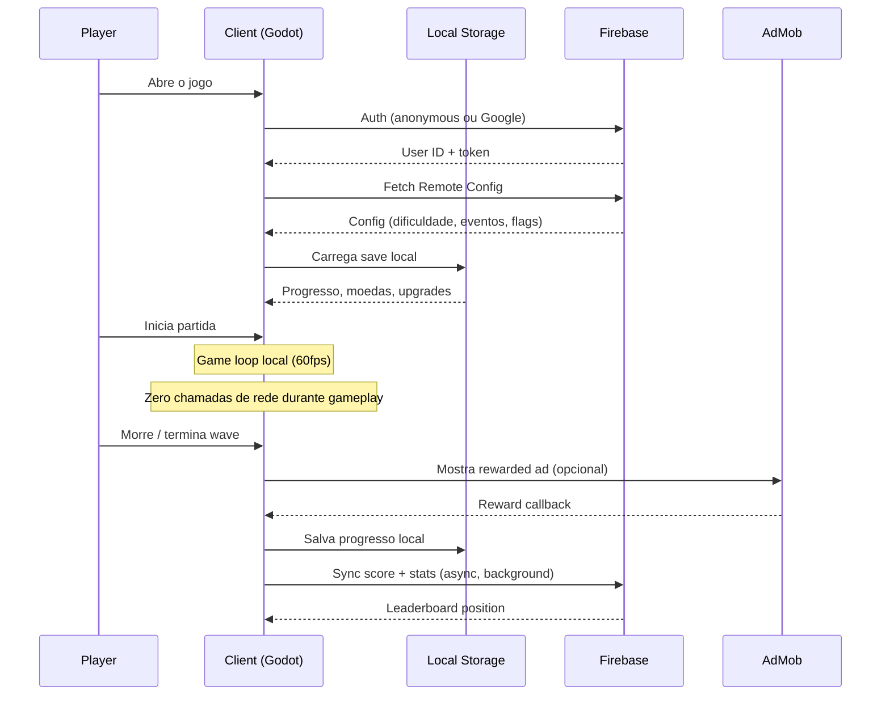
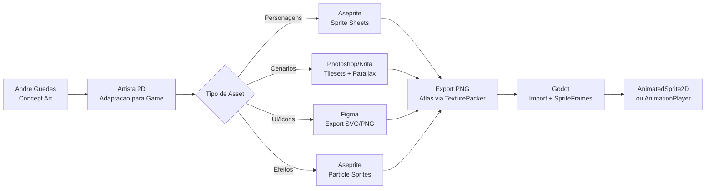
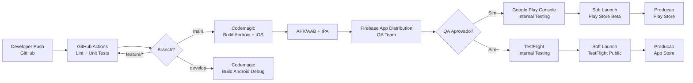

# ZUMBIS DE BRASILIA — Estrategia Tecnica
### Arquitetura, stack e plano de execucao — sem overengineering, sem bullshit

**Documento de Estrategia Tecnica | Abril 2026**
**Visao: John Carmack | Arquitetura e Decisoes de Engenharia**

---

> *"A melhor engine e a que voce domina. A melhor arquitetura e a que cabe na memoria. O melhor codigo e o que roda a 60fps num celular de R$ 800. Todo o resto e vaidade de engenheiro."*

---

## 1. Visao Tecnica

### Filosofia de Engenharia

Vou ser direto: li o Business Discovery do CEO e o Viability Challenge do jornalista. O CEO sonha grande — bom. O jornalista destruiu as premissas de timeline — correto. Meu trabalho agora e definir o que e **tecnicamente possivel** dentro da realidade: budget apertado, timeline curto, equipe pequena.

Tres principios guiam cada decisao tecnica deste documento:

**1. Simplicidade Radical**
Cada feature que entra no jogo precisa justificar seu custo em complexidade. Se nao da pra explicar em uma frase, nao entra no MVP. Doom rodava em 4MB de RAM. Nosso jogo roda num Galaxy A06 com 4GB. O principio e o mesmo: **respeite as restricoes do hardware do seu usuario**.

**2. Ship First, Optimize Later**
O inimigo numero um de um projeto indie com janela de oportunidade e o perfeccionismo tecnico. Nao vamos escrever um motor de particulas custom. Nao vamos inventar um protocolo de rede. Vamos usar o que existe, colar as pecas, e entregar um jogo que funciona. **Codigo feio que roda > codigo bonito que nao existe.**

**3. Otimizacao para o Pior Caso**
O target nao e o iPhone 16 Pro. O target e o Samsung Galaxy A06 com 4GB de RAM, tela 720p, chipset Helio G85. Se roda nisso, roda em tudo. Toda decisao tecnica parte desse baseline.

### Concordancia com o Pivot

O Devil's Advocate (Schreier) esta certo: 5 meses para um F2P completo e suicidio. A estrategia tecnica que apresento aqui e desenhada para o **PIVOT 1 — mini-jogo viral primeiro**, com arquitetura que escala para o jogo completo depois. Isso nao e "fazer pela metade" — e engenharia pragmatica. Voce nao constroi o Quake III Arena no dia 1. Voce constroi o Wolfenstein 3D, prova que FPS funciona, e itera.

---

## 2. Game Engine — Godot 4

### A Decisao

**Godot 4.4+. Sem discussao.**

O CEO recomendou Unity. Respeito, mas discordo. Em abril de 2026, para um jogo 2D mobile com budget indie, Godot e a resposta correta. Vou explicar por que com dados, nao com opiniao.

### Comparativo Tecnico

| Criterio | Godot 4.4 | Unity 6 | Veredito |
|---|---|---|---|
| **Pipeline 2D** | Nativo, dedicado. Nao e um hack em cima de 3D | 2D e um subset do pipeline 3D. Funciona, mas nao e nativo | **Godot** |
| **Tamanho do APK (vazio)** | ~30-40 MB | ~70-100 MB | **Godot** (critico para devices low-end) |
| **Licenciamento** | MIT. Zero royalties. Zero taxas. Para sempre | Gratis ate US$ 200K/ano. Depois, assinatura. Historico de mudar regras | **Godot** |
| **Performance 2D** | Pipeline dedicado com batching otimizado, rendering direto | Overhead de runtime 3D mesmo para 2D | **Godot** |
| **AdMob/IAP** | Plugins maduros: godot-admob-plugin (Poing Studios), godot-iap (OpenIAP). Suporte oficial Google Play Billing | Nativo, mais polido, ecossistema maior | **Unity** (margem pequena) |
| **Linguagem** | GDScript (simples, rapido de iterar) + C# opcional | C# (mais verboso, mais ferramentas) | **Empate** (depende da equipe) |
| **Comunidade mobile** | Crescendo rapido. Godot Foundation investindo em mobile plugins em 2025-2026 | Madura, 71% dos top mobile games | **Unity** |
| **Curva de aprendizado** | Baixa. Produtivo em 1-2 semanas | Media. Produtivo em 2-4 semanas | **Godot** |
| **Risco de vendor lock-in** | Zero. Open-source, MIT license | Alto. Unity pode mudar politica de precos novamente (ja fez em 2023) | **Godot** |
| **Build size otimizado** | Com stripping: 15-25 MB para jogo 2D simples | Com IL2CPP + stripping: 40-60 MB | **Godot** |

### Por que NAO Unity

1. **O incidente de 2023 nao e historia — e precedente.** Unity tentou cobrar por instalacao (runtime fee). Revogou apos revolta. Mas o dano de confianca e permanente. Um indie com budget apertado nao pode depender de uma empresa que demonstrou disposicao para mudar as regras do jogo.

2. **Overhead desnecessario.** Unity carrega o runtime 3D completo mesmo para jogos 2D. Para nosso caso — sprites 2D, animacao frame-a-frame, fisica simples — e como usar um caminhao para entregar uma pizza.

3. **APK size importa.** No Brasil, 76% das vendas de smartphones sao de aparelhos de entrada e intermediarios. Muitos usuarios tem planos de dados limitados (2-5 GB/mes). Um APK de 30 MB vs 70 MB e a diferenca entre "baixo agora" e "baixo depois no Wi-Fi" (e "depois" significa "nunca").

4. **Plugins de monetizacao estao maduros.** Em 2026, o ecossistema Godot tem plugins robustos para AdMob (Poing Studios, com suporte a mediacao e 15+ redes de ads), Google Play Billing (mantido pela Godot Foundation), e IAP cross-platform (godot-iap com OpenIAP Protocol).

### Mitigacao de Risco: Godot em Mobile

Godot em mobile ainda e menos testado que Unity em escala. Reconheco isso. Mitigacoes:

- **Prova de conceito na semana 1**: Antes de qualquer outra coisa, montar um build de teste com 200 sprites animados + AdMob + IAP rodando num Galaxy A06. Se nao atingir 60fps estavel, reconsideramos.
- **Compatibility layer**: Usar Godot 4.4 com renderer Compatibility (OpenGL ES 3.0), nao Vulkan. Vulkan nao e suportado em muitos devices low-end.
- **Godot 4.4 tem melhorias especificas de mobile**: Crash rate reduzido de ~4% para <1% em builds recentes. A Foundation esta investindo ativamente em estabilidade mobile.

### Custo da Decisao

| Item | Godot | Unity |
|---|---|---|
| Licenca (1 ano) | **R$ 0** | R$ 0 (free tier) a R$ 12.000+ (Pro, 2 seats) |
| Risco de mudanca de termos | **Zero** | **Real** |
| Plugins de monetizacao | **Gratuitos** (open-source) | Gratuitos (built-in) |
| Custo total de engine | **R$ 0** | R$ 0 a R$ 12.000 |

---

## 3. Arquitetura do Jogo

### Principio: Client-Heavy, Server-Light

Para o MVP (mini-jogo viral), a arquitetura e **client-authoritative** com backend minimo. Isso e intencional. Nao estamos fazendo MMO competitivo — estamos fazendo um jogo single-player com leaderboards e analytics. Nao precisa de server-authoritative. Nao precisa de anti-cheat sofisticado. Precisa funcionar.

Para a Fase 2 (jogo completo com PvP/co-op), migramos para server-authoritative onde necessario.

### Diagrama de Arquitetura

```mermaid
graph TB
    subgraph "CLIENTE (Godot 4.4)"
        A[Game Loop] --> B[Scene Manager]
        B --> C[Gameplay Systems]
        C --> C1[Combat System]
        C --> C2[Wave Spawner]
        C --> C3[Player Controller]
        C --> C4[Score/Progression]
        B --> D[UI Layer]
        D --> D1[HUD]
        D --> D2[Menus]
        D --> D3[Shop/IAP]
        B --> E[Ads Manager]
        E --> E1[AdMob Plugin]
        E --> E2[Rewarded Video]
        E --> E3[Interstitial]
        B --> F[Analytics SDK]
        F --> F1[Firebase Analytics]
        B --> G[Local Storage]
        G --> G1[Save System - JSON]
        G --> G2[Cache Layer]
    end

    subgraph "BACKEND (Firebase)"
        H[Firebase Auth] --> H1[Anonymous Auth]
        H --> H2[Google Sign-In]
        I[Cloud Firestore] --> I1[Leaderboards]
        I --> I2[Player Profiles]
        I --> I3[Remote Config]
        J[Cloud Functions] --> J1[Score Validation]
        J --> J2[Event Logic]
        K[Firebase Analytics]
        L[Firebase Crashlytics]
        M[Firebase Remote Config]
    end

    subgraph "SERVICOS EXTERNOS"
        N[Google Play Store]
        O[Apple App Store]
        P[AdMob Network]
        Q[Google Play Billing]
    end

    A -->|HTTPS/REST| H
    A -->|HTTPS/REST| I
    F1 -->|SDK| K
    E1 -->|SDK| P
    D3 -->|SDK| Q

    style A fill:#e74c3c,color:#fff
    style H fill:#f39c12,color:#fff
    style I fill:#f39c12,color:#fff
    style N fill:#27ae60,color:#fff
    style O fill:#27ae60,color:#fff
```



### Data Flow — Sessao de Jogo



### Decisoes Chave de Arquitetura

| Decisao | Escolha | Justificativa |
|---|---|---|
| Autoridade do jogo | Client-side (MVP) | Single-player. Nao precisa de anti-cheat no dia 1 |
| Protocolo de rede | HTTPS/REST (Firebase SDK) | Sem necessidade de real-time. Leaderboards sao async |
| Persistencia local | JSON encriptado | Simples, rapido. Sem SQLite overhead |
| Sync de dados | Eventual consistency | Score sobe quando tem internet. Jogo funciona offline |
| Rendering | Godot Compatibility (OpenGL ES 3.0) | Maximo de compatibilidade com devices low-end |
| Physics | Godot built-in 2D physics | Area2D para hitboxes. Sem Rigidbody complexo |
| Audio | Godot AudioStreamPlayer | Bus de audio simples: SFX, Music, UI |

---

## 4. Stack Completo

### Tabela de Stack

| Camada | Tecnologia | Versao | Justificativa |
|---|---|---|---|
| **Engine** | Godot | 4.4+ | Melhor engine 2D, open-source, zero custo |
| **Linguagem (game)** | GDScript | 4.4 | Produtividade maxima, curva de aprendizado minima |
| **Linguagem (tools/backend)** | Python / TypeScript | 3.12 / 5.x | Scripts de pipeline (Python), Cloud Functions (TS) |
| **Backend** | Firebase (Blaze plan) | - | BaaS completo: Auth, Firestore, Functions, Analytics, Crashlytics |
| **Ads** | AdMob + LevelPlay mediacao | - | AdMob para ads, mediacao com AppLovin/Unity Ads para maximizar eCPM |
| **IAP** | Google Play Billing (Godot plugin) + StoreKit 2 | - | Plugins oficiais mantidos pela Godot Foundation |
| **Analytics** | Firebase Analytics + GameAnalytics | - | Firebase para funil basico, GameAnalytics para metricas de game design |
| **Crash Reporting** | Firebase Crashlytics | - | Integrado no pacote Firebase, zero custo adicional |
| **Remote Config** | Firebase Remote Config | - | A/B testing, kill switches, balanceamento sem update de app |
| **CI/CD** | GitHub Actions + Codemagic | - | GitHub Actions para testes, Codemagic para builds mobile |
| **Versionamento** | Git + Git LFS | - | LFS para assets binarios (sprites, audio) |
| **Repositorio** | GitHub (privado) | - | Integracao nativa com CI/CD |
| **Arte** | Aseprite + Spine 2D | - | Aseprite para sprites, Spine para animacao esqueletal (se necessario) |
| **Audio** | FMOD (free tier) ou Godot nativo | - | FMOD se precisar de audio adaptativo. Godot nativo para MVP |
| **Design** | Figma | - | UI/UX mockups e design system |
| **Comunicacao** | Discord (equipe) | - | Gratis, adequado para equipe pequena |
| **Gestao** | Linear ou GitHub Projects | - | Tracking de tasks e sprints |

### Por que Firebase e nao PlayFab/Nakama

| Criterio | Firebase | PlayFab | Nakama |
|---|---|---|---|
| **Free tier** | Generoso: 50K MAU auth, 1GB Firestore, 125K Cloud Functions/mes | 100K users (dev mode, features limitadas) | Self-hosted gratis, managed US$ 600/mes |
| **Curva de aprendizado** | Baixa. SDKs bem documentados | Alta. Documentacao assume familiaridade com live-service | Media. Precisa gerenciar infra se self-hosted |
| **Integracao Godot** | SDKs community maduros, Firebase Analytics via REST | SDK nao-oficial, mais trabalho | SDK community, menos testado |
| **Custo ate 100K MAU** | ~US$ 50-150/mes | US$ 0 (dev) a US$ 400/mes (standard) | US$ 600+/mes (managed) |
| **Escala** | Escala automaticamente (pay-as-you-go) | Escala bem, pricing complexo | Excelente, mas exige DevOps se self-hosted |
| **Game-specific features** | Basico (precisa construir leaderboards, etc.) | Completo (leaderboards, matchmaking, economy) | Completo (leaderboards, matchmaking, real-time) |

**Veredito**: Firebase para MVP. E o mais rapido de integrar, mais barato ate 500K MAU, e a equipe provavelmente ja conhece. Se/quando o jogo crescer e precisar de features game-specific (matchmaking, economy server-side, PvP), migramos para PlayFab ou Nakama. **Nao construa para 3M de MAU no dia 1. Construa para 10K e tenha um plano para escalar.**

---

## 5. MVP Tecnico — O Mini-Jogo Viral

### Alinhamento com o Pivot

O Schreier esta certo: lancamos um mini-jogo viral primeiro. Aqui esta o escopo tecnico EXATO do MVP:

### Escopo do MVP

| Feature | Incluso | Detalhes |
|---|---|---|
| **1 mapa** | SIM | Esplanada dos Ministerios (iconica, reconhecivel) |
| **1 modo de jogo** | SIM | Survival horde — sobreviva o maximo de waves |
| **1 personagem jogavel** | SIM | "Cidadao Brasileiro" generico, customizavel (cor de pele, cabelo) |
| **5-8 tipos de zumbi** | SIM | Zumbi-Deputado, Zumbi-Senador, Zumbi-Assessor, Zumbi-Lobista, etc. |
| **3-5 armas** | SIM | Vassoura (melee), Chinelo (ranged), Urna (area), Santinho (throwable), Palanque (heavy) |
| **Sistema de waves** | SIM | Waves progressivas com dificuldade crescente |
| **Score + combo** | SIM | Multiplicador de combo, score local e global |
| **Leaderboard** | SIM | Firebase Firestore, global e semanal |
| **Ads recompensados** | SIM | "Continue jogando" apos morte, power-up temporario |
| **Interstitial ads** | SIM | A cada 3-4 partidas |
| **Analytics** | SIM | Firebase Analytics: sessao, retencao, funil, revenue |
| **Crash reporting** | SIM | Firebase Crashlytics |
| **Tutorial** | SIM | Joystick virtual + botao de ataque. 30 segundos, skip-able |
| **Share/screenshot** | SIM | Compartilhar score no WhatsApp/Instagram/TikTok |
| **Battle Pass** | NAO | Fase 2 |
| **Skins/cosmeticos** | NAO | Fase 2 |
| **IAP** | NAO | Fase 2 (apenas ads no MVP) |
| **PvP/Co-op** | NAO | Fase 2 |
| **Multiplos mapas** | NAO | Fase 2 |
| **Backend complexo** | NAO | Firebase basico e suficiente |
| **Sistema social/clans** | NAO | Fase 2 |

### Metricas de Validacao do MVP

| Metrica | Gate Minimo | Target | Kill Condition |
|---|---|---|---|
| **Retencao D1** | >30% | >40% | <25% |
| **Retencao D7** | >12% | >18% | <8% |
| **Sessao media** | >4 min | >7 min | <2 min |
| **CPI (Android, Brasil)** | <R$ 3,00 | <R$ 1,50 | >R$ 5,00 |
| **eCPM ads** | >R$ 15 | >R$ 25 | <R$ 8 |
| **Crash rate** | <2% | <1% | >5% |
| **FPS medio (Galaxy A06)** | >55 fps | 60 fps estavel | <45 fps |
| **Tamanho APK** | <50 MB | <35 MB | >80 MB |

### Especificacao Tecnica do MVP

**Resolucao**: 720x1280 (portrait), escalavel para 1080x1920
**Target FPS**: 60fps
**Max sprites simultaneos em tela**: 150 (zumbis + efeitos + UI)
**Max particulas**: 200
**Audio**: 8 canais simultaneos (SFX) + 1 musica + 1 ambience
**Memoria RAM target**: <300 MB
**Tamanho APK**: <40 MB (Android), <60 MB (iOS)

---

## 6. Backend & Infraestrutura

### Arquitetura de Backend

```
MVP (Fase 1):
Firebase Auth (anonymous) → Firestore (leaderboards, profiles) → Cloud Functions (score validation)

Jogo Completo (Fase 2):
Firebase Auth (Google/Apple) → Firestore (profiles, inventory, progression)
                             → Cloud Functions (economy, events, battle pass)
                             → Realtime Database (live leaderboards - se necessario)
                             → Cloud Storage (user-generated content - se necessario)
```

### Servicos e Justificativas

| Servico | Provider | Justificativa |
|---|---|---|
| **Autenticacao** | Firebase Auth | Anonymous login para friccao zero no primeiro acesso. Google Sign-In como upgrade. Gratis ate 50K MAU, depois US$ 0,0055/MAU |
| **Database** | Cloud Firestore | NoSQL, escala automaticamente, pricing por operacao (reads/writes). Ideal para profiles e leaderboards |
| **Serverless compute** | Cloud Functions | Score validation, event triggers, scheduled tasks. Pay-per-invocation |
| **Analytics** | Firebase Analytics + GA4 | Gratis. Funil de conversao, retencao, revenue tracking |
| **Crash reporting** | Firebase Crashlytics | Gratis. Real-time crash reports com stack traces |
| **Remote config** | Firebase Remote Config | Gratis. Feature flags, A/B testing, balanceamento sem deploy |
| **Push notifications** | Firebase Cloud Messaging (FCM) | Gratis. Re-engagement, eventos, updates |
| **CDN** | Firebase Hosting + Cloud Storage | Assets estaticos (patches de conteudo, imagens de eventos) |

### Custos por Tier de MAU — Backend

| Componente | 10K MAU | 100K MAU | 500K MAU | 1M MAU | 3M MAU |
|---|---|---|---|---|---|
| **Firebase Auth** | Gratis | Gratis | US$ 125/mes | US$ 375/mes | US$ 700/mes |
| **Firestore (reads)** | ~US$ 5/mes | ~US$ 50/mes | ~US$ 250/mes | ~US$ 500/mes | ~US$ 1.500/mes |
| **Firestore (writes)** | ~US$ 3/mes | ~US$ 30/mes | ~US$ 150/mes | ~US$ 300/mes | ~US$ 900/mes |
| **Cloud Functions** | ~US$ 2/mes | ~US$ 20/mes | ~US$ 100/mes | ~US$ 200/mes | ~US$ 600/mes |
| **Cloud Storage** | ~US$ 1/mes | ~US$ 5/mes | ~US$ 25/mes | ~US$ 50/mes | ~US$ 150/mes |
| **Analytics/Crashlytics** | Gratis | Gratis | Gratis | Gratis | Gratis |
| **FCM** | Gratis | Gratis | Gratis | Gratis | Gratis |
| **TOTAL Backend** | **~US$ 11/mes** | **~US$ 105/mes** | **~US$ 650/mes** | **~US$ 1.425/mes** | **~US$ 3.850/mes** |
| **Em reais (~R$ 5,50)** | **~R$ 60/mes** | **~R$ 578/mes** | **~R$ 3.575/mes** | **~R$ 7.838/mes** | **~R$ 21.175/mes** |

**Nota**: Estimativas baseadas em: ~10 reads e ~3 writes por sessao, 3 sessoes/dia por DAU, DAU/MAU ratio de 20-25%. Custos reais variam com padrao de uso.

### Estrategia de Escala

| Fase | MAU | Abordagem |
|---|---|---|
| MVP | 0 - 10K | Firebase free tier. Custo ~zero |
| Soft Launch | 10K - 100K | Firebase Blaze (pay-as-you-go). Custo < R$ 600/mes |
| Lancamento | 100K - 500K | Firebase Blaze. Adicionar caching agressivo no client. Custo < R$ 4.000/mes |
| Crescimento | 500K - 1M | Avaliar migracao parcial para PlayFab/Nakama para features game-specific. Custo < R$ 8.000/mes |
| Escala | 1M - 3M | Arquitetura hibrida: Firebase (auth, analytics) + backend custom ou PlayFab (economy, matchmaking). Custo < R$ 25.000/mes |

**Regra de ouro**: Nao otimize para 3M MAU quando voce tem 0. O custo de backend para o primeiro ano inteiro (ate 100K MAU) cabe em ~R$ 7.000. Gastar tempo otimizando isso agora e desperdicar o recurso mais escasso que temos: tempo de desenvolvimento.

---

## 7. Pipeline de Arte

### O Desafio

O estilo de Andre Guedes e unico: tracos grotescos, caricaturas deformadas, linhas grossas, cores saturadas. Traduzir isso para sprites de jogo que rodam a 60fps num celular barato e um problema tecnico real.

### Workflow de Producao de Arte



### Especificacoes Tecnicas de Arte

| Asset | Resolucao | Frames | Formato | Compressao |
|---|---|---|---|---|
| **Personagem jogavel** | 128x128 px | 8-12 por animacao (idle, walk, attack, death) | PNG sprite sheet | ETC2 (Android), PVRTC (iOS) |
| **Zumbis (cada tipo)** | 96x96 px | 6-8 por animacao (walk, attack, death) | PNG sprite sheet | ETC2/PVRTC |
| **Tileset cenario** | 32x32 px tiles | N/A (estatico) | PNG | ETC2/PVRTC |
| **Parallax backgrounds** | 1280x720 px (3-4 layers) | N/A (scroll continuo) | PNG | ETC2/PVRTC |
| **Projecteis/efeitos** | 32x32 px | 4-6 frames | PNG sprite sheet | ETC2/PVRTC |
| **UI elements** | Variavel | N/A | PNG (9-patch onde aplicavel) | Sem compressao (qualidade) |
| **Icons** | 64x64 px | N/A | PNG | Sem compressao |

### Otimizacoes de Arte

1. **Texture Atlas**: Todos os sprites de uma categoria em um unico atlas (TexturePacker). Reduz draw calls de ~200 para ~5-10.
2. **Sprite reuse com palette swap**: Variantes de zumbis usando o mesmo sprite base com paletas de cores diferentes. Um sprite, 4-5 variantes visuais.
3. **Animacao limitada intencional**: Estilo cartoon permite animacao em 12fps (6-8 frames por animacao). Nao precisa de animacao suave a 60fps — o charme esta na "tosquice" proposital.
4. **LOD simplificado**: Zumbis distantes usam sprites menores/simplificados. Economia de ~30% em memoria de textura.
5. **Object pooling**: Zumbis e projecteis usam pool. Zero allocations durante gameplay.

### Papel de Andre Guedes no Pipeline

Andre Guedes **nao precisa** (e provavelmente nao deve) criar sprites de jogo diretamente. O workflow ideal:

1. **Andre cria**: Concept art, character sheets (frente/costas/perfil), style guide com paleta de cores, guia de expressoes
2. **Artista de jogo adapta**: Traduz o estilo de Andre para sprites pixelados/vetorizados otimizados para game
3. **Andre aprova**: Review e feedback a cada milestone (semanal)

Isso respeita o tempo de Andre (que nao e game artist), garante fidelidade ao estilo, e mantem o pipeline fluindo.

---

## 8. Performance & Devices

### Target Devices

Baseado nos smartphones mais vendidos no Brasil em 2025-2026:

| Prioridade | Device | Chipset | RAM | GPU | Resolucao | Market Share |
|---|---|---|---|---|---|---|
| **P0 (deve rodar perfeito)** | Samsung Galaxy A06 | Helio G85 | 4 GB | Mali-G52 | 720x1600 | ~7% do mercado LATAM |
| **P0** | Samsung Galaxy A16 | Dimensity 6300 | 4 GB | Mali-G57 | 1080x2340 | Top 5 vendas BR |
| **P0** | Motorola Moto G 2026 | Dimensity 6300 | 4 GB | Mali-G57 | 720x1600 | Top 5 vendas BR |
| **P1 (deve rodar bem)** | Samsung Galaxy A07 | Helio G85 | 4 GB | Mali-G52 | 720x1600 | Top 10 vendas BR |
| **P1** | Xiaomi Redmi 14C | Helio G81 | 4 GB | Mali-G52 | 720x1600 | Top 10 vendas BR |
| **P2 (deve rodar)** | Devices com 3 GB RAM | Variados | 3 GB | Variados | 720p | ~15% do mercado |

### Budgets de Performance

| Recurso | Budget MVP | Budget Jogo Completo |
|---|---|---|
| **RAM total** | <300 MB | <400 MB |
| **RAM texturas** | <80 MB | <120 MB |
| **RAM audio** | <20 MB | <30 MB |
| **Draw calls por frame** | <30 | <50 |
| **Sprites em tela** | <150 | <200 |
| **Particulas ativas** | <200 | <400 |
| **FPS target** | 60 fps | 60 fps |
| **FPS minimo aceitavel** | 45 fps | 50 fps |
| **Battery drain** | <15%/hora | <15%/hora |
| **CPU usage** | <70% (2 cores) | <80% (2 cores) |
| **Tamanho APK** | <40 MB | <80 MB |
| **Tamanho instalado** | <120 MB | <250 MB |

### Estrategias de Otimizacao

1. **Renderer**: Usar Compatibility renderer (OpenGL ES 3.0), nao Forward+/Vulkan. Garante compatibilidade com 95%+ dos devices Android no Brasil.

2. **Object Pooling**: Todo objeto que aparece e desaparece (zumbis, projeteis, efeitos, particulas) usa pool pre-alocado. **Zero** instanciacao durante gameplay. Isso elimina GC spikes que causam stuttering.

3. **Visibilidade**: Zumbis fora da tela sao desativados (`set_process(false)`, `visible = false`). So processam AI e fisica quando visiveis ou proximos.

4. **Texture Compression**: ETC2 para Android (compressao 6:1), PVRTC para iOS. Reduz memoria de textura em ~80%.

5. **Audio Streaming**: Musica de fundo usa streaming (nao carrega na RAM inteira). SFX curtos ficam em memoria.

6. **LOD de Particulas**: Em devices low-end, reduzir particulas em 50%. Feature flag via Remote Config.

7. **Dynamic Quality**: Detectar specs do device no boot. Se RAM < 4GB ou GPU fraca: reduzir particulas, simplificar sombras, reduzir sprites simultaneos.

8. **Profiling semanal**: Toda sexta-feira, rodar profiler no Galaxy A06. Se FPS caiu, e prioridade maxima na semana seguinte.

---

## 9. CI/CD & DevOps

### Pipeline de Build



### Ferramentas e Custos

| Ferramenta | Funcao | Custo Mensal |
|---|---|---|
| **GitHub** (Team) | Repositorio, Issues, Projects | US$ 4/user (~R$ 22/user) |
| **GitHub Actions** | CI: lint, testes, validacao | 2.000 min gratis/mes (suficiente) |
| **Codemagic** (Pay-as-you-go) | CD: builds Android/iOS | ~US$ 50-100/mes (~R$ 275-550) |
| **Firebase App Distribution** | Distribuicao de builds para QA | Gratis |
| **Firebase Crashlytics** | Monitoramento de crashes em prod | Gratis |
| **Total CI/CD** | | **~R$ 500-800/mes** |

### OTA Updates e Hot Fixes

Para atualizar conteudo sem publicar nova versao na loja:

1. **Firebase Remote Config**: Flags de features, balanceamento de dificuldade, parametros de economia. Atualizacao instantanea.
2. **Asset bundles via Cloud Storage**: Novos sprites de eventos, assets sazonais. Download em background no app start.
3. **Force update**: Para fixes criticos, Remote Config flag que mostra dialog "atualize o app". Redirect para loja.

**Nao** vamos implementar um sistema de hot-patching de codigo (tipo CodePush). Complexidade desnecessaria para o escopo. Updates de logica passam pela loja.

### Ambientes

| Ambiente | Uso | Firebase Project |
|---|---|---|
| **dev** | Desenvolvimento local, testes | zumbis-brasilia-dev |
| **staging** | QA, testes de integracao | zumbis-brasilia-staging |
| **production** | Usuarios reais | zumbis-brasilia-prod |

---

## 10. Timeline Tecnico Realista

### Premissa: Equipe de 5 pessoas (nao 10)

Concordo com o Schreier: equipe menor, mais focada. 10 pessoas e overhead de coordenacao demais para um MVP.

### Fase 0: Validacao Tecnica (2 semanas)
**Maio 2026 — Semanas 1-2**

| Entrega | Responsavel | Duracao |
|---|---|---|
| Prova de conceito Godot: 200 sprites + 60fps no Galaxy A06 | Dev Lead | 3 dias |
| Integracao AdMob funcional no Godot | Dev 2 | 2 dias |
| Integracao Firebase Auth + Firestore | Dev 2 | 2 dias |
| Prototipo de controle (joystick virtual + ataque) | Dev Lead | 2 dias |
| Primeiro sprite animado no estilo Andre Guedes | Artista | 3 dias |
| **Gate**: Tudo funciona? GO. Algo falhou criticamente? PIVOT para Unity ou web game. | | |

### Fase 1: Prototipo Jogavel (6 semanas)
**Maio-Junho 2026 — Semanas 3-8**

| Entrega | Semana |
|---|---|
| Core gameplay: movimento, ataque melee/ranged, dano | 3-4 |
| Wave system: spawn, dificuldade progressiva, boss wave | 4-5 |
| 3 tipos de zumbi com AI basica (chase, attack, special) | 5-6 |
| HUD: vida, score, wave counter, combo | 5-6 |
| Mapa Esplanada: tileset, parallax, boundaries | 6-7 |
| Sistema de score + leaderboard (Firebase) | 7 |
| Integracao ads (rewarded + interstitial) | 7-8 |
| Tutorial basico | 8 |
| **Gate**: Playtest interno. O jogo e divertido por 5 minutos? | 8 |

### Fase 2: MVP Polish (4 semanas)
**Julho 2026 — Semanas 9-12**

| Entrega | Semana |
|---|---|
| 5-8 tipos de zumbi completos (arte + animacao + AI) | 9-10 |
| 3-5 armas com feedback visual/sonoro satisfatorio | 9-10 |
| Sistema de power-ups (drop de zumbis) | 10-11 |
| Efeitos visuais: screen shake, hit flash, combo visual | 10-11 |
| Sound design: SFX de combate, musica, ambience | 11 |
| Share/screenshot para WhatsApp/Instagram | 11 |
| Performance optimization pass | 12 |
| QA: testes em 5+ devices reais | 12 |
| **Gate**: Playtest com 200+ jogadores reais. D1 > 30%? | 12 |

### Fase 3: Soft Launch (4 semanas)
**Agosto 2026 — Semanas 13-16**

| Entrega | Semana |
|---|---|
| Upload para Google Play (beta aberto, regiao limitada) | 13 |
| Monitoramento de metricas: retencao, sessao, crashes, eCPM | 13-16 |
| Iteracao baseada em dados: balanceamento, bugs, UX | 14-15 |
| ASO (App Store Optimization): screenshots, descricao, keywords | 14 |
| Preparacao iOS (TestFlight) | 15-16 |
| **Gate**: CPI < R$ 3, D7 > 12%, crash rate < 2%? | 16 |

### Fase 4: Lancamento (2 semanas)
**Setembro 2026 — Semanas 17-18**

| Entrega | Semana |
|---|---|
| Lancamento Android (Google Play, Brasil) | 17 |
| Lancamento iOS (App Store, Brasil) | 17-18 |
| War room: monitoramento 24h nas primeiras 48h | 17 |
| Hotfix pipeline ativo | 17-18 |
| Coordenacao com marketing: trailer, Andre Guedes, influencers | 17-18 |

### Fase 5: Live Ops — Pico Eleitoral (6 semanas)
**Outubro-Novembro 2026 — Semanas 19-24**

| Entrega | Semana |
|---|---|
| Evento in-game "Dia da Eleicao" (1o turno: 4 outubro) | 19 |
| Novos zumbis tematicos (via asset bundles, sem update de app) | 20-21 |
| Evento 2o turno (se houver: 25 outubro) | 22 |
| Analise de metricas: decidir se escala para jogo completo | 23-24 |

### Timeline Visual

```
MAI 2026  |==VALIDACAO==|====PROTOTIPO==========================|
JUN 2026  |===================PROTOTIPO=====|===MVP POLISH======|
JUL 2026  |=========MVP POLISH=============|
AGO 2026  |=========SOFT LAUNCH============|
SET 2026  |===LANCAMENTO===|
OUT 2026  |=======LIVE OPS / PICO ELEITORAL=========|
NOV 2026  |===LIVE OPS===|===DECISAO: ESCALAR OU ENCERRAR===|
```

**Total: ~24 semanas (6 meses) de validacao tecnica ate pico eleitoral.**

Isso e apertado mas factivel porque:
1. Escopo e radical (1 mapa, 1 modo, sem IAP, sem battle pass)
2. Stack e simples (Godot + Firebase + AdMob)
3. Equipe e focada (5 pessoas, zero overhead de coordenacao)
4. Nao estamos inventando tecnologia — estamos colando pecas existentes

---

## 11. Equipe Tecnica

### Equipe MVP (5 pessoas)

| # | Funcao | Perfil | Salario Mensal | Quando | Meses |
|---|---|---|---|---|---|
| 1 | **Dev Lead / Game Programmer** | Senior, experiencia com Godot ou disposicao para aprender rapido. Responsavel pelo core gameplay, arquitetura, performance | R$ 18.000-22.000 | Maio (semana 1) | 6 |
| 2 | **Game Programmer** | Pleno+, foco em UI, sistemas de suporte (ads, analytics, save), integracao Firebase | R$ 14.000-18.000 | Maio (semana 1) | 6 |
| 3 | **Artista 2D / Animador** | Experiencia com pixel art ou sprite art. Capaz de traduzir o estilo de Andre Guedes para sprites de jogo | R$ 12.000-15.000 | Maio (semana 1) | 6 |
| 4 | **Game Designer / Producer** | Hibrido: design de gameplay + gestao de projeto. Responsavel por balanceamento, wave design, metricas | R$ 14.000-18.000 | Maio (semana 1) | 6 |
| 5 | **QA / Generalista** | Tester + community + DevOps basico. Testa em devices reais, configura CI/CD, gerencia builds | R$ 8.000-12.000 | Junho (semana 5) | 5 |

### Freelancers / Consultores (conforme necessidade)

| Funcao | Quando | Duracao | Custo Estimado |
|---|---|---|---|
| **Sound Designer** | Julho (Fase 2) | 3-4 semanas | R$ 15.000-25.000 (projeto fechado) |
| **Segundo Artista 2D** | Julho-Agosto (se necessario) | 6-8 semanas | R$ 10.000-12.000/mes |
| **Consultor Juridico** | Maio (parecer inicial) + ongoing | Pontual | R$ 20.000-30.000 total |
| **Andre Guedes** | Maio-Outubro (consultoria criativa) | 6 meses | Revenue share + fee |

### Custo Total de Equipe (6 meses)

| Item | Custo |
|---|---|
| Equipe core (5 pessoas, 5-6 meses) | R$ 370.000 - R$ 480.000 |
| Freelancers/consultores | R$ 50.000 - R$ 80.000 |
| **Total equipe** | **R$ 420.000 - R$ 560.000** |

### Equipe Fase 2 (se MVP validar) — adicionar:

| Funcao | Quando | Justificativa |
|---|---|---|
| **Backend Developer** | Dezembro 2026 | Para features server-side: economy, battle pass, matchmaking |
| **Segundo Game Programmer** | Dezembro 2026 | Para PvP/co-op, novos modos, novos mapas |
| **Community Manager** | Novembro 2026 | Para gerenciar a base de jogadores crescente |
| **Terceiro Artista** | Janeiro 2027 | Para conteudo de Temporada 2 |

---

## 12. Riscos Tecnicos

| # | Risco | Probabilidade | Impacto | Mitigacao |
|---|---|---|---|---|
| 1 | **Performance no Galaxy A06 abaixo de 60fps** | Media | Critico | PoC na semana 1. Se falhar: reduzir sprites, simplificar efeitos, ou pivotar para Godot Compatibility renderer com resolucao reduzida |
| 2 | **Godot mobile instabilidade (crashes)** | Media-Baixa | Alto | Usar versao estavel (4.4.x, nao dev build). Crashlytics desde o dia 1. Ter plano B: Unity migration (custaria ~3 semanas de atraso) |
| 3 | **Plugin AdMob nao funciona corretamente** | Baixa | Alto | Poing Studios plugin e bem mantido. Testar na semana 1 da PoC. Fallback: integracao direta via Android plugin interface |
| 4 | **Firebase cai no pico de lancamento** | Muito Baixa | Critico | Firebase tem SLA de 99.95%. Implementar fallback: jogo funciona 100% offline, sync quando voltar. Score salva local |
| 5 | **Equipe nao domina Godot** | Media | Alto | GDScript e simples — dev Python/JS produtivo em 1-2 semanas. Pair programming na primeira semana. Investir em onboarding |
| 6 | **Build iOS rejeitado pela Apple** | Media | Alto | Seguir guidelines rigorosamente. Sem nomes reais. Disclaimer visivel. Submeter 2 semanas antes do lancamento planejado |
| 7 | **Scope creep durante desenvolvimento** | Alta | Alto | Product Owner (Game Designer) tem poder de VETO absoluto sobre novas features. Se nao esta no escopo do MVP, nao entra |
| 8 | **Tamanho do APK excede 50 MB** | Media-Baixa | Medio | Compressao agressiva de texturas (ETC2). Asset stripping. Play Asset Delivery para assets opcionais |
| 9 | **Latencia de Firestore em picos** | Baixa | Medio | Leaderboard atualiza async. Cache local de 5 min. Player nunca espera rede para jogar |
| 10 | **Pirataria / APK mod** | Media | Baixo (MVP) | No MVP, nao importa — nao tem IAP. Na Fase 2: validacao server-side de compras, obfuscacao basica |

### Matriz de Contingencia

```
Se Godot falhar na PoC mobile → Pivotar para Unity (3 semanas de atraso)
Se Firebase exceder custos     → Migrar para PlayFab free tier (100K users)
Se AdMob rejeitado             → Usar AppLovin/Unity Ads como primary
Se Apple rejeitar o app        → Lancar so Android primeiro (80%+ do mercado BR)
Se Andre Guedes sair           → Estilo ja documentado no style guide; artista continua
```

---

## 13. Build vs Buy

| Componente | Decisao | Justificativa |
|---|---|---|
| **Game Engine** | BUY (Godot — gratis) | Nunca construa um engine. Isso nao e 1993 |
| **Core Gameplay** | BUILD | E o diferencial do produto. Ninguem vende "survival horde brasileiro" pronto |
| **AI de Zumbis** | BUILD | Simples (state machine: chase, attack, die). 200 linhas de GDScript |
| **Wave System** | BUILD | Logica especifica do nosso game design. 300 linhas |
| **Sistema de Save** | BUILD (simples) | JSON encriptado local. 100 linhas. Nao precisa de framework |
| **Autenticacao** | BUY (Firebase Auth) | Resolver auth e um problema resolvido. Nao reinvente |
| **Leaderboard** | BUY (Firestore) | Database query simples. Nao precisa de servico dedicado (ainda) |
| **Ads** | BUY (AdMob + plugins) | Rede de ads e um mercado, nao um componente tecnico |
| **IAP** | BUY (Google Play Billing plugin) | Obrigatorio usar SDK oficial das lojas |
| **Analytics** | BUY (Firebase Analytics) | Problema resolvido. Nao construa analytics custom |
| **Crash Reporting** | BUY (Crashlytics) | Problema resolvido |
| **CI/CD** | BUY (GitHub Actions + Codemagic) | Problema resolvido |
| **Sound/Music** | BUY (freelancer) | Nao temos sound designer full-time. Projeto fechado |
| **Push Notifications** | BUY (FCM) | Problema resolvido, gratis |
| **Remote Config** | BUY (Firebase Remote Config) | Problema resolvido, gratis |
| **Anti-cheat** | SKIP (MVP) | Nao gaste tempo com isso antes de ter usuarios |
| **Matchmaking** | SKIP (MVP) | Single-player. Fase 2 se PvP for validado |
| **Social/Clans** | SKIP (MVP) | Fase 2 |
| **Battle Pass system** | SKIP (MVP) → BUILD (Fase 2) | Logica especifica de economia do jogo |
| **Inventory/Economy** | SKIP (MVP) → BUY (PlayFab, Fase 2) | Economia server-side e complexa. Use um servico quando precisar |

### Principio

> **Se o componente e diferencial competitivo: BUILD. Se e infraestrutura comoditizada: BUY. Se nao e necessario para validar a ideia: SKIP.**

---

## 14. Custos de Infraestrutura — Tabela Consolidada

### Custo Mensal por Tier de Usuarios

| Componente | 10K MAU | 100K MAU | 500K MAU | 1M MAU | 3M MAU |
|---|---|---|---|---|---|
| **Firebase (backend total)** | R$ 60 | R$ 578 | R$ 3.575 | R$ 7.838 | R$ 21.175 |
| **CI/CD (GitHub + Codemagic)** | R$ 500 | R$ 600 | R$ 800 | R$ 800 | R$ 1.000 |
| **AdMob mediacao (custo zero — e receita)** | R$ 0 | R$ 0 | R$ 0 | R$ 0 | R$ 0 |
| **Dominio + DNS + SSL** | R$ 30 | R$ 30 | R$ 30 | R$ 30 | R$ 30 |
| **Monitoramento (Crashlytics + GA)** | R$ 0 | R$ 0 | R$ 0 | R$ 0 | R$ 0 |
| **CDN (Firebase Hosting/Storage)** | R$ 0 | R$ 55 | R$ 275 | R$ 550 | R$ 1.650 |
| **Contingencia (20%)** | R$ 118 | R$ 253 | R$ 936 | R$ 1.844 | R$ 4.771 |
| **TOTAL MENSAL** | **R$ 708** | **R$ 1.516** | **R$ 5.616** | **R$ 11.062** | **R$ 28.626** |
| **TOTAL ANUAL** | **R$ 8.496** | **R$ 18.192** | **R$ 67.392** | **R$ 132.744** | **R$ 343.512** |

### Receita vs Custo (sanity check)

| MAU | Custo Infra/mes | Receita Ads Estimada/mes* | Margem Bruta Infra |
|---|---|---|---|
| 10K | R$ 708 | R$ 3.000 | +R$ 2.292 |
| 100K | R$ 1.516 | R$ 30.000 | +R$ 28.484 |
| 500K | R$ 5.616 | R$ 150.000 | +R$ 144.384 |
| 1M | R$ 11.062 | R$ 300.000 | +R$ 288.938 |
| 3M | R$ 28.626 | R$ 900.000 | +R$ 871.374 |

*Estimativa: eCPM de R$ 15, 3 ad views/DAU, DAU = 20% MAU

**Conclusao**: Infraestrutura e **irrelevante** como custo comparado a equipe e marketing. Mesmo no tier mais alto (3M MAU), o custo de infra e ~3% da receita de ads. O bottleneck NUNCA e infra — e aquisicao de usuarios e retencao.

---

## Apendice A: Decisoes que DEVEM ser tomadas na Semana 1

| # | Decisao | Responsavel | Criterio |
|---|---|---|---|
| 1 | PoC Godot passa no Galaxy A06? | Dev Lead | 200 sprites, 60fps, sem drops |
| 2 | AdMob funciona no Godot? | Dev 2 | Banner + Rewarded + Interstitial funcionais |
| 3 | Firebase Auth + Firestore funciona no Godot? | Dev 2 | Login anonimo + write/read funcional |
| 4 | Style guide de Andre Guedes traduzido para sprites? | Artista | 1 personagem + 1 zumbi animados |
| 5 | Controle touch responsivo? | Dev Lead | Joystick virtual + botao de ataque sem lag perceptivel |

Se QUALQUER um dos itens 1-3 falhar: reuniao de emergencia para avaliar Unity como fallback.

---

## Apendice B: Tech Stack Diagram

```
┌─────────────────────────────────────────────────┐
│                    CLIENTE                       │
│  ┌───────────────────────────────────────────┐  │
│  │           Godot 4.4 (GDScript)            │  │
│  │  ┌─────────┐ ┌──────────┐ ┌───────────┐  │  │
│  │  │Gameplay │ │   UI     │ │   Ads     │  │  │
│  │  │Systems  │ │  Layer   │ │  Manager  │  │  │
│  │  └────┬────┘ └────┬─────┘ └─────┬─────┘  │  │
│  │       │           │             │         │  │
│  │  ┌────┴────┐ ┌────┴─────┐ ┌────┴─────┐  │  │
│  │  │Physics  │ │Analytics │ │ AdMob    │  │  │
│  │  │2D      │ │  SDK     │ │ Plugin   │  │  │
│  │  └─────────┘ └────┬─────┘ └──────────┘  │  │
│  │                    │                      │  │
│  │  ┌─────────────────┴──────────────────┐  │  │
│  │  │     Firebase SDK (REST/HTTP)       │  │  │
│  │  └─────────────────┬──────────────────┘  │  │
│  └────────────────────┼──────────────────────┘  │
└───────────────────────┼─────────────────────────┘
                        │ HTTPS
┌───────────────────────┼─────────────────────────┐
│                    BACKEND                       │
│  ┌────────────────────┼──────────────────────┐  │
│  │              Firebase                     │  │
│  │  ┌──────┐ ┌────────┐ ┌────────┐         │  │
│  │  │ Auth │ │Firestore│ │Functions│         │  │
│  │  └──────┘ └────────┘ └────────┘         │  │
│  │  ┌──────────┐ ┌────────────┐            │  │
│  │  │Crashlytics│ │Remote Config│            │  │
│  │  └──────────┘ └────────────┘            │  │
│  │  ┌──────────┐ ┌──────────┐              │  │
│  │  │Analytics │ │   FCM    │              │  │
│  │  └──────────┘ └──────────┘              │  │
│  └───────────────────────────────────────────┘  │
└─────────────────────────────────────────────────┘
```

---

## Apendice C: Fontes da Pesquisa Tecnica

### Game Engines
- [Godot Engine vs Unity: Which is Best in 2026 — RocketBrush](https://rocketbrush.com/blog/godot-vs-unity)
- [Godot vs Unity in 2026: Which Game Engine Should You Choose? — Ludara](https://ludara.app/blog/godot-vs-unity-2026)
- [Godot vs Unity: 1 Clear Winner in 2026 — Tech Insider](https://tech-insider.org/godot-vs-unity-2026/)
- [Godot or Unity in 2026: Which One Fits Your Indie Game? — Toxigon](https://toxigon.com/godot-vs-unity-which-is-better-for-indie-developers)
- [Godot Mobile Update April 2026 — Godot Engine](https://godotengine.org/article/godot-mobile-update-apr-2026/)
- [Most Successful Games Made With Godot Engine 2025 — Medium](https://alihan98ersoy.medium.com/most-successful-games-made-with-godot-engine-revenue-sales-analysis-2025-9b69af569585)

### Backend & Infraestrutura
- [Best Game Backend Service in 2026 — LEADR](https://www.leadr.gg/blog/the-best-backend-service-for-your-game-in-2026)
- [Best Mobile Game Backend Providers 2026 — Metaplay](https://www.metaplay.io/blog/best-game-backend-providers)
- [Mobile Game Server Costs 2026 — Metaplay](https://www.metaplay.io/blog/mobile-game-server-costs)
- [PlayFab Pricing — Microsoft](https://developer.microsoft.com/en-us/games/products/playfab/pricing/)
- [Firebase Pricing 2026 — FirebasePricing.com](https://firebasepricing.com/)
- [Firebase Auth Pricing 2026 — MetaCTO](https://www.metacto.com/blogs/the-complete-guide-to-firebase-auth-costs-setup-integration-and-maintenance)
- [Reducing Infrastructure Costs at Scale — Metaplay](https://www.metaplay.io/blog/best-practices-for-reducing-infrastructure-costs-at-scale)

### Monetizacao
- [Top AdMob Alternatives for App Monetization 2026 — MetaCTO](https://www.metacto.com/blogs/admob-competitors-and-alternatives-in-2024-comprehensive-guide)
- [Top Advertising Networks for Mobile Gaming Apps 2026 — The Game Marketer](https://www.thegamemarketer.com/insight-posts/top-advertising-networks-for-mobile-gaming-apps)
- [Highest Paying Ad Networks for Mobile Game Publishers 2026 — MonetizePros](https://monetizepros.com/monetization-basics/ad-networks-for-mobile-game-publishers/)
- [Ad Monetization in Mobile Games Benchmark 2025 — Tenjin](https://tenjin.com/blog/ad-mon-gaming-2025/)
- [Mobile Game Ads Future 2026 — Medium](https://medium.com/@expertappdevs/mobile-game-ads-2026-future-trends-developer-guide-80b56cea066a)

### CI/CD
- [CI/CD Build Speed Benchmark: Codemagic vs GitHub Actions vs Bitrise — Codemagic](https://blog.codemagic.io/build-speed-benchmark-comparison/)
- [Codemagic vs Bitrise: In Depth Comparison — Codemagic](https://blog.codemagic.io/codemagic-vs-bitrise/)
- [Bitrise Build Hub for GitHub — Bitrise](https://bitrise.io/blog/post/build-hub-press-release)

### Godot Mobile Plugins
- [Godot AdMob Plugin — Poing Studios](https://github.com/poingstudios/godot-admob-plugin)
- [Godot AdMob — Godot SDK Integrations](https://github.com/godot-sdk-integrations/godot-admob)
- [Godot IAP — OpenIAP Protocol](https://github.com/hyochan/godot-iap)
- [Android In-App Purchases — Godot Docs](https://docs.godotengine.org/en/stable/tutorials/platform/android/android_in_app_purchases.html)
- [2D Sprite Animation — Godot Docs](https://docs.godotengine.org/en/stable/tutorials/2d/2d_sprite_animation.html)

### Mercado Mobile Brasil
- [Celulares Mais Vendidos Brasil 2026 — Accio](https://www.accio.com/business/pt/celulares-mais-vendidos-no-brasil)
- [Samsung, Motorola e Xiaomi lideram vendas LATAM — MobileTime](https://www.mobiletime.com.br/noticias/20/02/2026/smartphones-america-latina-25/)
- [Market Share Celulares Brasil Fevereiro 2026 — Oficina da Net](https://www.oficinadanet.com.br/smartphones/68378-market-celulares-fevereiro-2026-brasil)
- [Motorola Moto G 2026 Specs — GSMArena](https://www.gsmarena.com/motorola_moto_g_5g_(2026)-14138.php)
- [Samsung Galaxy A17 vs Moto G 2026 — Android Central](https://www.androidcentral.com/phones/samsung-galaxy-a17-vs-moto-g-2026)

### Performance & Otimizacao
- [Godot 4 Android Performance Issues — Godot Forum](https://forum.godotengine.org/t/game-runs-poorly-on-lower-tier-android-devices/93006)
- [Godot 4 Android Build Size — Godot Forum](https://forum.godotengine.org/t/godot-4-android-build-size-difference/58593)
- [Mobile Game Development Costs 2026 — KodersPedia](https://koderspedia.com/mobile-game-development-costs/)

---

> *"Eu passei 20 anos da minha vida otimizando rendering pipelines. Sabe o que eu aprendi? Que a melhor otimizacao e cortar features que nao precisam existir. Voces nao precisam de PvP no dia 1. Nao precisam de battle pass. Nao precisam de 5 mapas. Precisam de um jogo que faz o jogador rir, morrer, e apertar 'jogar de novo'. Se isso funcionar num Galaxy A06, voces tem um negocio. O resto e expansao — e expansao so faz sentido depois que voce provou que alguem quer jogar o jogo base. Ship it. Metricas. Itera. Repete."*

---

*Documento preparado em Abril 2026. Stack e precos sujeitos a atualizacao conforme novas versoes e mudancas de pricing.*
