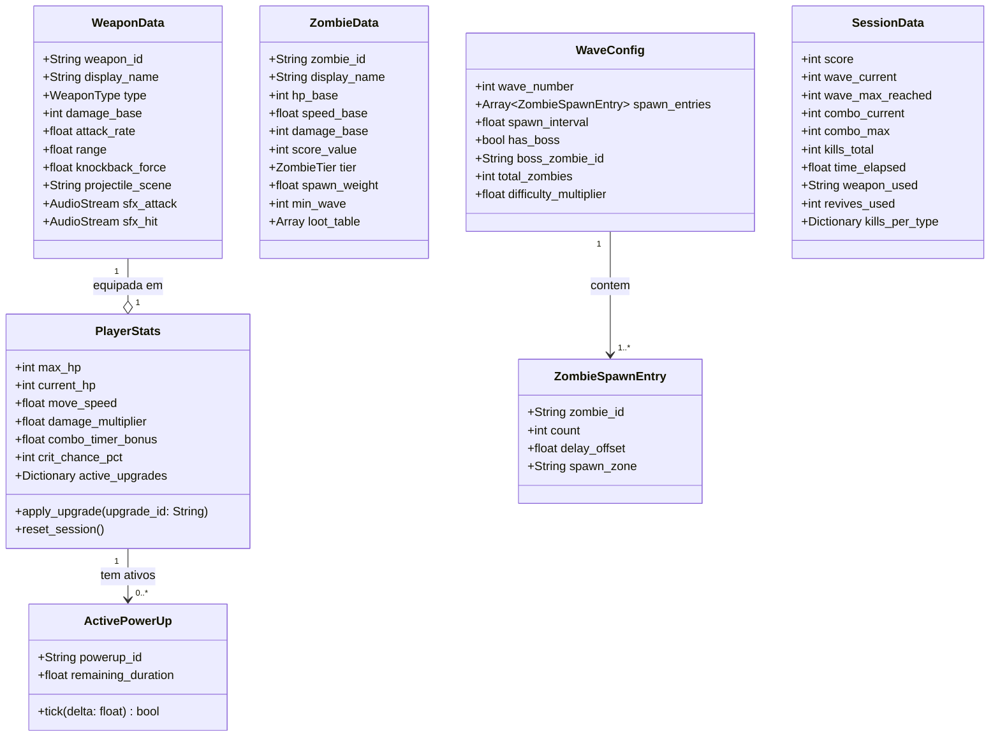
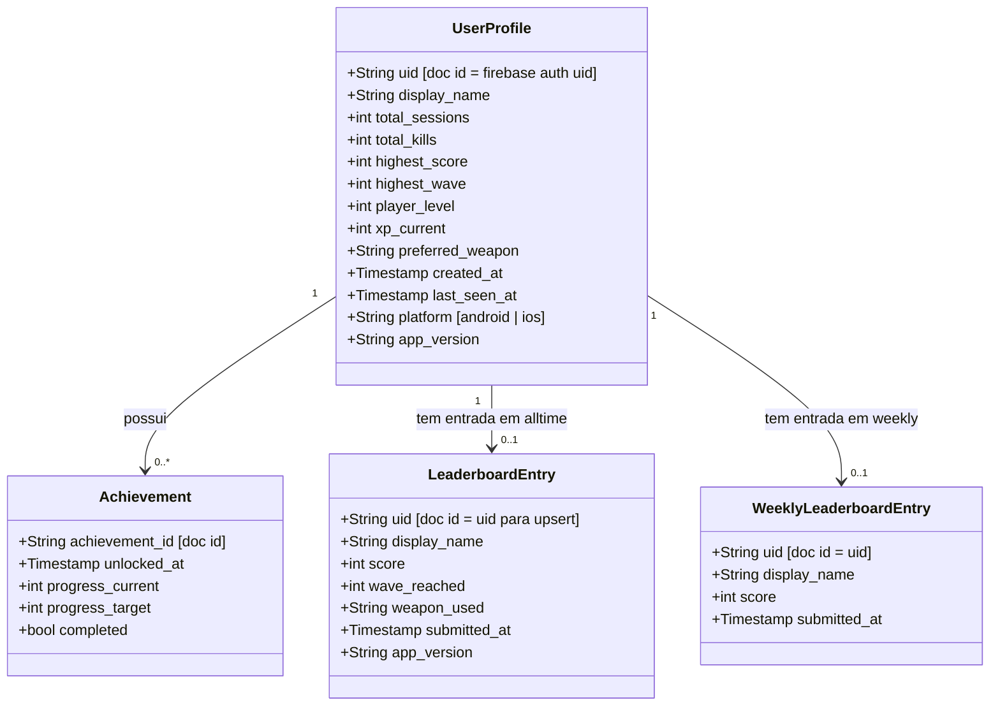
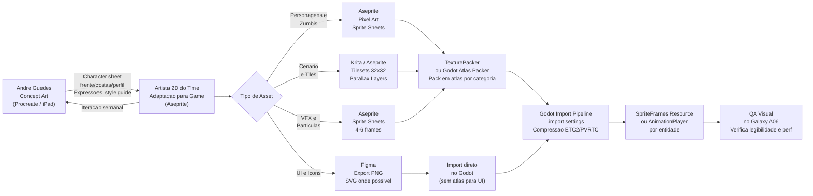
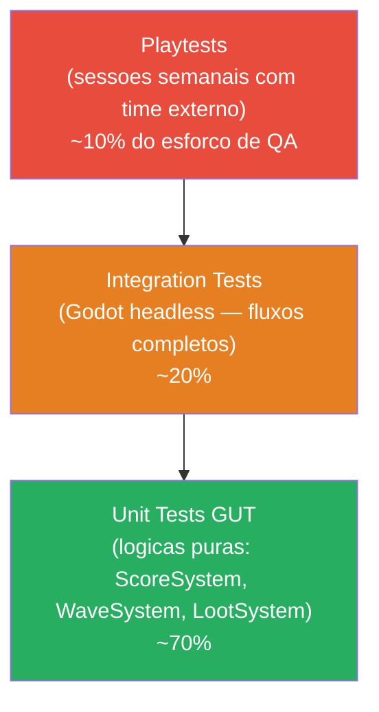
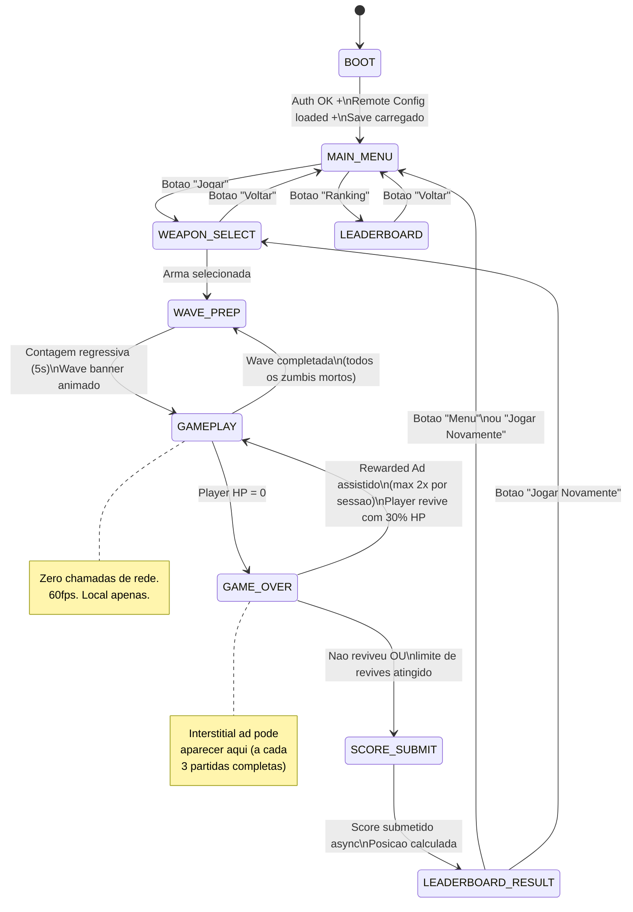
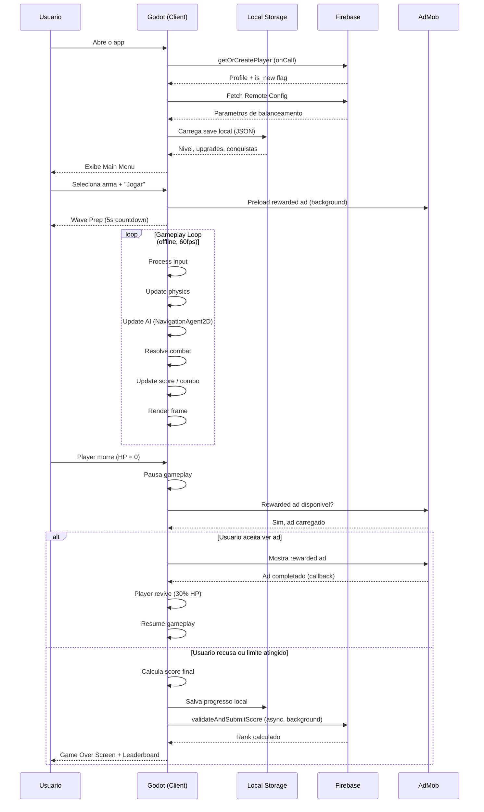
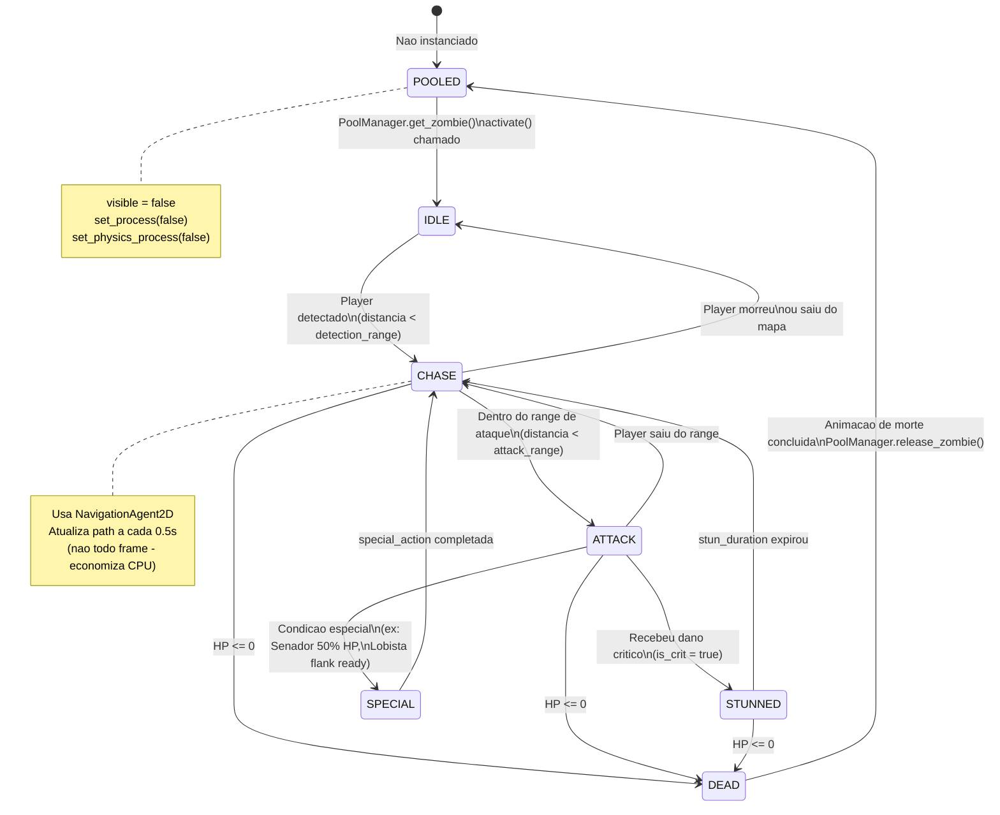
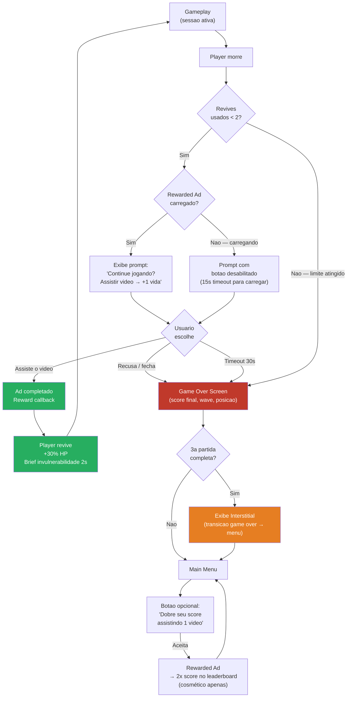

# ZUMBIS DE BRASILIA — Arquitetura Tecnica Detalhada
### Blueprint implementavel para a equipe de 5

**Documento de Arquitetura | Abril 2026**
**Visao: Tim Sweeney | Engenharia de Sistemas e Pipelines**

---

> *"A diferenca entre um jogo que sai e um jogo que nunca termina e o pipeline. Quem controla o pipeline, controla o destino do projeto."*

---

## 1. Diagrama de Arquitetura do Sistema

O sistema e dividido em tres camadas: cliente (Godot), backend (Firebase) e servicos externos. A regra de ouro: **zero chamadas de rede durante o gameplay**. Toda comunicacao com backend e assincrona e ocorre nas transicoes de estado.

```mermaid
graph TB
    subgraph "CLIENTE — Godot 4.4 (OpenGL ES 3.0)"
        direction TB
        BOOT[Boot / Autoloads] --> SM[SceneManager]

        SM --> GAMEPLAY[GameplayScene]
        SM --> MAINMENU[MainMenuScene]
        SM --> GAMEOVER[GameOverScene]

        GAMEPLAY --> GS[GameSystems]
        GS --> WS[WaveSystem]
        GS --> SPAWN[SpawnSystem]
        GS --> COMBAT[CombatSystem]
        GS --> AI[ZombieAISystem]
        GS --> LOOT[LootSystem]
        GS --> SCORE[ScoreSystem]

        GAMEPLAY --> HUD[HUD Layer]
        HUD --> HUD1[VidaBar]
        HUD --> HUD2[ScoreDisplay]
        HUD --> HUD3[WaveCounter]
        HUD --> HUD4[ComboDisplay]
        HUD --> HUD5[PowerUpSlot]

        MAINMENU --> LEADERBOARD[LeaderboardUI]
        MAINMENU --> WEAPONSELECT[WeaponSelectUI]

        GAMEOVER --> ADPROMPT[RewardedAdPrompt]
        GAMEOVER --> SHAREUI[ShareScoreUI]

        subgraph "AUTOLOADS (Singletons)"
            AL1[GameState]
            AL2[SaveSystem]
            AL3[AdsManager]
            AL4[FirebaseManager]
            AL5[AudioManager]
            AL6[PoolManager]
            AL7[RemoteConfigManager]
        end
    end

    subgraph "BACKEND — Firebase (Blaze Plan)"
        FA[Firebase Auth\nAnonymous / Google]
        FS[Cloud Firestore\nleaderboards, profiles]
        CF[Cloud Functions\nTypeScript]
        FCR[Firebase Crashlytics]
        FRC[Firebase Remote Config]
        FANA[Firebase Analytics]
        FCM[Firebase Cloud Messaging]

        CF --> CF1[validateAndSubmitScore]
        CF --> CF2[getWeeklyLeaderboard]
        CF --> CF3[resetWeeklyLeaderboard\nCron: toda segunda]
        CF --> CF4[getPlayerProfile]
    end

    subgraph "SERVICOS EXTERNOS"
        GP[Google Play Store]
        ADM[AdMob + LevelPlay\nMediacao]
        ADM2[Unity Ads / Meta AN\nRedes secundarias]
    end

    AL4 -->|Firebase SDK REST| FA
    AL4 -->|Firebase SDK REST| FS
    AL4 -->|HTTPS onCall| CF
    AL3 -->|Plugin Poing Studios| ADM
    ADM --> ADM2

    FANA -.->|SDK embutido| AL4
    FCR -.->|SDK embutido| AL4
    FRC -.->|SDK embutido| AL7

    style GAMEPLAY fill:#c0392b,color:#fff
    style AL1 fill:#e67e22,color:#fff
    style FA fill:#f39c12,color:#fff
    style FS fill:#f39c12,color:#fff
    style CF fill:#f39c12,color:#fff
    style GP fill:#27ae60,color:#fff
    style ADM fill:#2980b9,color:#fff
```



---

## 2. Estrutura do Projeto Godot

### Folder Structure

```
zumbis-brasilia/
├── project.godot
├── export_presets.cfg
├── .gitignore
├── .gitattributes              # Git LFS para assets binarios
│
├── src/                        # Todo codigo GDScript
│   ├── autoloads/              # Singletons registrados em Project Settings
│   │   ├── game_state.gd
│   │   ├── save_system.gd
│   │   ├── ads_manager.gd
│   │   ├── firebase_manager.gd
│   │   ├── audio_manager.gd
│   │   ├── pool_manager.gd
│   │   └── remote_config_manager.gd
│   │
│   ├── systems/                # Sistemas de jogo (sem Node proprio, injetados na GameScene)
│   │   ├── wave_system.gd
│   │   ├── spawn_system.gd
│   │   ├── combat_system.gd
│   │   ├── score_system.gd
│   │   └── loot_system.gd
│   │
│   ├── entities/               # Scripts de entidades (Player, Zombie, Weapon, Projectile)
│   │   ├── player/
│   │   │   ├── player.gd
│   │   │   ├── player_controller.gd
│   │   │   └── player_stats.gd
│   │   ├── zombies/
│   │   │   ├── zombie_base.gd
│   │   │   ├── zombie_vereador.gd
│   │   │   ├── zombie_assessor.gd
│   │   │   ├── zombie_senador.gd
│   │   │   ├── zombie_lobista.gd
│   │   │   ├── zombie_ministra.gd
│   │   │   ├── zombie_candidato.gd   # Boss
│   │   │   └── zombie_fantasma.gd
│   │   ├── weapons/
│   │   │   ├── weapon_base.gd
│   │   │   ├── weapon_vassoura.gd
│   │   │   ├── weapon_chinelo.gd
│   │   │   ├── weapon_urna.gd
│   │   │   ├── weapon_santinho.gd
│   │   │   └── weapon_microfone.gd
│   │   └── pickups/
│   │       ├── powerup_base.gd
│   │       └── powerup_types.gd
│   │
│   ├── ui/                     # Scripts de UI
│   │   ├── hud.gd
│   │   ├── main_menu.gd
│   │   ├── game_over_screen.gd
│   │   ├── leaderboard_ui.gd
│   │   ├── weapon_select_ui.gd
│   │   └── virtual_joystick.gd
│   │
│   └── utils/                  # Helpers e constantes
│       ├── constants.gd
│       ├── game_events.gd      # Enum central de sinais
│       └── math_utils.gd
│
├── scenes/                     # Arquivos .tscn
│   ├── autoloads/              # (um .tscn por autoload, se precisar de nodes)
│   ├── gameplay/
│   │   ├── gameplay.tscn       # Scene raiz do jogo
│   │   ├── player.tscn
│   │   ├── hud.tscn
│   │   └── map_esplanada.tscn
│   ├── zombies/
│   │   ├── zombie_vereador.tscn
│   │   ├── zombie_assessor.tscn
│   │   ├── zombie_senador.tscn
│   │   ├── zombie_lobista.tscn
│   │   ├── zombie_ministra.tscn
│   │   ├── zombie_candidato.tscn
│   │   └── zombie_fantasma.tscn
│   ├── weapons/
│   │   └── projectile_base.tscn
│   ├── pickups/
│   │   └── powerup.tscn
│   └── ui/
│       ├── main_menu.tscn
│       ├── game_over.tscn
│       ├── leaderboard.tscn
│       └── weapon_select.tscn
│
├── assets/                     # Assets importados pelo Godot
│   ├── sprites/
│   │   ├── player/
│   │   │   └── player_atlas.png        # Sprite sheet unico por entidade
│   │   ├── zombies/
│   │   │   ├── vereador_atlas.png
│   │   │   ├── assessor_atlas.png
│   │   │   ├── senador_atlas.png
│   │   │   ├── lobista_atlas.png
│   │   │   ├── ministra_atlas.png
│   │   │   ├── candidato_atlas.png
│   │   │   └── fantasma_atlas.png
│   │   ├── weapons/
│   │   ├── ui/
│   │   ├── fx/
│   │   └── map/
│   │       ├── esplanada_tileset.png
│   │       ├── parallax_ceu.png
│   │       ├── parallax_congresso.png
│   │       ├── parallax_arvores.png
│   │       └── parallax_chao.png
│   ├── audio/
│   │   ├── sfx/
│   │   └── music/
│   └── fonts/
│
├── addons/                     # Plugins Godot
│   ├── godot-admob-plugin/     # Poing Studios
│   ├── firebase_rest/          # Firebase SDK via REST (custom ou community)
│   └── gut/                    # GUT: Godot Unit Testing
│
└── tests/                      # Testes GUT
    ├── unit/
    └── integration/
```

### Scene Tree — Gameplay Scene

```
gameplay.tscn
└── Gameplay (Node2D) [gameplay.gd]
    ├── World
    │   ├── ParallaxBackground
    │   │   ├── ParallaxLayer_Ceu
    │   │   ├── ParallaxLayer_Congresso
    │   │   ├── ParallaxLayer_Arvores
    │   │   └── ParallaxLayer_Chao
    │   ├── TileMap (mapa_esplanada)
    │   └── Obstacles (Node2D — colunas, helicoptero, etc.)
    ├── Entities
    │   ├── Player (CharacterBody2D) [player.gd]
    │   │   ├── AnimatedSprite2D
    │   │   ├── CollisionShape2D
    │   │   ├── HitboxArea (Area2D)
    │   │   ├── WeaponPivot (Node2D)
    │   │   └── VirtualJoystick (CanvasLayer)
    │   ├── ZombiePool (Node2D — gerenciado pelo PoolManager)
    │   ├── ProjectilePool (Node2D)
    │   └── PickupPool (Node2D)
    ├── Systems
    │   ├── WaveSystem (Node) [wave_system.gd]
    │   ├── SpawnSystem (Node) [spawn_system.gd]
    │   ├── CombatSystem (Node) [combat_system.gd]
    │   ├── ScoreSystem (Node) [score_system.gd]
    │   └── LootSystem (Node) [loot_system.gd]
    └── HUD (CanvasLayer) [hud.gd]
        ├── VidaBar
        ├── ScoreLabel
        ├── WaveLabel
        ├── ComboDisplay
        ├── PowerUpSlot
        └── WaveStartBanner
```

### Autoloads (Singletons) — Project Settings

| Autoload | Arquivo | Responsabilidade |
|---|---|---|
| `GameState` | `src/autoloads/game_state.gd` | Estado global: sessao atual, score, vida, wave, upgrades do player |
| `SaveSystem` | `src/autoloads/save_system.gd` | Leitura/escrita de save local (JSON encriptado) |
| `AdsManager` | `src/autoloads/ads_manager.gd` | Interface com plugin AdMob: rewarded, interstitial, estado de carregamento |
| `FirebaseManager` | `src/autoloads/firebase_manager.gd` | Auth, Firestore, Cloud Functions calls (async) |
| `AudioManager` | `src/autoloads/audio_manager.gd` | Controle de buses: SFX, Music, UI. Volume, mute |
| `PoolManager` | `src/autoloads/pool_manager.gd` | Object pools pre-alocados para zombies, projéteis e FX |
| `RemoteConfigManager` | `src/autoloads/remote_config_manager.gd` | Cache e acesso a parametros do Firebase Remote Config |

### Sistema de Sinais (Event Bus)

Todos os sinais do jogo sao definidos em `src/utils/game_events.gd` como autoload. Evita acoplamento direto entre sistemas.

```gdscript
# src/utils/game_events.gd
extends Node

# --- Combat ---
signal zombie_damaged(zombie: ZombieBase, amount: float, is_critical: bool)
signal zombie_killed(zombie: ZombieBase, position: Vector2)
signal player_damaged(amount: float, source: Node)
signal player_died()
signal hit_landed(position: Vector2, damage: float)  # para VFX

# --- Wave ---
signal wave_started(wave_number: int, wave_data: Dictionary)
signal wave_completed(wave_number: int, score_earned: int)
signal boss_spawned(boss: ZombieBase)
signal all_waves_cleared()

# --- Score / Combo ---
signal score_changed(new_score: int)
signal combo_changed(new_combo: int, multiplier: float)
signal combo_broken()

# --- Pickup ---
signal powerup_collected(powerup_type: String, duration: float)
signal powerup_expired(powerup_type: String)

# --- Session ---
signal game_started(weapon_id: String)
signal game_over(final_score: int, max_wave: int, max_combo: int)
signal session_resumed_via_ad()

# --- Ads ---
signal rewarded_ad_ready()
signal rewarded_ad_completed(reward_type: String)
signal rewarded_ad_failed()
signal interstitial_closed()
```

---

## 3. Data Model

### Entidades do Jogo (runtime — em memoria, nao persistidas)



### Entidades Persistidas — Firebase Firestore



### Enums Centrais (constants.gd)

```gdscript
# src/utils/constants.gd
enum WeaponType { MELEE, RANGED, AREA, PIERCE, HEAVY }
enum ZombieTier { BASIC, MEDIUM, TANK, ESQUIVO, SPECIAL, BOSS, SUPPORT }
enum PowerUpType {
    PROPINA,         # +50% velocidade 15s
    CPI_IMAGINARIA,  # congelamento 5s
    TAPA_SAGRADA,    # 3x dano 10s
    ESCUDO,          # invulneravel 4s
    CURA_PIPAS,      # cura 30% hp
    ORCAMENTO,       # 2x score 20s
}
enum SpawnZone { NORTE, SUL, LESTE, OESTE, ESTACIONAMENTO }
enum GamePhase { BOOT, MAIN_MENU, WEAPON_SELECT, WAVE_PREP, GAMEPLAY, GAME_OVER, LEADERBOARD }
```

---

## 4. Game Systems

### Abordagem: Scene-Based com Sistemas Injetados

Optamos por **scene-based** (nao ECS puro) por tres razoes:
1. Godot e nativo scene-based. Lutar contra o engine custa mais do que ganhar.
2. A equipe e pequena. ECS exige infraestrutura de componente que atrasa o inicio.
3. Para o escopo do MVP (150 sprites em tela), scene-based com pooling e suficiente. ECS so compensaria acima de 1.000+ entidades.

O que adotamos e um hibrido: entidades sao nodes (`CharacterBody2D`, `Area2D`), mas a **logica de sistema** (wave, spawn, combat, loot, score) fica em nodes separados injetados na GameScene. Os sistemas se comunicam exclusivamente via `GameEvents` (bus de sinais).

### 4.1 Wave System

```gdscript
# src/systems/wave_system.gd
class_name WaveSystem extends Node

const WAVE_CONFIGS: Array[WaveConfig] = []  # carregado de JSON via RemoteConfig

var current_wave: int = 0
var zombies_alive: int = 0
var wave_active: bool = false

func start_next_wave() -> void:
    current_wave += 1
    var config := _get_wave_config(current_wave)
    GameEvents.wave_started.emit(current_wave, config)
    await get_tree().create_timer(5.0).timeout  # prep time com banner
    SpawnSystem.execute_wave(config)
    wave_active = true

func _on_zombie_killed(_zombie, _pos) -> void:
    zombies_alive -= 1
    if zombies_alive <= 0 and wave_active:
        _complete_wave()

func _complete_wave() -> void:
    wave_active = false
    GameEvents.wave_completed.emit(current_wave, ScoreSystem.get_wave_bonus())
    await get_tree().create_timer(3.0).timeout
    start_next_wave()

func _get_wave_config(wave_num: int) -> WaveConfig:
    # Gera config dinamicamente baseado em formula de dificuldade
    # ou usa config predefinido para waves 1-10
    pass
```

**Formula de Dificuldade:**
- `total_zombies(w) = 5 + (w * 3)`
- `hp_multiplier(w) = 1.0 + (w * 0.15)`
- `speed_multiplier(w) = 1.0 + (w * 0.05)` (cap em 1.8x)
- Boss spawna na wave 5, 10, 15... (multiplos de 5)
- A partir da wave 8, Lobista e Fantasma comecam a aparecer

### 4.2 Spawn System

```gdscript
# src/systems/spawn_system.gd
class_name SpawnSystem extends Node

# Spawn points ficam em areas fora da camera, nunca em frente ao jogador
@export var spawn_zones: Dictionary = {
    SpawnZone.NORTE: [],
    SpawnZone.SUL: [],
    SpawnZone.LESTE: [],
    SpawnZone.OESTE: [],
    SpawnZone.ESTACIONAMENTO: []
}

func execute_wave(config: WaveConfig) -> void:
    for entry in config.spawn_entries:
        await get_tree().create_timer(entry.delay_offset).timeout
        _spawn_batch(entry)

func _spawn_batch(entry: ZombieSpawnEntry) -> void:
    for i in entry.count:
        var zombie := PoolManager.get_zombie(entry.zombie_id)
        var pos := _get_spawn_position(entry.spawn_zone)
        zombie.global_position = pos
        zombie.activate()
        WaveSystem.zombies_alive += 1
        # escalonar spawns para nao dropar FPS
        if i % 3 == 0:
            await get_tree().process_frame

func _get_spawn_position(zone: SpawnZone) -> Vector2:
    # retorna posicao aleatoria dentro da zona, fora do frustum da camera
    var points: Array = spawn_zones[zone]
    return points.pick_random()
```

### 4.3 Combat System

```gdscript
# src/systems/combat_system.gd
class_name CombatSystem extends Node

const HIT_STOP_FRAMES: int = 3
const SCREEN_SHAKE_NORMAL: float = 2.0
const SCREEN_SHAKE_KILL: float = 5.0
const CRIT_MULTIPLIER: float = 2.0
const HEADSHOT_MULTIPLIER: float = 1.5

func process_hit(attacker: Node, target: ZombieBase, weapon: WeaponData, hit_area: String = "body") -> void:
    var damage := _calculate_damage(weapon, hit_area)
    var is_crit := randf() < (PlayerStats.crit_chance_pct / 100.0)
    if is_crit:
        damage = int(damage * CRIT_MULTIPLIER)

    # Hit feedback
    _apply_hit_stop(HIT_STOP_FRAMES)
    _show_damage_number(target.global_position, damage, is_crit)
    target.flash_hit()

    GameEvents.hit_landed.emit(target.global_position, damage)
    target.take_damage(damage)

    if target.is_dead():
        _process_kill(target)

func _process_kill(zombie: ZombieBase) -> void:
    GameEvents.zombie_killed.emit(zombie, zombie.global_position)
    CameraShake.shake(SCREEN_SHAKE_KILL)
    AudioManager.play_sfx(zombie.death_sfx)
    ScoreSystem.register_kill(zombie)
    LootSystem.roll_drop(zombie)

func _calculate_damage(weapon: WeaponData, hit_area: String) -> int:
    var base := weapon.damage_base
    var multiplier := GameState.damage_multiplier
    if hit_area == "head":
        multiplier *= HEADSHOT_MULTIPLIER
    return int(base * multiplier * ScoreSystem.combo_multiplier)

func _apply_hit_stop(frames: int) -> void:
    Engine.time_scale = 0.05
    await get_tree().create_timer(frames / 60.0 * 0.05).timeout
    Engine.time_scale = 1.0
```

### 4.4 Zombie AI System

Cada ZombieBase implementa um estado de AI simples via `StateMachine`:

```
Estados: IDLE → CHASE → ATTACK → STUNNED → DEAD

ZombieBase (CharacterBody2D)
├── StateMachine (Node)
│   ├── StateIdle
│   ├── StateChase       # navega em direcao ao player (NavigationAgent2D)
│   ├── StateAttack      # dentro do range de ataque
│   ├── StateStunned     # apos receber dano critico
│   └── StateDead        # animacao de morte, aguarda pool release
├── AnimatedSprite2D
├── CollisionShape2D
├── HurtboxArea (Area2D)  # detecta ataques do player
├── NavigationAgent2D     # pathfinding pelo TileMap
└── HealthBar (opcional, para boss)
```

**Comportamentos Especificos por Tipo:**

| Zumbi | Estado Custom | Logica |
|---|---|---|
| Vereador | Chase simples | NavigationAgent2D direto ao player |
| Assessor | Chase + Zigzag | Alterna direcao a cada 1.5s, dispara projétil a cada 3s |
| Senador | Chase lento + Imunidade | A 50% HP, ativa `immune_timer` 3s; a 10% HP, `speed *= 1.3` |
| Lobista | Flank + Buff | Calcula posicao 90 graus do player, buffa zumbis em raio 150px |
| Ministra | Area spawn | Nao ataca, cria `BudgetCutZone` a cada 5s no proprio tile |
| Candidato | Boss FSM | Fases: Normal → Discurso (AOE) → Invoca adds → Segundo Turno |
| Fantasma | Chase com debuff | Semi-transparente, aplica debuff de velocidade ao colidir |

### 4.5 Loot System

```gdscript
# src/systems/loot_system.gd
class_name LootSystem extends Node

# Tabela de drops por tipo de zumbi (peso relativo)
const DROP_TABLES: Dictionary = {
    "vereador":  [["none", 70], ["propina", 20], ["cura_pipas", 10]],
    "assessor":  [["none", 60], ["propina", 30], ["orcamento", 10]],
    "senador":   [["none", 40], ["escudo", 35], ["tapa_sagrada", 25]],
    "lobista":   [["none", 50], ["propina", 30], ["orcamento", 20]],
    "ministra":  [["none", 0], ["emenda_const", 100]],  # drop garantido
    "fantasma":  [["none", 60], ["cura_pipas", 40]],
    "candidato": [["cpi_imaginaria", 60], ["tapa_sagrada", 40]],  # boss: drop garantido
}

func roll_drop(zombie: ZombieBase) -> void:
    var table: Array = DROP_TABLES.get(zombie.zombie_id, [["none", 100]])
    var drop_id := _weighted_pick(table)
    if drop_id != "none":
        _spawn_pickup(drop_id, zombie.global_position)

func _spawn_pickup(powerup_id: String, pos: Vector2) -> void:
    var pickup := PoolManager.get_pickup()
    pickup.setup(powerup_id)
    pickup.global_position = pos + Vector2(randf_range(-20, 20), randf_range(-20, 20))

func _weighted_pick(table: Array) -> String:
    var total_weight := table.reduce(func(acc, e): return acc + e[1], 0)
    var roll := randi() % total_weight
    var cumulative := 0
    for entry in table:
        cumulative += entry[1]
        if roll < cumulative:
            return entry[0]
    return "none"
```

### 4.6 Score System

```gdscript
# src/systems/score_system.gd
class_name ScoreSystem extends Node

const COMBO_TIERS: Array[Array] = [
    [0, 1.0], [5, 1.5], [10, 2.0], [20, 3.0], [30, 4.0]
]
const COMBO_RESET_TIME: float = 3.0

var score: int = 0
var combo: int = 0
var combo_multiplier: float = 1.0
var _combo_timer: float = 0.0

func _process(delta: float) -> void:
    if combo > 0:
        _combo_timer -= delta
        if _combo_timer <= 0.0:
            _reset_combo()

func register_kill(zombie: ZombieBase) -> void:
    combo += 1
    _combo_timer = COMBO_RESET_TIME + GameState.combo_timer_bonus
    combo_multiplier = _get_multiplier(combo)
    var points := int(zombie.score_value * combo_multiplier)
    score += points
    GameState.score = score
    GameEvents.score_changed.emit(score)
    GameEvents.combo_changed.emit(combo, combo_multiplier)

func get_wave_bonus() -> int:
    return int(score * 0.05)  # 5% bonus ao completar wave

func _reset_combo() -> void:
    combo = 0
    combo_multiplier = 1.0
    GameEvents.combo_broken.emit()

func _get_multiplier(c: int) -> float:
    var result := 1.0
    for tier in COMBO_TIERS:
        if c >= tier[0]: result = tier[1]
        else: break
    return result
```

### 4.7 Object Pool System

```gdscript
# src/autoloads/pool_manager.gd
# Pre-aloca todos os objetos na inicializacao. Zero new() durante gameplay.

const POOL_SIZES: Dictionary = {
    "vereador": 15, "assessor": 10, "senador": 4, "lobista": 4,
    "ministra": 2, "candidato": 2, "fantasma": 8,
    "projectile_chinelo": 20, "projectile_santinho": 30,
    "pickup": 10, "damage_number": 30, "hit_fx": 20
}

var _pools: Dictionary = {}

func _ready() -> void:
    for pool_id in POOL_SIZES:
        _pools[pool_id] = []
        for i in POOL_SIZES[pool_id]:
            var scene_path := _resolve_scene(pool_id)
            var instance := load(scene_path).instantiate()
            instance.visible = false
            instance.set_process(false)
            add_child(instance)
            _pools[pool_id].append(instance)

func get_zombie(zombie_id: String) -> ZombieBase:
    return _get_from_pool(zombie_id)

func release_zombie(zombie: ZombieBase) -> void:
    zombie.visible = false
    zombie.set_process(false)
    zombie.set_physics_process(false)

func _get_from_pool(pool_id: String) -> Node:
    for obj in _pools[pool_id]:
        if not obj.visible:
            return obj
    push_warning("Pool esgotado para: %s" % pool_id)
    return null
```

---

## 5. Firebase Schema

### Firestore Collections

```
firestore/
├── users/
│   └── {uid}/                          # documento do usuario
│       ├── display_name: string
│       ├── total_sessions: number
│       ├── total_kills: number
│       ├── highest_score: number
│       ├── highest_wave: number
│       ├── player_level: number        # 1-20 (MVP)
│       ├── xp_current: number
│       ├── preferred_weapon: string
│       ├── created_at: timestamp
│       ├── last_seen_at: timestamp
│       ├── platform: string            # "android" | "ios"
│       └── app_version: string
│       │
│       └── achievements/               # sub-colecao
│           └── {achievement_id}/
│               ├── progress_current: number
│               ├── progress_target: number
│               ├── completed: boolean
│               └── unlocked_at: timestamp
│
├── leaderboard_alltime/
│   └── {uid}/                          # 1 doc por usuario (upsert)
│       ├── display_name: string
│       ├── score: number
│       ├── wave_reached: number
│       ├── weapon_used: string
│       └── submitted_at: timestamp
│
├── leaderboard_weekly/
│   └── {uid}/
│       ├── display_name: string
│       ├── score: number
│       └── submitted_at: timestamp
│
└── game_config/
    └── balance_v1/                     # documento de balanceamento (lido via CF)
        ├── wave_difficulty_multiplier: number
        ├── ads_interstitial_frequency: number
        ├── ads_rewarded_max_per_session: number
        └── feature_flags: map
```

**Regras de Seguranca (Firestore Rules):**

```javascript
rules_version = '2';
service cloud.firestore {
  match /databases/{database}/documents {

    // Usuario so pode ler/escrever o proprio perfil
    match /users/{uid} {
      allow read, write: if request.auth != null && request.auth.uid == uid;

      match /achievements/{achievementId} {
        allow read, write: if request.auth != null && request.auth.uid == uid;
      }
    }

    // Leaderboard: qualquer autenticado pode ler.
    // Escrita APENAS via Cloud Function (server-side validation)
    match /leaderboard_alltime/{uid} {
      allow read: if request.auth != null;
      allow write: if false;  // somente via CF
    }

    match /leaderboard_weekly/{uid} {
      allow read: if request.auth != null;
      allow write: if false;
    }

    // Config: apenas leitura
    match /game_config/{document} {
      allow read: if request.auth != null;
      allow write: if false;
    }
  }
}
```

### Firebase Remote Config — Parametros

| Parametro | Tipo | Valor Default | Uso |
|---|---|---|---|
| `wave_difficulty_multiplier` | float | 1.0 | Escalar dificuldade globalmente sem update |
| `ads_interstitial_frequency` | int | 3 | Partidas entre interstitials |
| `ads_rewarded_max_per_session` | int | 2 | Max revives por sessao |
| `particle_quality_low_end` | float | 0.5 | Reducao de particulas em devices weak |
| `spawn_rate_multiplier` | float | 1.0 | Ajuste global de spawn para eventos |
| `feature_share_score` | bool | true | Kill switch do botao de share |
| `feature_leaderboard` | bool | true | Kill switch do leaderboard |
| `event_name` | string | "" | Nome de evento ativo (ex: "Eleicoes 2026") |
| `event_wave_modifier` | string | "" | JSON com config especial de evento |
| `max_zombies_screen` | int | 25 | Cap de zumbis em tela simultaneos |

### Firebase Analytics — Eventos Custom

```javascript
// Eventos registrados via FirebaseManager.log_event()

// Sessao
"session_start"          { weapon_id, player_level }
"session_end"            { score, wave_reached, duration_sec, cause: "death"|"quit" }

// Gameplay
"wave_completed"         { wave_number, score_at_wave, kills_in_wave }
"player_died"            { wave_number, score, combo_max, kill_cause: string }
"combo_milestone"        { combo_count, multiplier, weapon_id }
"powerup_collected"      { powerup_id, wave_number }

// Monetizacao
"ad_rewarded_shown"      { placement: "revive"|"powerup"|"score_double" }
"ad_rewarded_completed"  { placement, reward }
"ad_rewarded_failed"     { placement }
"ad_interstitial_shown"  {}
"ad_interstitial_closed" {}

// Retencao
"tutorial_completed"     { duration_sec }
"leaderboard_viewed"     { position: int }
"score_shared"           { platform: "whatsapp"|"instagram"|"tiktok"|"other" }

// Erros (complementa Crashlytics)
"firebase_sync_failed"   { error_code: string }
"pool_exhausted"         { pool_id: string }
```

---

## 6. API Design — Cloud Functions

Todas as functions usam `onCall` (autenticadas via Firebase Auth token). Escritas em TypeScript.

### 6.1 validateAndSubmitScore

**Trigger:** `onCall`
**Chamada:** Ao fim de cada sessao com score > 0

```typescript
// functions/src/submitScore.ts
interface SubmitScoreRequest {
  score: number;
  wave_reached: number;
  weapon_used: string;
  session_duration_sec: number;
  kills_total: number;
  // checksum simples para dificultar adulteracao trivial
  checksum: string;
}

export const validateAndSubmitScore = onCall(async (request) => {
  const uid = request.auth?.uid;
  if (!uid) throw new HttpsError("unauthenticated", "Auth required");

  const data = request.data as SubmitScoreRequest;

  // Validacao basica (nao anti-cheat robusto — MVP nao precisa)
  const maxScorePerSecond = 500;  // score impossivel de atingir honestamente
  const estimatedMaxScore = data.session_duration_sec * maxScorePerSecond;
  if (data.score > estimatedMaxScore) {
    logger.warn("Score suspeito", { uid, score: data.score });
    // nao rejeita — apenas loga. Anti-cheat real e Fase 2.
  }

  const db = getFirestore();
  const batch = db.batch();

  // Atualiza leaderboard all-time (upsert pelo maior score)
  const alltimeRef = db.doc(`leaderboard_alltime/${uid}`);
  const existing = await alltimeRef.get();
  if (!existing.exists || existing.data()!.score < data.score) {
    batch.set(alltimeRef, {
      display_name: (await db.doc(`users/${uid}`).get()).data()?.display_name ?? "Cidadao",
      score: data.score,
      wave_reached: data.wave_reached,
      weapon_used: data.weapon_used,
      submitted_at: FieldValue.serverTimestamp(),
    });
  }

  // Atualiza leaderboard semanal (sempre sobrescreve se score maior)
  const weeklyRef = db.doc(`leaderboard_weekly/${uid}`);
  const existingWeekly = await weeklyRef.get();
  if (!existingWeekly.exists || existingWeekly.data()!.score < data.score) {
    batch.set(weeklyRef, {
      display_name: (await db.doc(`users/${uid}`).get()).data()?.display_name ?? "Cidadao",
      score: data.score,
      submitted_at: FieldValue.serverTimestamp(),
    });
  }

  // Atualiza perfil do usuario
  const userRef = db.doc(`users/${uid}`);
  batch.update(userRef, {
    total_sessions: FieldValue.increment(1),
    total_kills: FieldValue.increment(data.kills_total),
    highest_score: Math.max((existing.data()?.score ?? 0), data.score),
    highest_wave: Math.max((existing.data()?.wave_reached ?? 0), data.wave_reached),
    last_seen_at: FieldValue.serverTimestamp(),
  });

  await batch.commit();

  // Retorna posicao no leaderboard
  const rank = await _calculateRank(uid, data.score);
  return { success: true, rank_alltime: rank };
});
```

### 6.2 getWeeklyLeaderboard

```typescript
// Retorna top 100 semanal + posicao do caller
export const getWeeklyLeaderboard = onCall(async (request) => {
  const uid = request.auth?.uid;
  if (!uid) throw new HttpsError("unauthenticated", "Auth required");

  const db = getFirestore();
  const top100 = await db.collection("leaderboard_weekly")
    .orderBy("score", "desc")
    .limit(100)
    .get();

  const entries = top100.docs.map((doc, idx) => ({
    rank: idx + 1,
    uid: doc.id,
    display_name: doc.data().display_name,
    score: doc.data().score,
    is_self: doc.id === uid,
  }));

  // Se o caller nao esta no top 100, busca posicao dele
  const isInTop100 = entries.some(e => e.is_self);
  let player_rank = null;
  if (!isInTop100) {
    player_rank = await _calculateWeeklyRank(uid);
  }

  return { entries, player_rank };
});
```

### 6.3 resetWeeklyLeaderboard (Cron)

```typescript
// Executa toda segunda-feira às 00:00 BRT (UTC-3 = 03:00 UTC)
export const resetWeeklyLeaderboard = onSchedule("0 3 * * 1", async () => {
  const db = getFirestore();

  // 1. Salva winners antes de limpar
  const top10 = await db.collection("leaderboard_weekly")
    .orderBy("score", "desc").limit(10).get();

  // 2. Apaga todos os documentos da collection semanal
  // (em batches de 500 para nao estourar limite)
  const all = await db.collection("leaderboard_weekly").get();
  const batchSize = 500;
  for (let i = 0; i < all.docs.length; i += batchSize) {
    const batch = db.batch();
    all.docs.slice(i, i + batchSize).forEach(doc => batch.delete(doc.ref));
    await batch.commit();
  }

  logger.info(`Leaderboard semanal resetado. Top 10 da semana anterior salvo.`);
});
```

### 6.4 getOrCreatePlayer

```typescript
// Chamado no boot do app. Cria perfil se for novo usuario.
export const getOrCreatePlayer = onCall(async (request) => {
  const uid = request.auth?.uid;
  if (!uid) throw new HttpsError("unauthenticated", "Auth required");

  const db = getFirestore();
  const userRef = db.doc(`users/${uid}`);
  const snapshot = await userRef.get();

  if (!snapshot.exists) {
    await userRef.set({
      display_name: `Cidadao${Math.floor(Math.random() * 9999)}`,
      total_sessions: 0,
      total_kills: 0,
      highest_score: 0,
      highest_wave: 0,
      player_level: 1,
      xp_current: 0,
      preferred_weapon: "vassoura",
      created_at: FieldValue.serverTimestamp(),
      last_seen_at: FieldValue.serverTimestamp(),
      platform: request.data.platform ?? "android",
      app_version: request.data.app_version ?? "0.0.0",
    });
    return { is_new: true };
  }

  await userRef.update({ last_seen_at: FieldValue.serverTimestamp() });
  return { is_new: false, profile: snapshot.data() };
});
```

---

## 7. Asset Pipeline

### Workflow de Producao (Andre Guedes → Godot)



### Especificacoes Tecnicas de Assets

| Asset | Resolucao | Frames por Anim | Atlas? | Compressao |
|---|---|---|---|---|
| Player (idle, walk, attack x5, death, hurt) | 128x128 px | 6-12 | Sim (player_atlas.png) | ETC2 Android / PVRTC iOS |
| Zumbi Vereador (walk, attack, death, hurt) | 96x96 px | 6-8 por anim | Sim (vereador_atlas.png) | ETC2 / PVRTC |
| Zumbi Senador | 112x112 px | 6-8 | Sim | ETC2 / PVRTC |
| Zumbi Candidato (boss) | 160x160 px | 8-12 | Sim | ETC2 / PVRTC |
| Tileset Esplanada | 32x32 px tiles | N/A | Sim (tileset_atlas.png) | ETC2 / PVRTC |
| Parallax Fundo (4 layers) | 1280x720 px | N/A | Nao (muito grande) | ETC2 / PVRTC |
| Projéteis (chinelo, santinho, urna) | 32x32 px | 4-6 | Sim (projectiles_atlas.png) | ETC2 / PVRTC |
| VFX (hit, explosion, death) | 64x64 px | 4-8 | Sim (vfx_atlas.png) | ETC2 / PVRTC |
| UI Icons e Botoes | variavel | N/A | Nao | Sem compressao (max qual) |
| Fontes | TTF | N/A | N/A | DynamicFont resource |

### Convencoes de Nomenclatura de Assets

```
sprites/
├── player/
│   └── player_atlas.png         # player_<categoria>.png
├── zombies/
│   └── {zombie_id}_atlas.png    # vereador_atlas.png, senador_atlas.png
├── weapons/
│   └── {weapon_id}_atlas.png    # vassoura_atlas.png
├── fx/
│   └── fx_{efeito}_atlas.png    # fx_hit_atlas.png, fx_death_atlas.png
└── map/
    ├── tileset_esplanada.png
    └── parallax_{layer}.png     # parallax_ceu.png, parallax_congresso.png

Animacoes (SpriteFrames):
  idle, walk_n, walk_s, walk_e, walk_w,
  attack_1, attack_2, hurt, death, special
```

### Convencoes de Audio

```
audio/
├── sfx/
│   ├── player_hurt.ogg
│   ├── player_death.ogg
│   ├── weapon_vassoura_swing.ogg
│   ├── weapon_vassoura_hit.ogg
│   ├── weapon_chinelo_throw.ogg
│   ├── weapon_chinelo_hit.ogg
│   ├── weapon_urna_throw.ogg
│   ├── weapon_urna_explode.ogg
│   ├── zombie_{id}_death.ogg
│   ├── zombie_{id}_hurt.ogg
│   ├── zombie_{id}_attack.ogg
│   ├── powerup_collect.ogg
│   ├── combo_up.ogg
│   ├── wave_start.ogg
│   └── wave_complete.ogg
└── music/
    ├── theme_main_menu.ogg      # streaming
    ├── theme_gameplay.ogg       # streaming
    └── theme_game_over.ogg      # streaming
```

**Formatos:**
- SFX: `.ogg` mono, 44.1kHz, carregados em memoria (< 1MB cada)
- Musica: `.ogg` stereo, 44.1kHz, **streaming** (nunca na RAM inteira)
- Audio buses: `Master > Music (vol), SFX (vol), UI (vol)` — controlaveis individualmente

---

## 8. CI/CD Pipeline

### Diagrama CI/CD

```mermaid
graph TD
    DEV["Developer\nGit Push"] --> GH["GitHub Repository"]

    GH --> |"PR aberto\nqualquer branch"| PRCI

    subgraph "CI — GitHub Actions"
        PRCI["Trigger: pull_request"]
        PRCI --> LINT["gdscript-lint\n(gdtoolkit)"]
        PRCI --> UNIT["GUT Tests\n(Godot headless)"]
        LINT --> GATE1{Passou?}
        UNIT --> GATE1
        GATE1 -->|Falhou| BLOCK["Block Merge\nNotifica autor"]
    end

    GH --> |"Push em develop"| DEVBUILD

    subgraph "CD Develop — Codemagic"
        DEVBUILD["Trigger: develop branch"]
        DEVBUILD --> BUILDDEBUG["Build Android Debug\n(export_presets.cfg)"]
        BUILDDEBUG --> FADIST["Firebase App Distribution\n(QA interno)"]
        FADIST --> SLACK_DEV["Notifica Discord\n#builds canal"]
    end

    GH --> |"Push em main\n(apos PR merge)"| MAINBUILD

    subgraph "CD Main — Codemagic"
        MAINBUILD["Trigger: main branch"]
        MAINBUILD --> BUILDREL_A["Build Android Release\n(AAB assinado)"]
        MAINBUILD --> BUILDREL_I["Build iOS Release\n(IPA assinado)"]
        BUILDREL_A --> QA_GATE{QA Aprovado?\n(manual)}
        BUILDREL_I --> QA_GATE
        QA_GATE -->|Sim| PLAYCONSOLE["Google Play Console\nInternal Testing Track"]
        QA_GATE -->|Sim| TESTFLIGHT["TestFlight\nInternal Testing"]
        QA_GATE -->|Nao| BLOCK2["Nao promove\nAbrir bug"]
        PLAYCONSOLE --> BETA["Play Store\nOpen Beta (manual)"]
        TESTFLIGHT --> APPBETA["App Store\nTestFlight Public (manual)"]
        BETA --> PROD["Play Store\nProd (manual)"]
        APPBETA --> APPPROD["App Store\nProd (manual)"]
    end

    style GATE1 fill:#e74c3c,color:#fff
    style QA_GATE fill:#e74c3c,color:#fff
    style PROD fill:#27ae60,color:#fff
    style APPPROD fill:#27ae60,color:#fff
```

### GitHub Actions — Workflow de CI

```yaml
# .github/workflows/ci.yml
name: CI

on:
  pull_request:
    branches: [main, develop]
  push:
    branches: [develop]

jobs:
  lint:
    name: GDScript Lint
    runs-on: ubuntu-latest
    steps:
      - uses: actions/checkout@v4
      - uses: actions/setup-python@v5
        with:
          python-version: "3.12"
      - name: Install gdtoolkit
        run: pip install gdtoolkit==4.*
      - name: Run gdlint
        run: gdlint src/

  test:
    name: Unit Tests (GUT)
    runs-on: ubuntu-latest
    container:
      image: barichello/godot-ci:4.4
    steps:
      - uses: actions/checkout@v4
      - name: Import assets
        run: godot --headless --import
      - name: Run GUT tests
        run: |
          godot --headless \
            -s addons/gut/gut_cmdln.gd \
            -gdir=res://tests/ \
            -gprefix=test_ \
            -gsuffix=.gd \
            -gexit \
            -glog=2
      - name: Upload test results
        if: always()
        uses: actions/upload-artifact@v4
        with:
          name: gut-results
          path: "*.xml"
```

### Codemagic — Build Configuration

```yaml
# codemagic.yaml (trecho)
workflows:
  android-develop:
    name: Android Debug (develop)
    triggering:
      events: [push]
      branch_patterns:
        - pattern: develop
    environment:
      groups: [firebase-credentials, keystore-develop]
    scripts:
      - name: Import assets
        script: godot --headless --import
      - name: Build APK Debug
        script: |
          godot --headless \
            --export-debug "Android" \
            ./build/zumbis-brasilia-debug.apk
    artifacts:
      - build/*.apk
    publishing:
      firebase:
        firebase_token: $FIREBASE_TOKEN
        android:
          app_id: $FIREBASE_APP_ID_ANDROID
          groups: [qa-team]

  android-release:
    name: Android Release (main)
    triggering:
      events: [push]
      branch_patterns:
        - pattern: main
    environment:
      groups: [firebase-credentials, keystore-release, google-play]
    scripts:
      - name: Import assets
        script: godot --headless --import
      - name: Build AAB Release
        script: |
          godot --headless \
            --export-release "Android" \
            ./build/zumbis-brasilia.aab
    artifacts:
      - build/*.aab
    publishing:
      google_play:
        credentials: $GPLAY_SERVICE_ACCOUNT_JSON
        track: internal
```

### Ambientes e Branches

| Branch | Ambiente Firebase | Build | Destino |
|---|---|---|---|
| `feature/*` | dev | Nenhum (CI apenas) | PR Review |
| `develop` | staging | Debug APK | Firebase App Distribution |
| `main` | production | Release AAB/IPA | Play Console Internal / TestFlight |
| `hotfix/*` | production | Release AAB/IPA | Play Console Internal (fast-track) |

### Gitflow Simplificado para Equipe de 5

```
main           ----●-----------●-----------●------  (releases)
                  /           /           /
develop   ---●--●--●--●--●--●--●--●--●--●----------
              \       \       \
feature/*  ---●●       ●●       ●●  (PR → develop, squash merge)
```

**Regras:**
- Direto em `main`: proibido. Sempre via PR de `develop`.
- PR em `develop`: exige 1 aprovacao + CI verde.
- Hotfix: branch de `main`, PR direto em `main` + cherry-pick em `develop`.
- Commits seguem Conventional Commits (ver Secao 11).

---

## 9. Testing Strategy

### Piramide de Testes



### Unit Tests — GUT (gdUnit4)

```gdscript
# tests/unit/test_score_system.gd
extends GutTest

var score_system: ScoreSystem

func before_each() -> void:
    score_system = ScoreSystem.new()
    add_child(score_system)

func after_each() -> void:
    score_system.queue_free()

func test_combo_multiplier_increases_correctly() -> void:
    # combo 0-4: 1x
    assert_eq(score_system._get_multiplier(0), 1.0)
    assert_eq(score_system._get_multiplier(4), 1.0)
    # combo 5-9: 1.5x
    assert_eq(score_system._get_multiplier(5), 1.5)
    assert_eq(score_system._get_multiplier(9), 1.5)
    # combo 30+: 4x
    assert_eq(score_system._get_multiplier(30), 4.0)
    assert_eq(score_system._get_multiplier(99), 4.0)

func test_kill_increments_combo() -> void:
    var fake_zombie := _create_fake_zombie(10, "vereador")
    score_system.register_kill(fake_zombie)
    assert_eq(score_system.combo, 1)
    assert_eq(score_system.score, 10)  # score_value=10, multiplier=1.0

func test_score_uses_combo_multiplier() -> void:
    var fake_zombie := _create_fake_zombie(10, "vereador")
    for i in 5:
        score_system.register_kill(fake_zombie)
    # apos 5 kills, multiplicador e 1.5x
    assert_eq(score_system.combo_multiplier, 1.5)

func test_combo_resets_after_timer() -> void:
    var fake_zombie := _create_fake_zombie(10, "vereador")
    score_system.register_kill(fake_zombie)
    assert_eq(score_system.combo, 1)
    # simula passagem de tempo alem do timer
    score_system._combo_timer = -1.0
    score_system._process(0.01)
    assert_eq(score_system.combo, 0)
```

### Integration Tests (Godot Headless)

```gdscript
# tests/integration/test_wave_flow.gd
extends GutTest

# Testa o fluxo completo: WaveSystem -> SpawnSystem -> kill -> wave_completed

func test_wave_completes_when_all_zombies_killed() -> void:
    var gameplay := load("res://scenes/gameplay/gameplay.tscn").instantiate()
    add_child(gameplay)
    await get_tree().process_frame

    var wave_completed_signal := watch_signals(GameEvents)
    GameEvents.wave_started.emit(1, _mock_wave_config(3))

    # Simula 3 kills
    for i in 3:
        GameEvents.zombie_killed.emit(null, Vector2.ZERO)
        await get_tree().process_frame

    assert_signal_emitted(GameEvents, "wave_completed")
    gameplay.queue_free()
```

### Playtest Protocol

**Frequencia:** Semanal a partir da Sprint 4 (quando o jogo e jogavel).

**Protocolo por sessao:**

1. **Participantes**: 3-5 pessoas externas ao time (amigos, familia, playtesters voluntarios). Nunca membros do time — eles ja sabem demais.
2. **Duracao**: 30-45 minutos por participante.
3. **Metodo**: Think-aloud. "Fale o que esta pensando enquanto joga."
4. **Instrumentos**:
   - Gravacao de tela + audio no celular (OBS no PC espelhado via scrcpy)
   - Formulario Google Forms pos-sessao (NPS + 5 perguntas abertas)
   - Firebase Analytics ativo (dados quantitativos)
5. **Metricas observadas**: Onde o jogador morre mais, qual wave parece impossivel, onde para de jogar, expressa frustração ou alegria.
6. **Output**: Lista priorizada de bugs + balance issues. Entra no backlog da proxima sprint.

**Perguntas do Formulario:**
- (NPS 0-10) "Quanto voce recomendaria esse jogo para um amigo?"
- "Qual foi o momento mais divertido?"
- "O que te frustrou?"
- "Voce entendeu os controles sem explicacao?"
- "Voce chegaria em qual wave numa segunda tentativa?"

---

## 10. Sprint Plan — 24 Semanas (12 Sprints de 2 Semanas)

### Equipe e Papeis

| Pessoa | Papel | Responsabilidade Principal |
|---|---|---|
| Dev Lead | Engenheiro Sênior | Arquitetura, sistemas core, code review, CI/CD |
| Dev 2 | Engenheiro Mid | Firebase, AdMob, UI systems, Cloud Functions |
| Artista | Game Artist | Sprites, animacoes, tileset, VFX, UI art |
| Designer | Game Designer + QA | Balanceamento, level design, QA testing, audio direction |
| PM/Producer | Producao | Backlog, stakeholders, build management, analytics |

---

### Sprint 0 — Semanas 1-2: Fundacao e Prova de Conceito
**Gate: POC tecnica aprovada. Engine escolhida confirmada.**

| Tarefa | Responsavel | Criterio de Aceite |
|---|---|---|
| Criar repositorio GitHub, configurar Git LFS, branch strategy | Dev Lead | `git clone` funciona para todos |
| Setup Godot 4.4, projeto base, export presets Android | Dev Lead | Build APK roda no Galaxy A06 |
| POC: 200 AnimatedSprite2D + IA simples = 60fps no Galaxy A06 | Dev Lead | Profiler confirma 60fps estavel |
| Integrar plugin AdMob (Poing Studios) — rewarded + interstitial | Dev 2 | Ad aparece no device fisico |
| Firebase Auth (anonymous) + Firestore write/read | Dev 2 | Score escrito e lido do Firestore |
| Primeiro sprite animado (Vereador walk) no estilo Andre Guedes | Artista | Aprovado pelo time em review |
| Setup GitHub Actions: lint (gdtoolkit) | Dev Lead | Pipeline verde no PR de teste |
| Setup Codemagic: build Android Debug | Dev Lead | Build gerado automaticamente |

**Risco:** Se POC nao atingir 60fps ou AdMob nao funcionar no Godot -> avaliar Unity (decisao na semana 2, sem postergar).

---

### Sprint 1 — Semanas 3-4: Core Gameplay Loop
**Gate: Player se move, ataca e zumbi morre com feedback correto.**

| Tarefa | Responsavel |
|---|---|
| Player: movimento com joystick virtual, 8 direcoes | Dev Lead |
| Player: animacoes sincronizadas com movimento | Dev Lead + Artista |
| Arma Vassoura: melee swing, hitbox, dano, knockback | Dev Lead |
| ZombieBase: CharacterBody2D, NavAgent2D, chase state, take_damage, death | Dev Lead |
| Vereador: instancia de ZombieBase com stats proprios | Dev Lead |
| CombatSystem: hit stop (3 frames), screen shake, hit flash | Dev Lead |
| Damage number popup (FloatingLabel animado) | Dev 2 |
| AudioManager: buses, SFX basicos (vassoura swing/hit, zumbi death) | Designer |
| Sprites: player idle+walk+attack, vereador walk+death | Artista |
| GameEvents: bus de sinais implementado | Dev Lead |

---

### Sprint 2 — Semanas 5-6: Wave System e Score
**Gate: 3 waves jogaveis com dificuldade crescente. Score e combo funcionando.**

| Tarefa | Responsavel |
|---|---|
| WaveSystem: config, timer, spawn trigger, wave_completed | Dev Lead |
| SpawnSystem: zonas de spawn, escalonamento, pool manager (base) | Dev Lead |
| PoolManager: pool de zombies pre-alocado, zero new() durante gameplay | Dev Lead |
| ScoreSystem: score, combo tiers, combo timer, damage_number colorido | Dev 2 |
| HUD: VidaBar, ScoreLabel, WaveCounter, ComboDisplay | Dev 2 |
| Segundo zumbi: Assessor (zigzag + projetil) | Dev Lead |
| Projétil base: pool, colisao, dano | Dev Lead |
| Sprites: assessor, projetil santinho, HUD elements | Artista |
| Wave Start Banner ("WAVE X" full screen animado) | Dev 2 |
| GUT tests: ScoreSystem unit tests | Dev 2 |

---

### Sprint 3 — Semanas 7-8: Mapa e Arte
**Gate: Mapa Esplanada jogavel com parallax e tilesets.**

| Tarefa | Responsavel |
|---|---|
| TileMap: tileset Esplanada, colisoes, zonas de obstáculo | Artista + Dev Lead |
| Parallax background: 4 layers (ceu, Congresso, arvores, chao) | Artista |
| Boundaries: player e zumbis nao saem do mapa | Dev Lead |
| Spawn zones mapeadas no TileMap (markers) | Dev Lead |
| 3 novos zumbis: Senador (tank), Lobista (flank), Fantasma (debuff) | Dev Lead |
| Sprites: senador, lobista, fantasma, parallax layers | Artista |
| AudioManager: musica gameplay (streaming) | Designer |
| Dynamic quality: detectar device fraco, reduzir particulas | Dev Lead |
| Profiling semanal no Galaxy A06 (ritual estabelecido) | Dev Lead |
| GUT tests: WaveSystem integration test | Dev Lead |

---

### Sprint 4 — Semanas 9-10: Armas, Power-ups e Loot
**Gate: 5 armas jogaveis. Power-ups dropando e funcionando.**

| Tarefa | Responsavel |
|---|---|
| Weapon Select UI: tela de selecao de arma pre-partida | Dev 2 |
| Armas: Chinelo (ranged), Urna (area throw), Santinho (pierce), Microfone (heavy) | Dev Lead |
| Sistema de pierce (Santinho atravessa multiplos zumbis) | Dev Lead |
| LootSystem: tabela de drops por tipo de zumbi, peso relativo | Dev Lead |
| PowerUp base: colisao, coleta, feedback visual/audio | Dev Lead |
| 4 power-ups: Propina, CPI Imaginaria, Tapa Sagrada, Escudo | Dev Lead |
| PowerUp slot no HUD: icone + timer visual | Dev 2 |
| Sprites: 5 armas, 4 power-up icons, weapon select UI | Artista |
| Primeiro Playtest externo (sessao de 45 min, 3 pessoas) | PM + Designer |
| Correcoes de feedback critico do playtest | Todo o time |

---

### Sprint 5 — Semanas 11-12: Boss e Monetizacao
**Gate: Candidato Eterno (boss) funciona. Ads integrados e testados.**

| Tarefa | Responsavel |
|---|---|
| Boss: Candidato Eterno — FSM completo, Segundo Turno, invoca adds | Dev Lead |
| Ministra da Economia: zonas de controle, drop especial | Dev Lead |
| BossHealthBar: barra de HP dedicada no HUD para boss | Dev 2 |
| AdsManager: rewarded ad flow completo (death -> show -> reward) | Dev 2 |
| AdsManager: interstitial flow (a cada N partidas) | Dev 2 |
| Game Over Screen: score final, wave max, botao "continuar com ad" | Dev 2 |
| SaveSystem: JSON encriptado, salva/carrega progresso | Dev 2 |
| Firebase: getOrCreatePlayer CF + sync de perfil no boot | Dev 2 |
| Sprites: candidato eterno (boss), ministra, game over screen art | Artista |
| Balanceamento de dificuldade waves 1-15 | Designer |
| Playtest #2: foco em feel do boss e flow dos ads | PM + Designer |

---

### Sprint 6 — Semanas 13-14: Leaderboard, Polish e Tutorial
**Gate: Leaderboard global funcional. Tutorial integrado ao gameplay.**

| Tarefa | Responsavel |
|---|---|
| validateAndSubmitScore Cloud Function | Dev 2 |
| getWeeklyLeaderboard Cloud Function | Dev 2 |
| Leaderboard UI: top 10 global + posicao do jogador | Dev 2 |
| Tutorial integrado: joystick hint + attack hint nas primeiras 30s | Dev Lead |
| Main Menu: arte final, musica, botoes | Artista + Dev 2 |
| Share Score: screenshot + texto gerado automaticamente, share sheet | Dev 2 |
| Conquistas locais: 5 conquistas basicas, UI de notificacao | Dev 2 |
| Firebase Analytics: todos os eventos custom implementados | Dev 2 |
| Firebase Crashlytics: integrado e testado | Dev 2 |
| Haptic feedback em hits (Android Vibrator API via plugin) | Dev Lead |
| Sprites: main menu art, conquistas icons, tutorial hints | Artista |
| Playtest #3: sessao de 45 min, foco em onboarding (5s rule) | PM + Designer |

---

### Sprint 7 — Semanas 15-16: Performance e Polimento
**Gate: 60fps estavel no Galaxy A06 com 25 zumbis em tela. Crash rate < 1%.**

| Tarefa | Responsavel |
|---|---|
| Profiling completo: CPU, RAM, draw calls no Galaxy A06 | Dev Lead |
| Otimizacao: identificar e corrigir top 3 bottlenecks de perf | Dev Lead |
| LOD de particulas: devices low-end recebem 50% das particulas | Dev Lead |
| Texture atlases finais: TexturePacker ou Godot Atlas, ETC2 | Artista + Dev Lead |
| Audio: todos os SFX finais de combat, UI, zumbis | Designer |
| Balanceamento final de dificuldade (baseado em playtest data) | Designer |
| Remote Config: todos os parametros configurados no Firebase | Dev 2 |
| resetWeeklyLeaderboard cron function | Dev 2 |
| LGPD: consent banner para ads personalizados | Dev 2 |
| Revisao de Firestore Security Rules | Dev 2 |
| QA: regressao completa em 3 devices (A06, A16, Moto G) | Designer + PM |

---

### Sprint 8 — Semanas 17-18: Beta Fechado
**Gate: Build estavel. D1 retention > 25% no beta.**

| Tarefa | Responsavel |
|---|---|
| Build release assinado (Android AAB) | Dev Lead |
| Submit Google Play Console: Internal Testing Track | PM |
| Submit TestFlight: Internal Testing | PM |
| Beta fechado: 50-100 usuarios convidados (amigos, familia, Discord) | PM |
| Monitoramento ativo: Crashlytics, Analytics, feedback Discord | Todo o time |
| Correcoes de crash e bugs criticos do beta | Dev Lead + Dev 2 |
| Ajuste de dificuldade baseado em dados reais do beta | Designer |
| Store listing: icone, screenshots, descricao, rating | PM + Artista |
| Trailer de 30s para redes sociais | PM + Artista |
| Privacy Policy e Terms of Service publicados | PM |

---

### Sprint 9 — Semanas 19-20: Soft Launch Brasil
**Gate: Soft launch. Coletar dados de retencao e monetizacao por 2 semanas.**

| Tarefa | Responsavel |
|---|---|
| Promote Internal → Open Beta no Play Console | PM |
| Monitoring: D1/D7 retention, session length, crash rate, eCPM | PM + Dev 2 |
| Hotfixes criticos (turnaround < 24h para crash P0) | Dev Lead + Dev 2 |
| Ajuste de ads frequency baseado em dados de eCPM | Dev 2 |
| Ajuste de dificuldade baseado em funnel analytics | Designer |
| Social media: posts organicos (TikTok, Instagram Reels, Twitter/X) | PM |
| Resposta a reviews na Play Store | PM |
| Inicio do planejamento da v1.0 (Battle Pass, conteudo adicional) | PM + Designer |

---

### Sprint 10-12 — Semanas 21-24: Iteracao e v1.0 Planning
**Gate: D7 retention > 18% E MAU > 50K -> ativar monetizacao paga (v1.0).**

| Sprint | Foco |
|---|---|
| Sprint 10 | Correcoes baseadas em dados do soft launch. Zumbis #5 e #6 se ainda nao estiverem no jogo. Balanceamento fino. |
| Sprint 11 | Se gate atingido: inicio do Battle Pass (infra). Se nao: investigar retencao, A/B test de dificuldade via Remote Config. |
| Sprint 12 | Lancamento producao (Google Play + App Store). Setup de monitoramento pos-launch. Retrospectiva do projeto. |

---

## 11. Padroes de Codigo

### GDScript Style Guide

```gdscript
# Baseado no style guide oficial da Godot Foundation, com ajustes para o projeto.

# --- Nomenclatura ---
# Classes: PascalCase
class_name ZombieVereador extends ZombieBase

# Variaveis e funcoes: snake_case
var current_hp: int = 100
func take_damage(amount: int) -> void: pass

# Constantes: SCREAMING_SNAKE_CASE
const MAX_COMBO_MULTIPLIER: float = 4.0

# Sinais: snake_case, prefixo descreve o evento (nao "on_")
signal zombie_died(zombie: ZombieBase, position: Vector2)

# Exports: prefixo @export, agrupados no topo da classe
@export var move_speed: float = 150.0
@export var hp_base: int = 30

# Onready: apos exports
@onready var animated_sprite: AnimatedSprite2D = $AnimatedSprite2D
@onready var nav_agent: NavigationAgent2D = $NavigationAgent2D

# --- Ordem dos membros na classe ---
# 1. class_name e extends
# 2. Sinais
# 3. Enums
# 4. Constantes
# 5. @export vars
# 6. Variaveis publicas (sem prefixo)
# 7. Variaveis privadas (prefixo _)
# 8. @onready vars
# 9. _init()
# 10. _ready()
# 11. _process() / _physics_process()
# 12. Funcoes publicas
# 13. Funcoes privadas (prefixo _)
# 14. Signal callbacks (prefixo _on_)

# --- Tipagem ---
# SEMPRE tipar variaveis e parametros. Zero variaveis sem tipo.
var score: int = 0                    # BOM
var score = 0                         # RUIM

func deal_damage(target: ZombieBase, amount: int) -> void:    # BOM
func deal_damage(target, amount):                              # RUIM

# --- Null safety ---
# Usar 'if is_instance_valid(node)' antes de acessar nodes possivelmente mortos
if is_instance_valid(target) and not target.is_dead():
    target.take_damage(damage)

# --- Await ---
# Preferir await com sinais a await com timers quando possivel
await wave_completed  # BOM — reage ao evento
await get_tree().create_timer(3.0).timeout  # OK — quando timing e critico

# --- Comentarios ---
# Comentarios explicam O QUE NAO E OBVIO, nao o que o codigo ja diz
# RUIM: # Incrementa o combo
combo += 1
# BOM: # Combo cresce mesmo se o player levou dano — design intencional
combo += 1
```

### Naming Conventions Gerais

| Item | Convencao | Exemplo |
|---|---|---|
| Arquivo GDScript | `snake_case.gd` | `wave_system.gd` |
| Arquivo de Scene | `snake_case.tscn` | `zombie_vereador.tscn` |
| Arquivo de Asset | `snake_case.png` | `vereador_atlas.png` |
| Node name (editor) | `PascalCase` | `AnimatedSprite2D`, `NavAgent` |
| Classe GDScript | `PascalCase` | `WaveSystem`, `ZombieBase` |
| Sinal | `snake_case` verbo passado | `zombie_killed`, `wave_completed` |
| Constante | `SCREAMING_SNAKE_CASE` | `MAX_COMBO`, `HIT_STOP_FRAMES` |
| Variavel privada | `_prefixo_snake_case` | `_combo_timer`, `_is_immune` |
| Cloud Function | `camelCase` | `validateAndSubmitScore` |
| Firestore collection | `snake_case` | `leaderboard_alltime` |
| Analytics event | `snake_case` | `wave_completed`, `ad_rewarded_shown` |

### Commit Conventions (Conventional Commits)

```
<tipo>(<escopo>): <descricao curta em portugues>

Tipos:
  feat     — nova feature ou mecanica
  fix      — correcao de bug
  perf     — melhoria de performance
  refactor — refatoracao sem mudar comportamento
  test     — adicao ou correcao de testes
  ci       — mudancas em CI/CD
  art      — assets, sprites, audio (nao codigo)
  docs     — documentacao
  chore    — tarefas de manutencao (dependencias, configs)

Exemplos:
  feat(combat): adiciona hit stop de 3 frames no impacto
  fix(spawn): zumbis nao spawnam mais dentro do player
  perf(pool): pre-aloca pool de 200 objetos no boot
  art(vereador): adiciona animacao de morte do zumbi vereador
  ci(github-actions): adiciona step de lint GDScript no PR
  feat(leaderboard): implementa reset semanal via Cloud Function
  fix(ads): rewarded ad nao mostrava apos segundo revive

Escopo (exemplos): combat, wave, spawn, player, ui, firebase, ads, audio, map, ci, perf
```

### Code Review Checklist (PR Template)

```markdown
## Checklist antes de abrir PR

- [ ] CI verde (lint + testes passando)
- [ ] Testado no Galaxy A06 (para mudancas de gameplay/perf)
- [ ] Variaveis tipadas (zero `var x = 0` sem tipo)
- [ ] Nenhum `print()` de debug no codigo
- [ ] Sinais usados para comunicacao entre sistemas (sem referencias diretas)
- [ ] Novos nodes adicionados ao pool se forem instanciados durante gameplay
- [ ] Firebase Security Rules atualizadas se nova collection/field foi adicionado
- [ ] Analytics event adicionado se nova acao de usuario foi implementada
- [ ] Screenshot ou video do comportamento (para features visuais)
```

---

## 12. Diagramas Mermaid Adicionais

### Diagrama 1: Game Loop — State Machine



### Diagrama 2: Data Flow — Uma Sessao de Jogo



### Diagrama 3: Zombie AI — State Machine



### Diagrama 4: Arquitetura de Monetizacao (Ads Flow)



---

## Sumario Executivo para o Time

**O que esse documento define:**
- Toda comunicacao entre sistemas passa por `GameEvents` (bus de sinais) — nenhum sistema conhece outro diretamente.
- `PoolManager` e inviolavel: zero `new()` ou `instantiate()` durante gameplay.
- Firebase so e chamado nas transicoes de estado (boot, game over, menu) — nunca no game loop.
- CI obrigatorio: nenhum codigo quebra `main` ou `develop` sem passar lint + testes.
- Profiling no Galaxy A06 toda sexta-feira — queda de FPS e P0 imediato.

**O que nao esta nesse documento:**
- Correcoes de balanceamento (vivem no Firebase Remote Config, nao no codigo)
- Scripts de evento sazonal (v1.1+)
- Arquitetura de co-op/PvP (Fase 2 — servidor autoritativo, nao Firebase)

**Regra de ouro do projeto:**
> Se nao roda a 60fps no Galaxy A06 com 25 zumbis na tela, nao existe.
