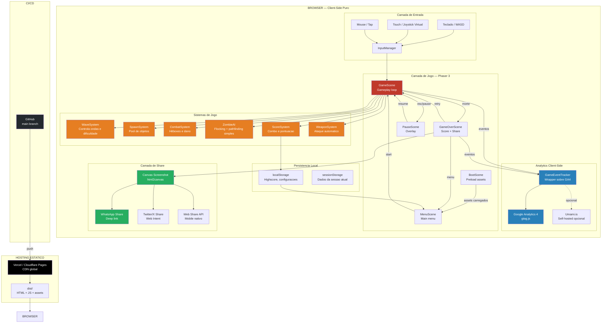
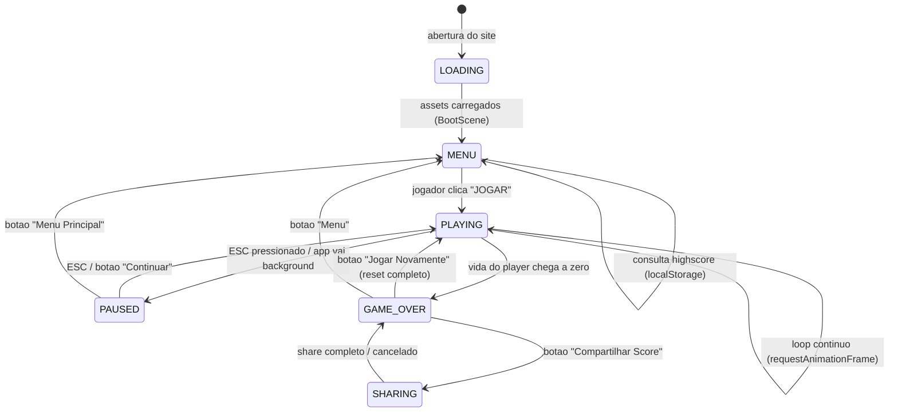
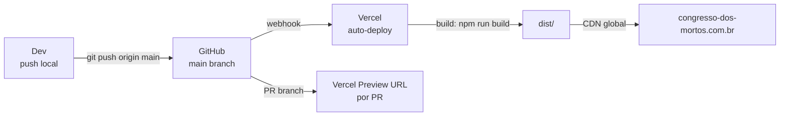

# ZUMBIS DE BRASILIA — Arquitetura Tecnica Web MVP
### Tim Sweeney — Tech Lead | Abril 2026

---

> *"A melhor arquitetura e aquela que permite ao desenvolvedor errar rapido, corrigir mais rapido ainda, e shipar antes do concorrente sonhar com a ideia. Client-side puro nao e limitacao — e velocidade maxima."*

---

## Prefacio: O Que Mudou e Por Que Isso Importa

Lemos o documento do CEO. A decisao foi clara: **client-side puro, sem backend, sem Firebase, hosting estatico, 2 semanas**. Minha funcao aqui nao e questionar essa decisao — e construir o pipeline mais afiado possivel para que 1-2 devs entreguem um jogo jogavel, viral e maintainable dentro desse prazo.

O que a arquitetura Godot original projetou era solida para um produto de longo prazo. O que construimos agora e diferente: um **jogo-bomba**. Um produto que precisa funcionar perfeitamente na primeira impressao, ser compartilhavel por natureza, e ser deployavel em minutos.

Cada decisao de arquitetura aqui foi tomada com uma pergunta em mente: **"isso acelera ou atrasa o primeiro deploy?"**

---

## 1. Arquitetura Web — Diagrama do Sistema (100% Client-Side)

Todo o sistema roda no browser do usuario. Nao existe servidor de aplicacao. O "backend" e o proprio browser mais storage local.



### Regra de ouro: zero chamadas de rede durante o gameplay

Todos os assets sao pre-carregados na BootScene. O loop de jogo roda 100% local. Isso garante latencia zero e experiencia consistente em conexoes lentas (3G, Wi-Fi ruim no trabalho).

---

## 2. Estrutura do Projeto

### Build System

**Vite** como bundler. Rapido, zero config, HMR nativo, output otimizado com code splitting automatico.

```
vite.config.ts       — configuracao principal
tsconfig.json        — TypeScript strict
eslint.config.ts     — regras de codigo
```

### Folder Structure Completa

```
congresso-dos-mortos/
├── index.html                     # Entry point — carrega o bundle
├── vite.config.ts
├── tsconfig.json
├── eslint.config.ts
├── package.json                   # Deps: phaser, typescript, vite, eslint
├── .env                           # VITE_GA_MEASUREMENT_ID=G-XXXXXXX
├── .env.example
├── .gitignore
│
├── public/                        # Assets estaticos (copiados sem processamento)
│   ├── favicon.ico
│   ├── og-image.png               # Open Graph para share social
│   └── robots.txt
│
├── src/
│   ├── main.ts                    # Entry Phaser — instancia o game
│   ├── config.ts                  # Constantes globais (dimensoes, FPS, versao)
│   │
│   ├── scenes/                    # Uma classe por cena Phaser
│   │   ├── BootScene.ts           # Preload de todos os assets
│   │   ├── MenuScene.ts           # Main menu, highscore, start
│   │   ├── GameScene.ts           # Loop principal do jogo
│   │   ├── GameOverScene.ts       # Score final, share, retry
│   │   └── PauseScene.ts          # Overlay de pausa (sem destruir GameScene)
│   │
│   ├── systems/                   # Logica de jogo pura (sem herdar de Phaser)
│   │   ├── WaveSystem.ts          # Configuracao e progressao de ondas
│   │   ├── SpawnSystem.ts         # Object pool e spawn logic
│   │   ├── CombatSystem.ts        # Resolucao de dano, hitboxes
│   │   ├── ZombieAI.ts            # Comportamento de IA (flocking simples)
│   │   ├── WeaponSystem.ts        # Ataque automatico e projeteis
│   │   └── ScoreSystem.ts         # Pontuacao, combo e titulos satiricos
│   │
│   ├── entities/                  # Classes de entidades do jogo
│   │   ├── Player.ts
│   │   ├── zombies/
│   │   │   ├── ZombieBase.ts      # Classe base com comportamento comum
│   │   │   ├── ZombieVereador.ts
│   │   │   ├── ZombieAssessor.ts
│   │   │   ├── ZombieSenador.ts
│   │   │   ├── ZombieLobista.ts
│   │   │   └── ZombieCandidato.ts # Mini-boss da wave 5
│   │   ├── weapons/
│   │   │   ├── WeaponBase.ts
│   │   │   ├── Vassoura.ts
│   │   │   ├── Chinelo.ts
│   │   │   ├── Urna.ts
│   │   │   └── Microfone.ts
│   │   └── Projectile.ts
│   │
│   ├── ui/                        # Componentes de HUD e UI
│   │   ├── HUD.ts                 # Vida, score, wave counter, combo
│   │   ├── VirtualJoystick.ts     # Controle touch para mobile
│   │   ├── ShareCard.ts           # Geracao da imagem de share
│   │   └── SatiricalTitle.ts      # Titulo satirico ao fim da partida
│   │
│   ├── managers/                  # Singletons de infraestrutura
│   │   ├── AudioManager.ts        # Web Audio API wrapper
│   │   ├── StorageManager.ts      # localStorage abstraction
│   │   ├── AnalyticsManager.ts    # Wrapper sobre GA4
│   │   └── InputManager.ts        # Unifica teclado + touch
│   │
│   ├── data/                      # Dados estaticos em JSON/TS
│   │   ├── waves.ts               # Configuracao de todas as waves
│   │   ├── zombieTypes.ts         # Stats de cada tipo de zumbi
│   │   ├── weapons.ts             # Stats de cada arma
│   │   ├── satiricalTitles.ts     # Titulos politicos satiricos por score
│   │   └── gameOverPhrases.ts     # Frases acidas para tela de game over
│   │
│   └── utils/
│       ├── math.ts                # Helpers: distancia, angulo, lerp
│       ├── pool.ts                # Generic object pool
│       └── events.ts              # EventEmitter tipado (sem deps externas)
│
├── assets/                        # Assets fonte (nao servidos diretamente)
│   ├── sprites/
│   │   ├── player_sheet.png       # 64x64 frames, spritesheet unico
│   │   ├── zombies_sheet.png      # Todos os zumbis num atlas
│   │   ├── weapons_sheet.png
│   │   ├── fx_sheet.png           # Explosoes, hit effects
│   │   └── ui_sheet.png           # Icones, botoes
│   ├── audio/
│   │   ├── sfx/
│   │   │   ├── hit.ogg
│   │   │   ├── death.ogg
│   │   │   ├── powerup.ogg
│   │   │   └── wave_start.ogg
│   │   └── music/
│   │       └── theme_loop.ogg
│   └── fonts/
│       └── PressStart2P.woff2     # Font retro, subset PT-BR
│
└── dist/                          # Output do build (gitignored)
    ├── index.html
    ├── assets/
    └── [hash].js
```

### Dependencias do package.json

```json
{
  "dependencies": {
    "phaser": "^3.88.0"
  },
  "devDependencies": {
    "typescript": "^5.4.0",
    "vite": "^5.2.0",
    "@types/node": "^20.0.0",
    "eslint": "^9.0.0",
    "@typescript-eslint/eslint-plugin": "^7.0.0",
    "@typescript-eslint/parser": "^7.0.0",
    "vite-plugin-compression": "^0.5.1"
  }
}
```

---

## 3. Game Systems

Todos os sistemas sao classes TypeScript puras que recebem a `GameScene` como dependencia via construtor. Nenhum sistema herda de classes Phaser — isso mantém a logica testavel e portavel.

### 3.1 WaveSystem

Controla a progressao de dificuldade ao longo dos 3 minutos de partida.

```
Responsabilidades:
- Ler configuracao de waves do data/waves.ts
- Controlar timer global da partida (180 segundos)
- Disparar eventos de inicio/fim de wave
- Calcular multiplicador de dificuldade crescente
- Disparar wave de boss na wave 5 (minuto 2:30)
```

**Configuracao de wave (data/waves.ts):**
```typescript
interface WaveConfig {
  waveNumber: number;
  startTime: number;          // segundos desde o inicio
  zombieTypes: ZombieType[];  // tipos permitidos nessa wave
  spawnRate: number;          // zumbis por segundo
  maxConcurrent: number;      // maximo simultaneo na tela
  speedMultiplier: number;    // fator de velocidade dos zumbis
  hasBoss: boolean;
}
```

**Curva de dificuldade:**

| Wave | Tempo | Zumbis | Spawn/s | Tipo |
|------|-------|--------|---------|------|
| 1 | 0:00–0:30 | Vereador | 0.5 | Fraco, lento |
| 2 | 0:30–1:00 | Vereador + Assessor | 1.0 | Rapido |
| 3 | 1:00–1:30 | + Senador (tanky) | 1.5 | Resistente |
| 4 | 1:30–2:30 | + Lobista (spawna zumbis) | 2.0 | Elite |
| 5 | 2:30–3:00 | BOSS: Candidato | 0.3 | Mini-boss + horda |

### 3.2 SpawnSystem

Object pool para evitar garbage collection durante o gameplay (principal causa de frame drops em JS).

```
Responsabilidades:
- Manter pool pre-alocado de N objetos por tipo
- Spawnar zumbis fora da viewport (margin de 64px)
- Nunca criar new() durante o loop de jogo
- Reciclar objetos ao morrerem (reset de estado)
- Spawnar em posicoes distribuidas pelos 4 quadrantes
```

**Logica de spawn:**
- Posicao de spawn: ponto aleatorio no perimetro da camera + offset de 80px
- Nao spawna em cima do player (distancia minima de 200px)
- Distribui spawn pelos 4 lados do viewport para evitar clustering

### 3.3 CombatSystem

Resolve colisoes e aplica dano sem usar o physics engine do Phaser (que e pesado). Usa verificacao de distancia simples (circle collision).

```
Responsabilidades:
- Verificar colisao player x zumbi (dano ao player)
- Verificar colisao projetil/arma x zumbi (dano ao zumbi)
- Aplicar knockback ao zumbi ao tomar dano
- Disparar eventos de morte (zumbi ou player)
- Calcular multiplicador de combo
```

**Ciclo de combate:**
```
A cada frame:
1. Para cada projetil ativo: verifica distancia com cada zumbi ativo
2. Se distancia < (raioProjetil + raioZumbi): aplica dano, destroi projetil, inicia efeito visual
3. Para cada zumbi ativo: verifica distancia com player
4. Se distancia < (raioPlayer + raioZumbi): aplica dano ao player
5. Cooldown de dano ao player: 1 segundo de invencibilidade apos cada hit
```

### 3.4 ZombieAI

IA simples baseada em flocking (separacao + seguir player). Sem pathfinding complexo — a Esplanada e mapa aberto.

```
Responsabilidades:
- Mover zumbi em direcao ao player
- Aplicar forca de separacao entre zumbis (evita empilhamento)
- Comportamentos especiais por tipo (lobista circula, senador carrega)
- Animar sprite de acordo com direcao de movimento
```

**Algoritmo de flocking (simplificado):**
```
Para cada zumbi:
  1. forcaDirecao = normalizar(player.pos - zumbi.pos) * velocidade
  2. forcaSeparacao = soma de vetores repulsao de zumbis proximos (raio: 40px)
  3. velocidadeFinal = forcaDirecao * 0.8 + forcaSeparacao * 0.2
  4. zumbi.pos += velocidadeFinal * delta
```

**Comportamentos especiais:**
- **Assessor:** velocidade 1.5x, raio menor
- **Senador:** vida 3x, velocidade 0.6x, empurra outros zumbis
- **Lobista:** spawna um Assessor ao morrer (1 vez)
- **Candidato (boss):** teleporta a cada 10 segundos, imune a knockback

### 3.5 WeaponSystem

Ataque automatico no estilo Vampire Survivors. O player escolhe a arma no menu; o sistema atira sozinho.

```
Responsabilidades:
- Executar o ataque da arma ativa em intervalo fixo
- Definir direcao/area de ataque por tipo de arma
- Gerenciar projeteis do pool
- Aplicar upgrades de arma (se houver powerup)
```

**Tipos de ataque:**

| Arma | Tipo | Area | Cadencia | Dano |
|------|------|------|----------|------|
| Vassoura | Melee arco 120° | Raio 80px | 0.8s | 15 |
| Chinelo | Projetil unico | Linha | 0.5s | 10 |
| Urna | Projetil explosivo | AOE raio 60px | 2.0s | 40 |
| Microfone | Onda sonora | Cone frontal | 1.2s | 20 + slow |

### 3.6 ScoreSystem

Pontuacao com combo multiplicador e titulos politicos satiricos.

```
Responsabilidades:
- Somar pontos por kill (base: 10 pts por zumbi comum)
- Multiplicador de combo: kills consecutivos sem tomar dano
- Quebrar combo ao tomar dano
- Calcular titulo satirico final com base no score
- Salvar highscore no localStorage
- Gerar texto de game over com frases acidas
```

**Formula de score:**
```
pontosPorKill = pontoBase[tipoZumbi] * comboMultiplier
comboMultiplier = 1 + (kills_consecutivos * 0.1), max 3.0x
```

**Titulos por score (data/satiricalTitles.ts):**

| Score | Titulo |
|-------|--------|
| 0–500 | "Cabo Eleitoral Desempregado" |
| 501–1500 | "Vereador do Interior" |
| 1501–3000 | "Deputado Federal Investigado" |
| 3001–6000 | "Senador com Mandato Blindado" |
| 6001–10000 | "Ministro de Estado Interino" |
| 10001–20000 | "Presidente da Republica (1° mandato)" |
| 20001+ | "Eleito Vereador dos Mortos" |

---

## 4. State Machine do Jogo



### Transicoes e Responsabilidades

| Estado | O Que Acontece | Sistemas Ativos |
|--------|---------------|-----------------|
| **LOADING** | Phaser carrega todos os assets, exibe barra de progresso | BootScene |
| **MENU** | Exibe logo, highscore, botao start. Anima background | Nenhum sistema de jogo |
| **PLAYING** | Loop completo. 60fps. Input ativo. | Todos os sistemas |
| **PAUSED** | Loop pausado. Overlay escuro. Input bloqueado exceto ESC. | Nenhum |
| **GAME_OVER** | Score exibido. Titulo satirico. Opcoes de acao. Analytics disparado. | ScoreSystem (leitura) |
| **SHARING** | Gera screenshot do canvas. Abre share sheet. | ShareCard |

### Gerenciamento de Estado com Phaser Scene Manager

Phaser gerencia cada estado como uma Scene separada. `GameScene` nunca e destruida durante PAUSED — ela e pausada (`scene.pause()`). Isso preserva o estado do jogo intacto.

```typescript
// Transicao PLAYING -> PAUSED
this.scene.launch('PauseScene');
this.scene.pause('GameScene');

// Transicao PAUSED -> PLAYING
this.scene.resume('GameScene');
this.scene.stop('PauseScene');

// Transicao PLAYING -> GAME_OVER
this.scene.start('GameOverScene', { score, waveReached, title });
```

---

## 5. Data Model

Modelos simplificados para o MVP. TypeScript interfaces — sem ORM, sem schema externo.

### Player

```typescript
interface PlayerState {
  x: number;
  y: number;
  hp: number;              // 100 max
  maxHp: number;
  activeWeapon: WeaponId;
  isInvincible: boolean;   // cooldown de dano
  invincibleTimer: number; // ms restantes
  speed: number;           // pixels por segundo, base: 200
}
```

### ZombieType (configuracao estatica)

```typescript
type ZombieId = 'vereador' | 'assessor' | 'senador' | 'lobista' | 'candidato';

interface ZombieTypeConfig {
  id: ZombieId;
  displayName: string;      // "Vereador Zumbi"
  satiricalName: string;    // "Eleito Democraticamente"
  hp: number;
  speed: number;
  damage: number;           // dano por toque no player
  points: number;           // pontos por kill
  spriteKey: string;        // chave no atlas do Phaser
  frameStart: number;       // primeiro frame da animacao walk
  frameEnd: number;
  scale: number;
  tint?: number;            // cor de tint para variacoes
  specialBehavior?: ZombieSpecial;
}

type ZombieSpecial = 'spawns_on_death' | 'charge_attack' | 'teleport' | 'speed_burst';
```

### Instancia de Zumbi (runtime)

```typescript
interface ZombieInstance {
  typeId: ZombieId;
  x: number;
  y: number;
  hp: number;
  isAlive: boolean;
  velocityX: number;
  velocityY: number;
  sprite: Phaser.GameObjects.Sprite;  // referencia ao objeto Phaser
  specialTimer: number;               // timer para comportamento especial
}
```

### Weapon

```typescript
type WeaponId = 'vassoura' | 'chinelo' | 'urna' | 'microfone';

interface WeaponConfig {
  id: WeaponId;
  displayName: string;
  description: string;    // descricao satirica
  damage: number;
  cooldown: number;       // ms entre ataques
  projectileSpeed: number;
  attackType: 'melee' | 'projectile' | 'aoe' | 'cone';
  range: number;          // pixels
  spriteKey: string;
}
```

### Wave

```typescript
interface WaveState {
  currentWave: number;
  timeElapsed: number;       // segundos desde inicio da partida
  timeRemaining: number;     // segundos restantes (180 - timeElapsed)
  activeZombies: number;     // contagem atual na tela
  totalKillsThisWave: number;
  bossActive: boolean;
}
```

### Score / Session

```typescript
interface GameSession {
  score: number;
  combo: number;
  maxCombo: number;
  totalKills: number;
  killsByType: Record<ZombieId, number>;
  waveReached: number;
  survivalTime: number;      // segundos sobrevividos
  weaponUsed: WeaponId;
  satiricalTitle: string;    // calculado ao fim
  gameOverPhrase: string;    // frase acida aleatoria
  timestamp: number;         // Date.now()
}

interface HighScore {
  score: number;
  title: string;
  date: string;
  waveReached: number;
}
```

### StorageManager (localStorage)

```typescript
interface LocalData {
  highScore: HighScore;
  settings: {
    musicVolume: number;   // 0.0 a 1.0
    sfxVolume: number;
    preferredWeapon: WeaponId;
  };
  sessions: GameSession[]; // ultimas 5 sessoes para analytics
}
```

---

## 6. Asset Pipeline Web

### Filosofia: Tudo no Boot, Nada Durante o Jogo

A BootScene carrega 100% dos assets antes de exibir o menu. O jogo nunca faz requests de rede durante o gameplay. A barra de progresso no boot e o unico momento de espera.

### Spritesheets

**Formato:** PNG com atlas JSON (Phaser TextureAtlas format).

Ferramenta de geracao: **TexturePacker** (ou **Free Texture Packer** como alternativa gratuita).

```
assets/sprites/
├── game_atlas.png          # Todos os sprites do jogo num arquivo so
├── game_atlas.json         # Mapeamento de frames
└── ui_atlas.png            # Sprites de UI separados (carregados primeiro)

Dimensoes maximas do atlas: 2048x2048 pixels
Formato: PNG-8 para sprites pixel art (reducao de 60% vs PNG-32)
Padding entre frames: 2px (evita bleeding)
```

**Carregamento no BootScene:**
```typescript
// Carrega atlas principal (sprites do jogo)
this.load.atlas('game', 'assets/sprites/game_atlas.png', 'assets/sprites/game_atlas.json');

// Carrega atlas de UI (menor, carrega primeiro)
this.load.atlas('ui', 'assets/sprites/ui_atlas.png', 'assets/sprites/ui_atlas.json');

// Audio em OGG (melhor compressao para web)
this.load.audio('music', 'assets/audio/music/theme_loop.ogg');
this.load.audio('sfx_hit', 'assets/audio/sfx/hit.ogg');
this.load.audio('sfx_death', 'assets/audio/sfx/death.ogg');
this.load.audio('sfx_powerup', 'assets/audio/sfx/powerup.ogg');
this.load.audio('sfx_wave', 'assets/audio/sfx/wave_start.ogg');

// Font bitmap (mais rapida que web font para placares)
this.load.bitmapFont('score_font', 'assets/fonts/score_font.png', 'assets/fonts/score_font.xml');
```

### Compressao de Assets

| Tipo | Ferramenta | Reducao Esperada |
|------|-----------|-----------------|
| PNG sprites | `oxipng --opt 3` | 30–50% |
| OGG audio | `ffmpeg -q:a 5` | 70% vs WAV |
| Woff2 font | Subset PT-BR | 80% vs font completa |
| JSON | Minificado no build Vite | 20% |

**Target de tamanho total:** menos de 3 MB (carrega em menos de 3s em 4G).

### Lazy Loading (Opcional — Semana 2)

Para o MVP, tudo e carregado no boot. Se o tamanho total ultrapassar 5 MB, separar em dois grupos:

```
Grupo 1 (boot obrigatorio): UI, player, wave 1 zombies, musica
Grupo 2 (lazy, durante gameplay): zombies das waves 3-5, boss sprites
```

Phaser suporta `this.load.start()` durante uma Scene ativa para carregamento em background.

### Vite Build Config

```typescript
// vite.config.ts
import { defineConfig } from 'vite';
import compression from 'vite-plugin-compression';

export default defineConfig({
  plugins: [
    compression({ algorithm: 'gzip' }),
    compression({ algorithm: 'brotliCompress' })
  ],
  build: {
    outDir: 'dist',
    assetsDir: 'assets',
    rollupOptions: {
      output: {
        manualChunks: {
          phaser: ['phaser'],  // Phaser em chunk separado para cache
        }
      }
    }
  },
  base: './'  // Paths relativos para funcionar em qualquer subdiretorio
});
```

**Resultado do build:**
- `phaser.[hash].js` — ~1MB (cacheado agressivamente)
- `index.[hash].js` — ~50KB (codigo do jogo)
- Assets comprimidos com Brotli

---

## 7. CI/CD Simples

### GitHub Actions + Vercel (Zero Config)



### Configuracao Vercel (vercel.json)

```json
{
  "buildCommand": "npm run build",
  "outputDirectory": "dist",
  "framework": "vite",
  "headers": [
    {
      "source": "/assets/(.*)",
      "headers": [
        { "key": "Cache-Control", "value": "public, max-age=31536000, immutable" }
      ]
    },
    {
      "source": "/(.*).js",
      "headers": [
        { "key": "Cache-Control", "value": "public, max-age=31536000, immutable" }
      ]
    }
  ]
}
```

### GitHub Actions (Opcional — checagem antes do merge)

```yaml
# .github/workflows/ci.yml
name: CI
on: [push, pull_request]
jobs:
  build:
    runs-on: ubuntu-latest
    steps:
      - uses: actions/checkout@v4
      - uses: actions/setup-node@v4
        with: { node-version: '20' }
      - run: npm ci
      - run: npm run lint       # ESLint
      - run: npm run typecheck  # tsc --noEmit
      - run: npm run build      # Verifica que o build nao quebra
```

### Scripts do package.json

```json
{
  "scripts": {
    "dev": "vite",
    "build": "tsc --noEmit && vite build",
    "preview": "vite preview",
    "lint": "eslint src --ext .ts",
    "typecheck": "tsc --noEmit"
  }
}
```

### Deploy em 60 Segundos

1. `git push origin main`
2. Vercel detecta o push automaticamente
3. Roda `npm run build` no servidor da Vercel
4. Deploy em CDN global em ~30 segundos
5. URL de producao atualizada

Cada PR recebe uma **Preview URL** unica — util para testar mudancas antes de ir para producao.

---

## 8. Sprint Plan de 2 Semanas (10 Dias Uteis)

**Time assumido:** 1 dev principal + 1 dev suporte (ou artista que codifica)

**Regra do sprint:** No fim de cada dia, o jogo deve estar em estado jogavel. Nenhum dia termina com o jogo quebrado.

### Semana 1 — Fundacao e Gameplay Core

#### Dia 1 — Setup e Esqueleto

**Objetivo do dia:** Jogo abre no browser, exibe tela preta, sem erros.

- [ ] Inicializar projeto com `npm create vite@latest` (template vanilla-ts)
- [ ] Instalar Phaser 3: `npm install phaser`
- [ ] Configurar TypeScript strict + ESLint
- [ ] Criar estrutura de pastas completa
- [ ] Implementar `main.ts` com configuracao basica do Phaser (800x600, cor de fundo #1a0a00)
- [ ] Criar BootScene vazia, MenuScene vazia, GameScene vazia
- [ ] Configurar Vite para build e dev server
- [ ] Setup Vercel e conectar ao GitHub (primeiro deploy — tela preta em producao)
- [ ] Criar `.env.example` e `.gitignore`

**Entregavel:** URL de producao funcionando.

---

#### Dia 2 — BootScene e Assets

**Objetivo do dia:** Menu com background e musica tocando.

- [ ] Criar placeholder assets (retangulos coloridos) para comecar a codificar sem arte final
- [ ] Implementar BootScene com `this.load.*` para todos os assets
- [ ] Barra de progresso de carregamento (simples: retangulo branco que cresce)
- [ ] Transicao BootScene → MenuScene apos carregamento
- [ ] MenuScene: background estatico, texto "CONGRESSO DOS MORTOS", botao "JOGAR"
- [ ] AudioManager basico: toca musica no menu com fade in
- [ ] StorageManager: le/escreve highscore no localStorage
- [ ] Exibir highscore no menu se existir

**Entregavel:** Menu funcionando com navegacao para GameScene (ainda vazia).

---

#### Dia 3 — Player e Movimento

**Objetivo do dia:** Boneco se movendo pela tela.

- [ ] Implementar entidade `Player` (Phaser Sprite com physica arcade basica)
- [ ] InputManager: WASD + setas para movimento, touch para mobile
- [ ] VirtualJoystick para dispositivos touch (biblioteca ou implementacao simples)
- [ ] Movimento normalizado (diagonal nao e mais rapida)
- [ ] Camera segue o player (scroll em mapa 1600x1200)
- [ ] Background do mapa: tiles simples representando a Esplanada (placeholder verde)
- [ ] Limites do mapa (player nao sai da area jogavel)
- [ ] Animacao de sprite: walk em 4 direcoes

**Entregavel:** Player se movendo com controles responsivos em desktop e mobile.

---

#### Dia 4 — Zombies e AI

**Objetivo do dia:** Horda de zumbis perseguindo o player.

- [ ] Implementar `ZombieBase` com sprite, vida, movimento
- [ ] Implementar `ZombieAI`: flocking simples (direcao ao player + separacao)
- [ ] SpawnSystem: spawn no perimetro da camera, pool de 50 objetos
- [ ] Implementar `ZombieVereador` (tipo mais basico)
- [ ] WaveSystem basico: spawna zumbis continuamente com taxa crescente
- [ ] Visual de zumbi: sprite placeholder roxo com animacao de walk

**Entregavel:** Horda de zumbis perseguindo o player de todos os lados.

---

#### Dia 5 — Combate e Game Over

**Objetivo do dia:** Loop completo: jogar, morrer, ver game over.

- [ ] WeaponSystem: Vassoura com ataque melee automatico em arco 120°
- [ ] CombatSystem: colisao circulo-a-circulo entre arma e zumbi
- [ ] Zumbi toma dano e morre (animacao de morte simples: flash branco + fade)
- [ ] Player toma dano ao contato com zumbi (cooldown de 1s)
- [ ] HUD: barra de vida, score, wave counter
- [ ] ScoreSystem: 10 pts por kill, combo multiplicador
- [ ] GameOverScene: exibe score, wave, botao retry e menu
- [ ] Highscore salvo no localStorage
- [ ] StateMachine completa: menu → playing → paused → game_over → menu

**Entregavel:** Loop de jogo completo e jogavel, mesmo que simples.

---

### Semana 2 — Polimento, Arte e Viral

#### Dia 6 — Arte e Atmosfera

**Objetivo do dia:** Jogo parece um produto real.

- [ ] Substituir todos os placeholders por arte pixel art final
- [ ] Tileset da Esplanada dos Ministerios (perspectiva top-down)
- [ ] Sprites do player (cidadao de polo azul com vassoura)
- [ ] Sprites dos zumbis (Vereador, Assessor, Senador)
- [ ] Efeitos visuais: particulas de sangue verde no hit, flash vermelho ao tomar dano
- [ ] Musica final e SFX
- [ ] Fonte do titulo: estilo urgente/politico
- [ ] Ceu laranja-sangue no background (parallax 2 camadas)

**Entregavel:** Sessao de jogo com identidade visual reconhecivel.

---

#### Dia 7 — Conteudo Satirico e Tipos de Zumbi

**Objetivo do dia:** Satira politica presente em todo momento do jogo.

- [ ] Implementar todos os tipos de zumbi com comportamentos especiais
- [ ] `ZombieAssessor`: veloz
- [ ] `ZombieSenador`: tanky
- [ ] `ZombieLobista`: spawna Assessor ao morrer
- [ ] `ZombieCandidato` (boss wave 5): teleporta, imune a knockback
- [ ] Nomes satiricos flutuantes ao matar zumbi ("Fui Eleito Democraticamente!")
- [ ] Titulos satiricos completos por faixa de score
- [ ] Frases de game over acidas (pool de 20+ frases)
- [ ] Todas as 3 armas adicionais: Chinelo, Urna, Microfone
- [ ] Tela de selecao de arma antes do jogo

**Entregavel:** Experiencia satirica completa com diversidade de inimigos.

---

#### Dia 8 — Feature de Share e Viral

**Objetivo do dia:** Partida compartilhavel pelo WhatsApp.

- [ ] ShareCard: captura screenshot do canvas com html2canvas
- [ ] Overlay sobre o screenshot: score, titulo, logo do jogo, "Joguei em [URL]"
- [ ] Botao WhatsApp: `https://wa.me/?text=[score+titulo+url]`
- [ ] Botao Twitter/X: Web Intent com texto pre-formatado
- [ ] Web Share API para mobile (sheet nativa de share)
- [ ] Download direto da imagem de share (fallback)
- [ ] Open Graph tags no `index.html` para link preview bonito
- [ ] Analytics: trackear evento `share_completed` por plataforma

**Entregavel:** Score compartilhavel em 1 clique com imagem gerada automaticamente.

---

#### Dia 9 — Analytics, Performance e Polimento

**Objetivo do dia:** Dados de uso capturados, jogo fluindo a 60fps em celular.

- [ ] Integrar Google Analytics 4 (gtag.js via Vite plugin)
- [ ] AnalyticsManager: trackear `game_start`, `game_over`, `wave_reached`, `share`, `retry`
- [ ] Profiling de performance: identificar e corrigir gargalos de frame rate
- [ ] Testes em dispositivos reais: iPhone, Android mid-range, Chrome/Safari/Firefox
- [ ] PauseScene: overlay funcional com musica pausada
- [ ] Loading screen com identidade visual (nao mais barra generica)
- [ ] Tela de tutoriais inline (primera wave mais lenta, texto "mova-se com WASD")
- [ ] Sons de feedback: kill satisfatorio, wave nova, dano recebido
- [ ] Ajuste fino de dificuldade baseado em primeiros testes

**Entregavel:** Jogo rodando a 60fps em Moto G84 (device de referencia para classe C).

---

#### Dia 10 — Launch Day

**Objetivo do dia:** Jogo no ar, link pronto para viralizar.

- [ ] Dominio configurado (congresso-dos-mortos.com.br ou similar)
- [ ] HTTPS ativo (automatico no Vercel)
- [ ] Teste final de share no WhatsApp real
- [ ] Teste final em 5 browsers diferentes
- [ ] Meta tags completas: OG title, description, image, Twitter Card
- [ ] `robots.txt` e `sitemap.xml`
- [ ] Build de producao otimizado: verificar tamanho total < 3MB
- [ ] Monitoramento: GA4 em tempo real aberto durante primeiros shares
- [ ] Preparar textos de divulgacao para WhatsApp, Twitter, Instagram
- [ ] LANÇAMENTO

**Entregavel:** URL funcionando, link voando no grupo de amigos.

---

## 9. Padroes de Codigo

### TypeScript

```json
// tsconfig.json
{
  "compilerOptions": {
    "target": "ES2020",
    "module": "ESNext",
    "moduleResolution": "bundler",
    "strict": true,
    "noUncheckedIndexedAccess": true,
    "exactOptionalPropertyTypes": true,
    "noImplicitReturns": true,
    "noFallthroughCasesInSwitch": true,
    "lib": ["ES2020", "DOM"]
  }
}
```

**Regras essenciais:**
- Proibido usar `any` — use `unknown` e narrow depois
- Proibido usar `!` non-null assertion exceto em callbacks do Phaser onde sabemos que o objeto existe
- Todos os parametros de funcao devem ter tipo explicito
- Retornos de funcao devem ter tipo explicito quando nao inferido trivialmente

### ESLint

```typescript
// eslint.config.ts
export default [
  {
    rules: {
      '@typescript-eslint/no-explicit-any': 'error',
      '@typescript-eslint/explicit-function-return-type': 'warn',
      '@typescript-eslint/no-unused-vars': 'error',
      'no-console': 'warn',  // Remover antes do deploy
    }
  }
];
```

### Naming Conventions

| Tipo | Convencao | Exemplo |
|------|-----------|---------|
| Classes | PascalCase | `ZombieVereador`, `WaveSystem` |
| Interfaces | PascalCase sem prefixo I | `ZombieInstance`, `PlayerState` |
| Types | PascalCase | `WeaponId`, `ZombieSpecial` |
| Enums | PascalCase com membros PascalCase | `GameState.Playing` |
| Funcoes e metodos | camelCase | `spawnZombie()`, `calculateScore()` |
| Variaveis | camelCase | `activeZombies`, `comboMultiplier` |
| Constantes globais | UPPER_SNAKE_CASE | `MAX_ZOMBIES_ON_SCREEN`, `BASE_PLAYER_SPEED` |
| Arquivos | PascalCase para classes, camelCase para utils | `WaveSystem.ts`, `math.ts` |
| Chaves de assets Phaser | kebab-case | `'zombie-vereador-walk'`, `'ui-heart'` |

### Organizacao de Codigo por Arquivo

Cada arquivo deve ter **uma unica responsabilidade**. Se um sistema comecar a fazer coisas demais, e hora de extrair.

```typescript
// Ordem padrao dentro de um arquivo de classe:
// 1. Imports
// 2. Tipos locais (se houver)
// 3. Constantes locais
// 4. Declaracao da classe
//    a. Propriedades privadas
//    b. Constructor
//    c. Metodos publicos
//    d. Metodos privados

class WaveSystem {
  // --- Props ---
  private scene: GameScene;
  private currentWave: number = 0;
  private timer: number = 0;

  // --- Constructor ---
  constructor(scene: GameScene) {
    this.scene = scene;
  }

  // --- Publico ---
  public update(delta: number): void { ... }
  public getCurrentWave(): number { ... }

  // --- Privado ---
  private triggerWaveTransition(): void { ... }
}
```

### Comentarios

- **Nao comente o que o codigo faz** — o codigo deve ser auto-explicativo
- **Comente o POR QUE** quando a logica for nao-obvia
- Use `// TODO:` e `// FIXME:` durante o desenvolvimento, removidos antes do launch
- Docstrings JSDoc apenas em interfaces publicas e funcoes utilitarias

```typescript
// Ruim:
// Incrementa o timer
this.timer += delta;

// Bom:
// Usamos delta em ms pois Phaser passa o tempo em milissegundos
// Os valores de configuracao de wave estao em segundos
this.timer += delta / 1000;
```

### Git Workflow

- `main` — producao (deploy automatico via Vercel)
- `dev` — integracao (features mergeadas aqui primeiro)
- `feature/nome-da-feature` — trabalho individual

Commits em portugues, mensagens curtas e descritivas:
```
feat: adiciona ZombieAssessor com comportamento de sprint
fix: corrige posicao de spawn sobreposta ao player
perf: otimiza object pool para reduzir GC durante horda
```

---

## 10. O Que da Arquitetura Original Sobrevive

A arquitetura original (doc 06) foi projetada para Godot com Firebase. A plataforma mudou completamente — mas **os conceitos de design sobrevivem intactos**. O bom design de sistemas e agnóstico de plataforma.

### O Que Reaproveitar Diretamente

| Conceito Original (Godot) | Equivalente Web (Phaser) | Status |
|--------------------------|--------------------------|--------|
| `SceneManager` com transicoes | `Phaser.Scene` manager nativo | Reaproveitado |
| `PoolManager` para objetos | `SpawnSystem` com array de instancias | Reaproveitado |
| `GameState` autoload singleton | `StorageManager` + estado local nas Scenes | Adaptado |
| `AudioManager` autoload | `AudioManager.ts` wrapper sobre Phaser Sound | Reaproveitado |
| `WaveSystem` separado da GameScene | `WaveSystem.ts` injetado na GameScene | Identico |
| `CombatSystem` separado | `CombatSystem.ts` com mesma logica | Identico |
| `ScoreSystem` com combo | `ScoreSystem.ts` com mesma formula | Identico |
| `ZombieAI` com flocking | `ZombieAI.ts` com flocking simplificado | Simplificado |
| Spritesheet por entidade | Atlas unificado com frames por entidade | Otimizado para web |
| Parallax de background | Parallax nativo do Phaser | Reaproveitado |
| Titulos satiricos por score | `data/satiricalTitles.ts` | Identico |
| Frases de game over | `data/gameOverPhrases.ts` | Identico |
| Virtual joystick para mobile | `VirtualJoystick.ts` | Reaproveitado |

### O Que Nao Sobrevive (e Por Que)

| Original | Motivo da Remocao |
|----------|------------------|
| Firebase Auth, Firestore | Sem backend = sem autenticacao. Highscore e local. |
| Cloud Functions (validateScore) | Sem servidor para validar. Score local, honrado. |
| Firebase Analytics | Substituido por GA4 client-side. |
| AdMob / LevelPlay | Sem SDK mobile. Ads web sao diferentes (futuro). |
| Firebase Remote Config | Configuracao hardcoded no `data/`. Muda via deploy. |
| `SaveSystem` com cloud sync | `StorageManager` com localStorage puro. |
| Leaderboard global | Removido do MVP. Score compartilhavel via screenshot substitui. |
| 5 regioes de Brasilia | Esplanada unica por 2 semanas. |
| 7 tipos de zumbi completos | 5 tipos no MVP (sacrificio consciente). |
| Sistema de loot | Removido. Vampire Survivors com arma fixa por partida. |
| GDScript, .tscn, .gd | TypeScript, classes, Phaser nativo. |

### A Logica Que Permanece Viva

O documento 06 tinha uma frase chave: **"zero chamadas de rede durante o gameplay"**. Essa regra sobrevive perfeitamente. No browser, a versao e ainda mais forte: zero chamadas de rede em momento algum. Tudo esta no bundle.

O design de sistemas separados (WaveSystem, SpawnSystem, CombatSystem como classes independentes, nao acopladas ao framework) foi uma decisao arquitetural excelente. Ela torna a logica de jogo testavel, portavel e legivel. Essa decisao foi preservada identica na arquitetura web.

A hierarquia de entidades (ZombieBase → ZombieVereador, WeaponBase → Vassoura) foi preservada. TypeScript com heranca e mais expressivo que GDScript para esse padrao.

### A Reducao de Escopo e Intencional

O MVP web nao e uma versao pior do jogo original. E um produto diferente com um objetivo diferente: **provar a tese de demanda em 2 semanas**. Cada feature removida nao e uma perda — e uma decisao deliberada de foco.

Quando (e se) os dados do browser game justificarem o investimento no mobile, a arquitetura original do doc 06 sera o blueprint de retomada. Os conceitos que sobreviveram aqui serão a base do mobile. O que construimos em 2 semanas nao e descartado — e o Proof of Concept que financia o produto completo.

---

## Notas Finais do Tech Lead

Dois riscos tecnicos que precisam de atencao antes do Dia 1:

**Risco 1 — Performance em Android mid-range:** Phaser com muitos sprites na tela pode cair para 30fps em aparelhos como Moto G84. Solucao: limite rigido de `MAX_ZOMBIES_ON_SCREEN = 30` e validacao de performance no Dia 9 com tempo reservado para otimizacao.

**Risco 2 — Web Audio no iOS Safari:** iOS Safari bloqueia audio ate o primeiro toque do usuario. A primeira interacao (botao "JOGAR") deve obrigatoriamente fazer `AudioContext.resume()`. Testar no iPhone no Dia 6 sem falta.

Fora isso: a stack e solida, o escopo e executavel, e o pipeline e rapido. Dois devs focados podem entregar isso em 10 dias. A Esplanada dos Ministerios vai arder.

---

**Versao:** 1.0 | **Data:** Abril 2026
**Autor:** Tim Sweeney — Tech Lead, Zumbis de Brasilia MVP Web
