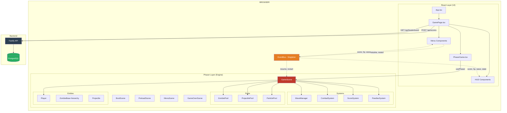

# ZUMBIS DE BRASILIA — Arquitetura de Implementacao Side-View
### Tim Sweeney — Tech Lead | Abril 2026

---

> *"Side-scroller e a decisao arquitetural mais barata que voce pode tomar para maximizar impacto visual. Sem Y-sort. Sem isometria. Sem overhead de perspectiva. Camera fixa no eixo horizontal, parallax em camadas, personagens grandes. Metal Slug rodava em Neo Geo de 1994. Nos temos muito mais CPU sobrando."*

---

## Visao Geral

Este documento define a arquitetura completa de implementacao para o pivot side-view do Zumbis de Brasilia. Stack: React (UI/HUD) + Phaser 3.88 (engine de jogo) + Express/Fastify (backend) em monorepo com workspaces npm. Cada secao contem TypeScript real, nao pseudocodigo — este documento e referencia de implementacao.

**Decisoes arquiteturais chave:**
- React gerencia telas (menus, overlays, HUD), Phaser gerencia o canvas de jogo
- Comunicacao React <-> Phaser via EventBus (sem polling, sem shared state direto)
- Object pooling obrigatorio para zumbis, projeteis e particulas — zero `new` durante gameplay
- Arcade Physics do Phaser 3 (AABB + overlap) para hitboxes, sem fisicas complexas
- Backend minimo: JWT auth + leaderboard. Anti-cheat server-side via score plausibility check
- Viewport logico 480x270 (16:9), escala 2x/3x dependendo do dispositivo

---

## 1. Project Structure — Monorepo

```
zumbis-brasilia/
├── apps/
│   ├── web/                          # React + Vite + Phaser
│   │   ├── index.html
│   │   ├── vite.config.ts
│   │   ├── tsconfig.json
│   │   ├── .env
│   │   ├── .env.example
│   │   ├── public/
│   │   │   ├── favicon.ico
│   │   │   ├── og-image.png          # 1200x630 para Open Graph / WhatsApp
│   │   │   ├── robots.txt
│   │   │   └── assets/
│   │   │       ├── sprites/
│   │   │       │   ├── game_atlas.png        # Atlas principal: player, zumbis, pickups
│   │   │       │   ├── game_atlas.json       # Frame map (TexturePacker format)
│   │   │       │   ├── bg_atlas.png          # Atlas de backgrounds: ministerios, congresso
│   │   │       │   ├── bg_atlas.json
│   │   │       │   ├── ui_atlas.png          # Icones HUD, botoes, joystick virtual
│   │   │       │   └── ui_atlas.json
│   │   │       ├── tilemaps/
│   │   │       │   ├── esplanada.json        # Tiled JSON, 600x17 tiles, 5 segmentos
│   │   │       │   └── esplanada_tiles.png   # Tileset 16x16 side-scroller
│   │   │       └── audio/
│   │   │           ├── sfx/
│   │   │           │   ├── hit.ogg
│   │   │           │   ├── death.ogg
│   │   │           │   ├── boss_roar.ogg
│   │   │           │   ├── chinelo_throw.ogg
│   │   │           │   ├── wave_start.ogg
│   │   │           │   └── powerup.ogg
│   │   │           └── music/
│   │   │               └── theme_loop.ogg
│   │   └── src/
│   │       ├── main.tsx              # React entry point
│   │       ├── App.tsx               # Router + global providers
│   │       │
│   │       ├── components/           # React UI pura (sem Phaser)
│   │       │   ├── PhaserGame.tsx    # Wrapper do canvas Phaser
│   │       │   ├── HUD/
│   │       │   │   ├── HUD.tsx       # Container do HUD overlay
│   │       │   │   ├── HealthBar.tsx
│   │       │   │   ├── ScoreDisplay.tsx
│   │       │   │   ├── WaveCounter.tsx
│   │       │   │   └── ComboDisplay.tsx
│   │       │   ├── menus/
│   │       │   │   ├── MainMenu.tsx
│   │       │   │   ├── PauseMenu.tsx
│   │       │   │   └── GameOverScreen.tsx
│   │       │   ├── overlays/
│   │       │   │   ├── LoadingScreen.tsx
│   │       │   │   └── WaveAnnouncement.tsx
│   │       │   └── leaderboard/
│   │       │       └── LeaderboardModal.tsx
│   │       │
│   │       ├── game/                 # Codigo Phaser puro (zero React aqui)
│   │       │   ├── PhaserConfig.ts   # Configuracao do Phaser.Game
│   │       │   ├── EventBus.ts       # Canal React <-> Phaser
│   │       │   ├── scenes/
│   │       │   │   ├── BootScene.ts
│   │       │   │   ├── PreloadScene.ts
│   │       │   │   ├── MenuScene.ts
│   │       │   │   ├── GameScene.ts  # Loop principal
│   │       │   │   └── GameOverScene.ts
│   │       │   ├── entities/
│   │       │   │   ├── BaseEntity.ts
│   │       │   │   ├── Player.ts
│   │       │   │   ├── Projectile.ts
│   │       │   │   ├── Pickup.ts
│   │       │   │   └── zombies/
│   │       │   │       ├── ZombieBase.ts
│   │       │   │       ├── ZombieVereador.ts
│   │       │   │       ├── ZombieAssessor.ts
│   │       │   │       ├── ZombieSenador.ts
│   │       │   │       ├── ZombieLobista.ts
│   │       │   │       └── BossXandao.ts
│   │       │   ├── systems/
│   │       │   │   ├── WaveManager.ts
│   │       │   │   ├── CombatSystem.ts
│   │       │   │   ├── ScoreSystem.ts
│   │       │   │   └── ParallaxSystem.ts
│   │       │   ├── pools/
│   │       │   │   ├── ObjectPool.ts       # Classe generica Pool<T>
│   │       │   │   ├── ZombiePool.ts
│   │       │   │   ├── ProjectilePool.ts
│   │       │   │   └── ParticlePool.ts
│   │       │   └── config/
│   │       │       ├── GameConstants.ts    # VIEWPORT, PHYSICS, DEPTHS
│   │       │       ├── WaveConfigs.ts      # Dados de todas as waves
│   │       │       ├── ZombieConfigs.ts    # Stats de cada tipo
│   │       │       └── WeaponConfigs.ts    # Stats de armas
│   │       │
│   │       ├── hooks/
│   │       │   ├── usePhaser.ts      # Inicializa e destroe o Phaser.Game
│   │       │   ├── useGameState.ts   # Sincroniza estado do jogo com React
│   │       │   └── useAuth.ts        # Login, token, usuario atual
│   │       │
│   │       ├── pages/
│   │       │   ├── GamePage.tsx      # Pagina principal: PhaserGame + HUD overlay
│   │       │   └── LeaderboardPage.tsx
│   │       │
│   │       ├── services/
│   │       │   ├── api.ts            # Fetch wrapper para o backend
│   │       │   └── storage.ts        # localStorage abstraction
│   │       │
│   │       └── types/
│   │           └── index.ts          # Re-export de @zumbis/shared
│   │
│   └── api/                          # Express/Fastify backend
│       ├── package.json
│       ├── tsconfig.json
│       ├── src/
│       │   ├── server.ts             # Entry point
│       │   ├── routes/
│       │   │   ├── auth.ts           # POST /auth/google, POST /auth/guest
│       │   │   ├── scores.ts         # POST /scores
│       │   │   └── leaderboard.ts    # GET /leaderboard
│       │   ├── middleware/
│       │   │   ├── auth.ts           # Verifica JWT
│       │   │   ├── rateLimit.ts      # Rate limiting por IP
│       │   │   └── antiCheat.ts      # Validacao de score
│       │   └── db/
│       │       ├── client.ts         # Prisma client
│       │       ├── schema.prisma     # Schema completo
│       │       └── migrations/       # Migrations geradas pelo Prisma
│       └── Dockerfile
│
├── packages/
│   └── shared/                       # Tipos compartilhados web + api
│       ├── package.json
│       ├── tsconfig.json
│       └── src/
│           ├── index.ts
│           ├── types/
│           │   ├── game.ts           # GameSession, ZombieType, WeaponId
│           │   ├── api.ts            # Request/Response types
│           │   └── auth.ts           # User, Token
│           └── constants/
│               └── game.ts           # Constantes compartilhadas
│
├── package.json                      # Workspace root
├── turbo.json                        # TurboRepo (builds paralelos)
└── .github/
    └── workflows/
        ├── ci.yml
        └── deploy.yml
```

### Workspace Root package.json

```json
{
  "name": "zumbis-brasilia",
  "private": true,
  "workspaces": ["apps/*", "packages/*"],
  "scripts": {
    "dev": "turbo run dev",
    "build": "turbo run build",
    "lint": "turbo run lint",
    "typecheck": "turbo run typecheck",
    "dev:web": "turbo run dev --filter=@zumbis/web",
    "dev:api": "turbo run dev --filter=@zumbis/api"
  },
  "devDependencies": {
    "turbo": "^2.0.0",
    "typescript": "^5.4.0"
  }
}
```

### apps/web/package.json

```json
{
  "name": "@zumbis/web",
  "dependencies": {
    "phaser": "^3.88.0",
    "react": "^18.3.0",
    "react-dom": "^18.3.0",
    "react-router-dom": "^6.23.0",
    "@zumbis/shared": "*"
  },
  "devDependencies": {
    "@types/react": "^18.3.0",
    "@types/react-dom": "^18.3.0",
    "@vitejs/plugin-react": "^4.3.0",
    "vite": "^5.2.0",
    "typescript": "^5.4.0",
    "eslint": "^9.0.0",
    "@typescript-eslint/eslint-plugin": "^7.0.0",
    "vite-plugin-compression": "^0.5.1"
  }
}
```

---

## 2. React <-> Phaser Integration

### 2.1 GameConstants.ts — Viewport e Fisica

```typescript
// apps/web/src/game/config/GameConstants.ts

export const VIEWPORT = {
  WIDTH: 480,
  HEIGHT: 270,
  SCALE: 2,            // renderiza em 960x540 (2x pixel-perfect)
  SCALE_MOBILE: 2,     // mesmo scale no mobile landscape
} as const;

export const LEVEL = {
  TILE_SIZE: 16,
  TILES_WIDE: 600,     // 5 segmentos x 120 tiles cada
  TILES_TALL: 17,
  WIDTH: 9600,         // 600 * 16
  HEIGHT: 272,         // 17 * 16
  GROUND_Y: 190,       // pixel Y onde o chao comeca no viewport logico
  SEGMENT_WIDTH: 1920, // 120 tiles * 16px
} as const;

export const PHYSICS = {
  GRAVITY: 0,          // side-scroller sem gravidade (nao e platformer)
  PLAYER_SPEED: 120,   // pixels/segundo no viewport logico
  PLAYER_SPEED_GRASS: 102,   // 0.85x em grama morta
  PLAYER_SPEED_ASPHALT: 120, // 1.0x no asfalto
  ZOMBIE_BASE_SPEED: 60,
  PROJECTILE_SPEED: 200,
  KNOCKBACK_FORCE: 180,
  KNOCKBACK_DECAY: 0.85,     // multiplier por frame
} as const;

export const DEPTHS = {
  SKY: -1000,
  TOXIC_CLOUDS: -995,
  CONGRESS: -900,
  CONGRESS_GLOW: -899,
  MINISTRIES_FAR: -800,
  MINISTRIES_NEAR: -600,
  BG_OBJECTS: -400,
  GROUND: 0,
  SUBSURFACE: -1,
  PICKUP: 100,
  ZOMBIE_BACK: 200,
  PLAYER: 300,
  ZOMBIE_FRONT: 400,
  PROJECTILE: 500,
  VFX: 600,
  ONOMATOPOEIA: 700,
  FOREGROUND: 900,
  HUD: 1000,
} as const;

export const SCROLL_FACTORS = {
  SKY: 0,
  TOXIC_CLOUDS: 0.05,
  CONGRESS: 0.1,
  MINISTRIES_FAR: 0.25,
  MINISTRIES_NEAR: 0.5,
  BG_OBJECTS: 0.75,
  GROUND: 1.0,
  ENTITIES: 1.0,
  FOREGROUND: 1.3,
} as const;

export const POOL_SIZES = {
  ZOMBIES: 50,
  PROJECTILES: 30,
  PARTICLES: 100,
  ONOMATOPOEIAS: 20,
  PICKUPS: 15,
} as const;

export const HIT_STOP_FRAMES = 3; // frames de freeze no hit
export const INVINCIBILITY_MS = 1200; // ms de invencibilidade apos tomar dano
export const CAMERA_DEADZONE_X = 60;
export const CAMERA_DEADZONE_Y = 20;
export const CAMERA_LERP = 0.1;
```

### 2.2 EventBus.ts — Canal Bidirecional React <-> Phaser

```typescript
// apps/web/src/game/EventBus.ts
import Phaser from 'phaser';

// Eventos que o Phaser emite para o React
export interface PhaserToReactEvents {
  'game:score-update': { score: number; combo: number; maxCombo: number };
  'game:health-update': { hp: number; maxHp: number };
  'game:wave-update': { wave: number; enemiesRemaining: number };
  'game:state-change': { state: GameState };
  'game:ready': { scene: Phaser.Scene };
  'game:over': { session: GameSession };
  'game:wave-announce': { wave: number; bossWave: boolean };
}

// Eventos que o React emite para o Phaser
export interface ReactToPhaserEvents {
  'ui:resume': void;
  'ui:restart': void;
  'ui:goto-menu': void;
  'ui:toggle-audio': { muted: boolean };
  'ui:volume-change': { music: number; sfx: number };
}

export type GameState = 'booting' | 'menu' | 'playing' | 'paused' | 'gameover';

// Importar do shared package
import type { GameSession } from '@zumbis/shared';

// EventBus e um Phaser.Events.EventEmitter singleton
// Acessivel tanto pelo codigo React quanto pelo codigo Phaser
class GameEventBus extends Phaser.Events.EventEmitter {
  private static instance: GameEventBus;

  private constructor() {
    super();
  }

  static getInstance(): GameEventBus {
    if (!GameEventBus.instance) {
      GameEventBus.instance = new GameEventBus();
    }
    return GameEventBus.instance;
  }

  // Type-safe emit para eventos Phaser -> React
  emitToReact<K extends keyof PhaserToReactEvents>(
    event: K,
    data: PhaserToReactEvents[K]
  ): void {
    this.emit(event, data);
  }

  // Type-safe emit para eventos React -> Phaser
  emitToPhaser<K extends keyof ReactToPhaserEvents>(
    event: K,
    data?: ReactToPhaserEvents[K]
  ): void {
    this.emit(event, data);
  }

  // Type-safe on para React consumir eventos do Phaser
  onFromPhaser<K extends keyof PhaserToReactEvents>(
    event: K,
    listener: (data: PhaserToReactEvents[K]) => void
  ): this {
    return this.on(event, listener);
  }

  // Type-safe on para Phaser consumir eventos do React
  onFromReact<K extends keyof ReactToPhaserEvents>(
    event: K,
    listener: (data: ReactToPhaserEvents[K]) => void
  ): this {
    return this.on(event, listener);
  }
}

export const EventBus = GameEventBus.getInstance();
```

### 2.3 PhaserConfig.ts — Configuracao do Game

```typescript
// apps/web/src/game/PhaserConfig.ts
import Phaser from 'phaser';
import { VIEWPORT } from './config/GameConstants';
import { BootScene } from './scenes/BootScene';
import { PreloadScene } from './scenes/PreloadScene';
import { MenuScene } from './scenes/MenuScene';
import { GameScene } from './scenes/GameScene';
import { GameOverScene } from './scenes/GameOverScene';

export function createPhaserConfig(parent: HTMLElement): Phaser.Types.Core.GameConfig {
  return {
    type: Phaser.AUTO,
    width: VIEWPORT.WIDTH,
    height: VIEWPORT.HEIGHT,
    parent,
    backgroundColor: '#1A0A00',
    pixelArt: true,                    // Desabilita antialiasing — pixel art
    antialias: false,
    roundPixels: true,                 // Evita bleeding em pixel art
    scale: {
      mode: Phaser.Scale.FIT,          // Escala mantendo aspect ratio
      autoCenter: Phaser.Scale.CENTER_BOTH,
      min: {
        width: VIEWPORT.WIDTH,
        height: VIEWPORT.HEIGHT,
      },
      max: {
        width: VIEWPORT.WIDTH * 4,
        height: VIEWPORT.HEIGHT * 4,
      },
    },
    physics: {
      default: 'arcade',
      arcade: {
        gravity: { x: 0, y: 0 },
        debug: import.meta.env.DEV,    // Hitboxes visiveis em dev
      },
    },
    scene: [
      BootScene,
      PreloadScene,
      MenuScene,
      GameScene,
      GameOverScene,
    ],
  };
}
```

### 2.4 usePhaser.ts — Hook de Ciclo de Vida

```typescript
// apps/web/src/hooks/usePhaser.ts
import { useEffect, useRef, useCallback } from 'react';
import Phaser from 'phaser';
import { createPhaserConfig } from '../game/PhaserConfig';

interface UsePhaserReturn {
  gameRef: React.RefObject<Phaser.Game | null>;
  containerRef: React.RefObject<HTMLDivElement | null>;
  destroyGame: () => void;
}

export function usePhaser(): UsePhaserReturn {
  const gameRef = useRef<Phaser.Game | null>(null);
  const containerRef = useRef<HTMLDivElement | null>(null);

  useEffect(() => {
    // Nao inicializa se o container ainda nao existe no DOM
    if (!containerRef.current) return;
    // Nao cria um segundo game se ja existe
    if (gameRef.current) return;

    gameRef.current = new Phaser.Game(
      createPhaserConfig(containerRef.current)
    );

    return () => {
      // Cleanup: destroi o game quando o componente desmonta
      if (gameRef.current) {
        gameRef.current.destroy(true);
        gameRef.current = null;
      }
    };
  }, []); // Executa apenas no mount e unmount

  const destroyGame = useCallback(() => {
    if (gameRef.current) {
      gameRef.current.destroy(true);
      gameRef.current = null;
    }
  }, []);

  return { gameRef, containerRef, destroyGame };
}
```

### 2.5 useGameState.ts — Sincronizacao de Estado

```typescript
// apps/web/src/hooks/useGameState.ts
import { useState, useEffect, useCallback } from 'react';
import { EventBus, GameState } from '../game/EventBus';
import type { GameSession } from '@zumbis/shared';

interface GameStateHook {
  score: number;
  combo: number;
  hp: number;
  maxHp: number;
  wave: number;
  enemiesRemaining: number;
  gameState: GameState;
  lastSession: GameSession | null;
  pauseGame: () => void;
  resumeGame: () => void;
  restartGame: () => void;
}

export function useGameState(): GameStateHook {
  const [score, setScore] = useState(0);
  const [combo, setCombo] = useState(1);
  const [hp, setHp] = useState(100);
  const [maxHp] = useState(100);
  const [wave, setWave] = useState(1);
  const [enemiesRemaining, setEnemiesRemaining] = useState(0);
  const [gameState, setGameState] = useState<GameState>('booting');
  const [lastSession, setLastSession] = useState<GameSession | null>(null);

  useEffect(() => {
    // Registra listeners — o EventBus sobrevive ao ciclo de vida do React
    const onScoreUpdate = (data: { score: number; combo: number; maxCombo: number }) => {
      setScore(data.score);
      setCombo(data.combo);
    };

    const onHealthUpdate = (data: { hp: number; maxHp: number }) => {
      setHp(data.hp);
    };

    const onWaveUpdate = (data: { wave: number; enemiesRemaining: number }) => {
      setWave(data.wave);
      setEnemiesRemaining(data.enemiesRemaining);
    };

    const onStateChange = (data: { state: GameState }) => {
      setGameState(data.state);
    };

    const onGameOver = (data: { session: GameSession }) => {
      setLastSession(data.session);
    };

    EventBus.onFromPhaser('game:score-update', onScoreUpdate);
    EventBus.onFromPhaser('game:health-update', onHealthUpdate);
    EventBus.onFromPhaser('game:wave-update', onWaveUpdate);
    EventBus.onFromPhaser('game:state-change', onStateChange);
    EventBus.onFromPhaser('game:over', onGameOver);

    return () => {
      EventBus.off('game:score-update', onScoreUpdate);
      EventBus.off('game:health-update', onHealthUpdate);
      EventBus.off('game:wave-update', onWaveUpdate);
      EventBus.off('game:state-change', onStateChange);
      EventBus.off('game:over', onGameOver);
    };
  }, []);

  const pauseGame = useCallback(() => {
    EventBus.emitToPhaser('ui:resume'); // toggle
  }, []);

  const resumeGame = useCallback(() => {
    EventBus.emitToPhaser('ui:resume');
  }, []);

  const restartGame = useCallback(() => {
    EventBus.emitToPhaser('ui:restart');
  }, []);

  return {
    score,
    combo,
    hp,
    maxHp,
    wave,
    enemiesRemaining,
    gameState,
    lastSession,
    pauseGame,
    resumeGame,
    restartGame,
  };
}
```

### 2.6 PhaserGame.tsx — Componente React Wrapper

```typescript
// apps/web/src/components/PhaserGame.tsx
import { useRef, forwardRef, useImperativeHandle, useLayoutEffect } from 'react';
import { usePhaser } from '../hooks/usePhaser';
import type Phaser from 'phaser';

interface PhaserGameProps {
  onReady?: (game: Phaser.Game) => void;
}

export interface PhaserGameHandle {
  game: Phaser.Game | null;
}

// forwardRef permite o pai acessar o game instance via ref
export const PhaserGame = forwardRef<PhaserGameHandle, PhaserGameProps>(
  ({ onReady }, ref) => {
    const { gameRef, containerRef } = usePhaser();

    // Expoe o game para o pai via ref
    useImperativeHandle(ref, () => ({
      get game() {
        return gameRef.current;
      },
    }));

    // useLayoutEffect garante que containerRef.current existe antes do Phaser inicializar
    useLayoutEffect(() => {
      if (gameRef.current && onReady) {
        onReady(gameRef.current);
      }
    }, [gameRef.current]);

    return (
      <div
        ref={containerRef}
        id="phaser-container"
        style={{
          width: '100%',
          height: '100%',
          display: 'flex',
          alignItems: 'center',
          justifyContent: 'center',
          backgroundColor: '#1A0A00',
          // Canvas vai ser inserido aqui pelo Phaser
        }}
      />
    );
  }
);

PhaserGame.displayName = 'PhaserGame';
```

### 2.7 GamePage.tsx — Composicao Final

```typescript
// apps/web/src/pages/GamePage.tsx
import { useRef } from 'react';
import { PhaserGame, PhaserGameHandle } from '../components/PhaserGame';
import { HUD } from '../components/HUD/HUD';
import { PauseMenu } from '../components/menus/PauseMenu';
import { GameOverScreen } from '../components/menus/GameOverScreen';
import { WaveAnnouncement } from '../components/overlays/WaveAnnouncement';
import { useGameState } from '../hooks/useGameState';

export function GamePage() {
  const phaserRef = useRef<PhaserGameHandle>(null);
  const {
    score, combo, hp, maxHp, wave,
    gameState, lastSession,
    resumeGame, restartGame,
  } = useGameState();

  return (
    <div style={{ position: 'relative', width: '100vw', height: '100vh', overflow: 'hidden' }}>
      {/* Canvas Phaser — ocupa toda a tela */}
      <PhaserGame ref={phaserRef} />

      {/* React UI sobreposta ao canvas — pointer-events: none por padrao */}
      {gameState === 'playing' && (
        <HUD
          score={score}
          combo={combo}
          hp={hp}
          maxHp={maxHp}
          wave={wave}
        />
      )}

      {gameState === 'paused' && (
        <PauseMenu
          onResume={resumeGame}
          onRestart={restartGame}
        />
      )}

      {gameState === 'gameover' && lastSession && (
        <GameOverScreen
          session={lastSession}
          onRestart={restartGame}
        />
      )}

      {/* Announcement aparece por 2s no inicio de cada wave */}
      <WaveAnnouncement wave={wave} gameState={gameState} />
    </div>
  );
}
```

---

## 3. Phaser Scene Architecture

### 3.1 BootScene.ts — Preload Minimo para Loading Screen

```typescript
// apps/web/src/game/scenes/BootScene.ts
import Phaser from 'phaser';
import { EventBus } from '../EventBus';

export class BootScene extends Phaser.Scene {
  constructor() {
    super({ key: 'BootScene' });
  }

  preload(): void {
    // Carrega apenas o atlas de UI para a loading screen
    // O resto carrega na PreloadScene
    this.load.atlas(
      'ui',
      'assets/sprites/ui_atlas.png',
      'assets/sprites/ui_atlas.json'
    );
  }

  create(): void {
    EventBus.emitToReact('game:state-change', { state: 'booting' });
    this.scene.start('PreloadScene');
  }
}
```

### 3.2 PreloadScene.ts — Carregamento com Progress Bar

```typescript
// apps/web/src/game/scenes/PreloadScene.ts
import Phaser from 'phaser';
import { VIEWPORT } from '../config/GameConstants';

export class PreloadScene extends Phaser.Scene {
  private progressBar!: Phaser.GameObjects.Rectangle;
  private progressBg!: Phaser.GameObjects.Rectangle;

  constructor() {
    super({ key: 'PreloadScene' });
  }

  preload(): void {
    this.createLoadingUI();

    // Atlas principal: player, zumbis, pickups, VFX
    this.load.atlas(
      'game',
      'assets/sprites/game_atlas.png',
      'assets/sprites/game_atlas.json'
    );

    // Atlas de backgrounds: ministerios, congresso, foreground
    this.load.atlas(
      'bg',
      'assets/sprites/bg_atlas.png',
      'assets/sprites/bg_atlas.json'
    );

    // Tilemap da Esplanada (JSON do Tiled)
    this.load.tilemapTiledJSON('esplanada', 'assets/tilemaps/esplanada.json');
    this.load.image('esplanada-tiles', 'assets/tilemaps/esplanada_tiles.png');

    // Audio
    this.load.audio('music', 'assets/audio/music/theme_loop.ogg');
    this.load.audio('sfx_hit', 'assets/audio/sfx/hit.ogg');
    this.load.audio('sfx_death', 'assets/audio/sfx/death.ogg');
    this.load.audio('sfx_boss_roar', 'assets/audio/sfx/boss_roar.ogg');
    this.load.audio('sfx_chinelo', 'assets/audio/sfx/chinelo_throw.ogg');
    this.load.audio('sfx_wave', 'assets/audio/sfx/wave_start.ogg');
    this.load.audio('sfx_powerup', 'assets/audio/sfx/powerup.ogg');

    // Progress listener
    this.load.on('progress', this.onProgress, this);
    this.load.on('complete', this.onComplete, this);
  }

  private createLoadingUI(): void {
    const cx = VIEWPORT.WIDTH / 2;
    const cy = VIEWPORT.HEIGHT / 2;

    // Fundo da barra
    this.progressBg = this.add.rectangle(cx, cy + 20, 200, 8, 0x333333);
    // Barra de progresso
    this.progressBar = this.add.rectangle(cx - 100, cy + 20, 0, 8, 0xE83B3B);
    this.progressBar.setOrigin(0, 0.5);

    // Texto do loading
    this.add.text(cx, cy - 10, 'CARREGANDO O APOCALIPSE...', {
      fontFamily: 'monospace',
      fontSize: '8px',
      color: '#F0E8D0',
    }).setOrigin(0.5);
  }

  private onProgress(value: number): void {
    this.progressBar.setSize(200 * value, 8);
  }

  private onComplete(): void {
    this.scene.start('MenuScene');
  }
}
```

### 3.3 GameScene.ts — Loop Principal com Parallax e Fisica

```typescript
// apps/web/src/game/scenes/GameScene.ts
import Phaser from 'phaser';
import { VIEWPORT, LEVEL, DEPTHS, SCROLL_FACTORS, POOL_SIZES, CAMERA_DEADZONE_X, CAMERA_DEADZONE_Y, CAMERA_LERP } from '../config/GameConstants';
import { EventBus } from '../EventBus';
import { Player } from '../entities/Player';
import { WaveManager } from '../systems/WaveManager';
import { CombatSystem } from '../systems/CombatSystem';
import { ScoreSystem } from '../systems/ScoreSystem';
import { ParallaxSystem } from '../systems/ParallaxSystem';
import { ZombiePool } from '../pools/ZombiePool';
import { ProjectilePool } from '../pools/ProjectilePool';
import { ParticlePool } from '../pools/ParticlePool';

export class GameScene extends Phaser.Scene {
  // Entidades
  player!: Player;

  // Sistemas
  waveManager!: WaveManager;
  combatSystem!: CombatSystem;
  scoreSystem!: ScoreSystem;
  parallaxSystem!: ParallaxSystem;

  // Pools
  zombiePool!: ZombiePool;
  projectilePool!: ProjectilePool;
  particlePool!: ParticlePool;

  // Grupos de fisica
  zombieGroup!: Phaser.Physics.Arcade.Group;
  projectileGroup!: Phaser.Physics.Arcade.Group;

  // Layers de tilemap
  groundLayer!: Phaser.Tilemaps.TilemapLayer;
  subsurfaceLayer!: Phaser.Tilemaps.TilemapLayer;

  // Estado de hit stop
  private hitStopFrames = 0;

  constructor() {
    super({ key: 'GameScene' });
  }

  create(): void {
    EventBus.emitToReact('game:state-change', { state: 'playing' });

    // Ordem de criacao e critica para depth sorting correto
    this.createSky();
    this.createTilemap();
    this.createParallaxLayers();
    this.createEntityGroups();
    this.createPools();
    this.createPlayer();
    this.createSystems();
    this.createCamera();
    this.createForeground();
    this.registerEventBusListeners();

    // Inicia a primeira wave
    this.waveManager.startWave(1);
  }

  private createSky(): void {
    // Sky gradient via Graphics (mais leve que imagem)
    const sky = this.add.graphics();
    sky.fillGradientStyle(0xFF4500, 0xFF4500, 0x8B0000, 0x1A0A00, 1);
    sky.fillRect(0, 0, VIEWPORT.WIDTH, VIEWPORT.HEIGHT);
    sky.setScrollFactor(0);
    sky.setDepth(DEPTHS.SKY);

    // Nuvens toxicas: tileSprite para loop suave
    const clouds = this.add.tileSprite(
      0, 0, VIEWPORT.WIDTH, 60, 'bg', 'toxic_clouds'
    );
    clouds.setScrollFactor(SCROLL_FACTORS.TOXIC_CLOUDS);
    clouds.setDepth(DEPTHS.TOXIC_CLOUDS);
    clouds.setAlpha(0.6);
    clouds.setOrigin(0, 0);

    // Pulso de brilho do sky via tween
    this.tweens.add({
      targets: sky,
      alpha: { from: 0.95, to: 1.0 },
      duration: 3000,
      yoyo: true,
      repeat: -1,
      ease: 'Sine.easeInOut',
    });
  }

  private createTilemap(): void {
    const map = this.make.tilemap({ key: 'esplanada' });
    const tileset = map.addTilesetImage('esplanada-tiles', 'esplanada-tiles');

    if (!tileset) throw new Error('Tileset nao encontrado: esplanada-tiles');

    // Layer de superficie (chao onde o player anda)
    this.groundLayer = map.createLayer('ground-surface', tileset, 0, LEVEL.GROUND_Y)!;
    this.groundLayer.setDepth(DEPTHS.GROUND);
    this.groundLayer.setCollisionByProperty({ collidable: true });

    // Layer de subsuperficie (visual, sem colisao)
    this.subsurfaceLayer = map.createLayer('ground-subsurface', tileset, 0, LEVEL.GROUND_Y + 16)!;
    this.subsurfaceLayer.setDepth(DEPTHS.GROUND - 1);

    // Layer de detritos (decorativo, depth negativo — abaixo das entidades)
    const debrisLayer = map.createLayer('ground-debris', tileset, 0, LEVEL.GROUND_Y)!;
    debrisLayer.setDepth(DEPTHS.GROUND - 2);
  }

  private createParallaxLayers(): void {
    this.parallaxSystem = new ParallaxSystem(this);
    this.parallaxSystem.create();
  }

  private createEntityGroups(): void {
    // Arcade Physics groups para overlap detection eficiente
    this.zombieGroup = this.physics.add.group({
      classType: Phaser.Physics.Arcade.Sprite,
      maxSize: POOL_SIZES.ZOMBIES,
      runChildUpdate: false, // Nos gerenciamos o update manualmente via pool
    });

    this.projectileGroup = this.physics.add.group({
      classType: Phaser.Physics.Arcade.Sprite,
      maxSize: POOL_SIZES.PROJECTILES,
      runChildUpdate: false,
    });
  }

  private createPools(): void {
    this.zombiePool = new ZombiePool(this, POOL_SIZES.ZOMBIES);
    this.projectilePool = new ProjectilePool(this, POOL_SIZES.PROJECTILES);
    this.particlePool = new ParticlePool(this, POOL_SIZES.PARTICLES);
  }

  private createPlayer(): void {
    // Player spawna no inicio do nivel, no chao
    this.player = new Player(this, 80, LEVEL.GROUND_Y - 24);
    this.player.setDepth(DEPTHS.PLAYER);

    // Colisao player com chao
    this.physics.add.collider(this.player.sprite, this.groundLayer);
  }

  private createSystems(): void {
    this.waveManager = new WaveManager(this);
    this.combatSystem = new CombatSystem(this);
    this.scoreSystem = new ScoreSystem(this);
  }

  private createCamera(): void {
    const cam = this.cameras.main;

    // Bounds: camera nao pode sair do nivel
    cam.setBounds(0, 0, LEVEL.WIDTH, LEVEL.HEIGHT);

    // Follow com lerp suave (0.1 = muito suave, 1.0 = instantaneo)
    cam.startFollow(this.player.sprite, true, CAMERA_LERP, CAMERA_LERP);

    // Deadzone: player pode se mover dentro dessa area sem mover a camera
    cam.setDeadzone(CAMERA_DEADZONE_X * 2, CAMERA_DEADZONE_Y * 2);
  }

  private createForeground(): void {
    // Postes e grades em primeiro plano (alpha baixo, mais rapido que camera)
    const foregroundSprites = [
      { key: 'bg', frame: 'poste_foreground', x: 50 },
      { key: 'bg', frame: 'grade_alambrado', x: 200 },
      { key: 'bg', frame: 'poste_foreground', x: 400 },
    ];

    foregroundSprites.forEach(({ key, frame, x }) => {
      const sprite = this.add.image(x, LEVEL.GROUND_Y, key, frame);
      sprite.setScrollFactor(SCROLL_FACTORS.FOREGROUND);
      sprite.setDepth(DEPTHS.FOREGROUND);
      sprite.setAlpha(0.25);
    });
  }

  private registerEventBusListeners(): void {
    // React pode mandar pause/resume/restart
    EventBus.onFromReact('ui:resume', () => {
      this.scene.resume();
      EventBus.emitToReact('game:state-change', { state: 'playing' });
    });

    EventBus.onFromReact('ui:restart', () => {
      this.scene.restart();
    });

    EventBus.onFromReact('ui:goto-menu', () => {
      this.scene.start('MenuScene');
    });
  }

  update(time: number, delta: number): void {
    // Hit stop: congela tudo por N frames no impacto
    if (this.hitStopFrames > 0) {
      this.hitStopFrames--;
      return;
    }

    this.player.update(time, delta);
    this.waveManager.update(time, delta);
    this.combatSystem.update(time, delta);
    this.zombiePool.updateActive(time, delta);
    this.projectilePool.updateActive(time, delta);

    // Parallax manual para tileSprites (layers 2 e 3)
    this.parallaxSystem.update();
  }

  // Chamado pelo CombatSystem no hit
  triggerHitStop(): void {
    this.hitStopFrames = 3; // 3 frames a 60fps = 50ms de freeze
    this.cameras.main.shake(50, 0.005);
  }
}
```

### 3.4 ParallaxSystem.ts — Gerenciamento das 7 Camadas

```typescript
// apps/web/src/game/systems/ParallaxSystem.ts
import Phaser from 'phaser';
import { VIEWPORT, LEVEL, DEPTHS, SCROLL_FACTORS } from '../config/GameConstants';

export class ParallaxSystem {
  private scene: Phaser.Scene;

  // Layers que usam tileSprite (repetem horizontalmente)
  private ministriesFar!: Phaser.GameObjects.TileSprite;
  private ministriesNear!: Phaser.GameObjects.TileSprite;

  // Layer do Congresso (sprite unico, nao repete)
  private congress!: Phaser.GameObjects.Image;
  private congressGlow!: Phaser.GameObjects.PointLight;

  constructor(scene: Phaser.Scene) {
    this.scene = scene;
  }

  create(): void {
    // Layer 1: Congresso Nacional
    // Posicionado ao centro do nivel, dominando o horizonte
    this.congress = this.scene.add.image(
      LEVEL.WIDTH / 2,
      100,  // Y: topo da silhueta do Congresso no viewport
      'bg',
      'congresso_sideview'
    );
    this.congress.setScrollFactor(SCROLL_FACTORS.CONGRESS);
    this.congress.setDepth(DEPTHS.CONGRESS);

    // Brilho verde pulsante entre as torres
    this.congressGlow = this.scene.add.pointlight(
      LEVEL.WIDTH / 2,
      90,
      0x3D6B3A,  // verde militar
      80,        // raio
      0.6        // intensity
    );
    this.congressGlow.setScrollFactor(SCROLL_FACTORS.CONGRESS);
    this.congressGlow.setDepth(DEPTHS.CONGRESS_GLOW);

    // Pulso do brilho verde
    this.scene.tweens.add({
      targets: this.congressGlow,
      intensity: { from: 0.4, to: 0.8 },
      radius: { from: 60, to: 100 },
      duration: 2000,
      yoyo: true,
      repeat: -1,
      ease: 'Sine.easeInOut',
    });

    // Layer 2: Ministerios distantes (tileSprite, loop horizontal)
    this.ministriesFar = this.scene.add.tileSprite(
      0,
      40,          // Y: topo dos ministerios distantes
      VIEWPORT.WIDTH,
      120,
      'bg',
      'ministerios_far'
    );
    this.ministriesFar.setScrollFactor(0); // Gerenciamos manualmente no update
    this.ministriesFar.setDepth(DEPTHS.MINISTRIES_FAR);
    this.ministriesFar.setOrigin(0, 0);

    // Layer 3: Ministerios proximos (mais detalhados, mais rapidos)
    this.ministriesNear = this.scene.add.tileSprite(
      0,
      60,          // Y: topo dos ministerios proximos (mais baixo = mais alto na tela)
      VIEWPORT.WIDTH,
      180,
      'bg',
      'ministerios_near'
    );
    this.ministriesNear.setScrollFactor(0); // Gerenciamos manualmente
    this.ministriesNear.setDepth(DEPTHS.MINISTRIES_NEAR);
    this.ministriesNear.setOrigin(0, 0);

    // Layer 4: Objetos de fundo (arvores, postes) — sprites individuais
    this.createBackgroundObjects();
  }

  private createBackgroundObjects(): void {
    // Distribui objetos ao longo de todo o nivel
    const objects = [
      { frame: 'arvore_seca', interval: 300, yOffset: -20 },
      { frame: 'poste_tombado', interval: 500, yOffset: -5 },
      { frame: 'placa_campanha', interval: 200, yOffset: 10 },
      { frame: 'carro_abandonado', interval: 800, yOffset: 0 },
      { frame: 'lixeira', interval: 400, yOffset: 5 },
    ];

    objects.forEach(({ frame, interval, yOffset }) => {
      for (let x = 100; x < LEVEL.WIDTH; x += interval + Phaser.Math.Between(-50, 50)) {
        const sprite = this.scene.add.image(
          x,
          (LEVEL.GROUND_Y - 10) + yOffset,
          'bg',
          frame
        );
        sprite.setScrollFactor(SCROLL_FACTORS.BG_OBJECTS);
        sprite.setDepth(DEPTHS.BG_OBJECTS);
        // Variacao horizontal para nao parecer repetitivo
        sprite.setFlipX(Math.random() > 0.5);
      }
    });
  }

  // Chamado todo frame pelo GameScene.update()
  update(): void {
    const camX = this.scene.cameras.main.scrollX;

    // Parallax manual: tilePositionX = camX * fator
    this.ministriesFar.tilePositionX = camX * SCROLL_FACTORS.MINISTRIES_FAR;
    this.ministriesNear.tilePositionX = camX * SCROLL_FACTORS.MINISTRIES_NEAR;
  }
}
```

---

## 4. Entity System com Object Pooling

### 4.1 ObjectPool.ts — Classe Generica

```typescript
// apps/web/src/game/pools/ObjectPool.ts

export interface Poolable {
  active: boolean;
  reset(): void;
  activate(x: number, y: number, config?: unknown): void;
  deactivate(): void;
}

export class ObjectPool<T extends Poolable> {
  private pool: T[] = [];
  private factory: () => T;
  private maxSize: number;
  private activeCount = 0;

  constructor(factory: () => T, maxSize: number) {
    this.factory = factory;
    this.maxSize = maxSize;
  }

  // Pre-aloca todos os objetos antes do gameplay
  preWarm(count: number): void {
    const toCreate = Math.min(count, this.maxSize);
    for (let i = 0; i < toCreate; i++) {
      const obj = this.factory();
      obj.deactivate();
      this.pool.push(obj);
    }
  }

  // Retorna um objeto inativo, ou null se pool esgotado
  get(x: number, y: number, config?: unknown): T | null {
    // Primeiro: tenta reutilizar um inativo
    for (const obj of this.pool) {
      if (!obj.active) {
        obj.activate(x, y, config);
        this.activeCount++;
        return obj;
      }
    }

    // Segundo: cria novo se ainda nao chegou ao limite
    if (this.pool.length < this.maxSize) {
      const obj = this.factory();
      obj.activate(x, y, config);
      this.pool.push(obj);
      this.activeCount++;
      return obj;
    }

    // Pool esgotado: retorna null (caller decide o que fazer)
    console.warn(`ObjectPool: limite de ${this.maxSize} atingido`);
    return null;
  }

  // Devolve o objeto para o pool
  release(obj: T): void {
    if (obj.active) {
      obj.deactivate();
      obj.reset();
      this.activeCount--;
    }
  }

  // Devolve todos os objetos ativos (ex: restart de jogo)
  releaseAll(): void {
    for (const obj of this.pool) {
      if (obj.active) {
        this.release(obj);
      }
    }
    this.activeCount = 0;
  }

  getActive(): T[] {
    return this.pool.filter(obj => obj.active);
  }

  getActiveCount(): number {
    return this.activeCount;
  }

  getTotalSize(): number {
    return this.pool.length;
  }
}
```

### 4.2 BaseEntity.ts

```typescript
// apps/web/src/game/entities/BaseEntity.ts
import Phaser from 'phaser';
import type { Poolable } from '../pools/ObjectPool';

export abstract class BaseEntity implements Poolable {
  sprite: Phaser.Physics.Arcade.Sprite;
  active = false;
  protected scene: Phaser.Scene;

  constructor(scene: Phaser.Scene, x: number, y: number, textureKey: string, frame?: string) {
    this.scene = scene;
    this.sprite = scene.physics.add.sprite(x, y, textureKey, frame);
    this.sprite.setActive(false).setVisible(false);
  }

  activate(x: number, y: number, _config?: unknown): void {
    this.active = true;
    this.sprite.setPosition(x, y);
    this.sprite.setActive(true).setVisible(true);
    this.sprite.body?.enable === false && this.sprite.body?.reset(x, y);
    if (this.sprite.body) {
      (this.sprite.body as Phaser.Physics.Arcade.Body).enable = true;
    }
  }

  deactivate(): void {
    this.active = false;
    this.sprite.setActive(false).setVisible(false);
    if (this.sprite.body) {
      (this.sprite.body as Phaser.Physics.Arcade.Body).enable = false;
      (this.sprite.body as Phaser.Physics.Arcade.Body).setVelocity(0, 0);
    }
  }

  reset(): void {
    this.sprite.setVelocity(0, 0);
    this.sprite.clearTint();
    this.sprite.setAlpha(1);
    this.sprite.setFlipX(false);
  }

  abstract update(time: number, delta: number): void;
}
```

### 4.3 ZombieBase.ts — Hierarquia de Inimigos

```typescript
// apps/web/src/game/entities/zombies/ZombieBase.ts
import Phaser from 'phaser';
import { BaseEntity } from '../BaseEntity';
import { DEPTHS, LEVEL } from '../../config/GameConstants';
import type { ZombieConfig } from '../../config/ZombieConfigs';

export abstract class ZombieBase extends BaseEntity {
  protected config!: ZombieConfig;
  protected hp = 0;
  protected maxHp = 0;
  protected isKnockedBack = false;
  protected knockbackVx = 0;
  protected specialTimer = 0;
  protected facingRight = false;

  // HP bar (opcional, visiveis apenas para bosses e elites)
  private hpBar?: Phaser.GameObjects.Rectangle;

  constructor(scene: Phaser.Scene) {
    super(scene, 0, 0, 'game');
  }

  activate(x: number, y: number, config: ZombieConfig): void {
    super.activate(x, y);
    this.config = config;
    this.hp = config.hp;
    this.maxHp = config.hp;
    this.specialTimer = 0;
    this.isKnockedBack = false;

    // Configura sprite
    this.sprite.setTexture('game', config.spriteFrame);
    this.sprite.setScale(config.scale ?? 1);
    this.sprite.setDepth(DEPTHS.ZOMBIE_BACK);

    // Configura hitbox (menor que o sprite para fair play)
    this.sprite.body?.setSize(
      config.hitboxWidth ?? this.sprite.width * 0.6,
      config.hitboxHeight ?? this.sprite.height * 0.8
    );

    this.sprite.anims.play(`${config.id}_walk`, true);

    // Cria HP bar para elites e bosses
    if (config.showHpBar) {
      this.createHpBar();
    }
  }

  deactivate(): void {
    super.deactivate();
    this.hpBar?.destroy();
    this.hpBar = undefined;
  }

  private createHpBar(): void {
    this.hpBar = this.scene.add.rectangle(
      this.sprite.x, this.sprite.y - this.sprite.height / 2 - 4,
      this.sprite.width, 2,
      0xE83B3B
    );
    this.hpBar.setDepth(DEPTHS.HUD - 1);
  }

  update(time: number, delta: number): void {
    if (!this.active) return;

    this.updateMovement(delta);
    this.updateSpecialBehavior(time, delta);
    this.updateFacing();
    this.updateHpBar();
  }

  private updateMovement(delta: number): void {
    if (this.isKnockedBack) {
      // Knockback decai exponencialmente
      this.knockbackVx *= 0.8;
      this.sprite.x += this.knockbackVx * (delta / 1000);
      if (Math.abs(this.knockbackVx) < 5) {
        this.isKnockedBack = false;
        this.knockbackVx = 0;
      }
      return;
    }

    // Movimento basico: busca o player
    const player = (this.scene as any).player;
    if (!player) return;

    const dx = player.sprite.x - this.sprite.x;
    const dist = Math.abs(dx);

    if (dist < 4) return; // Ja esta no player

    const speed = this.config.speed * (delta / 1000);
    const dir = dx > 0 ? 1 : -1;
    this.sprite.x += dir * speed;

    // Clamp dentro do nivel
    this.sprite.x = Phaser.Math.Clamp(this.sprite.x, 0, LEVEL.WIDTH);
  }

  protected updateSpecialBehavior(_time: number, _delta: number): void {
    // Override nas subclasses
  }

  private updateFacing(): void {
    const vx = (this.sprite.body as Phaser.Physics.Arcade.Body)?.velocity?.x ?? 0;
    if (vx > 0) {
      this.sprite.setFlipX(false);
      this.facingRight = true;
    } else if (vx < 0) {
      this.sprite.setFlipX(true);
      this.facingRight = false;
    }
  }

  private updateHpBar(): void {
    if (!this.hpBar) return;
    const ratio = this.hp / this.maxHp;
    this.hpBar.setPosition(this.sprite.x, this.sprite.y - this.sprite.height / 2 - 4);
    this.hpBar.setSize(this.sprite.width * ratio, 2);
    this.hpBar.setFillStyle(ratio > 0.5 ? 0x00CC00 : ratio > 0.25 ? 0xFFAA00 : 0xE83B3B);
  }

  takeDamage(amount: number, knockbackDirection: number): boolean {
    this.hp -= amount;

    // Flash de dano
    this.scene.tweens.add({
      targets: this.sprite,
      alpha: { from: 0, to: 1 },
      duration: 80,
      yoyo: true,
      repeat: 1,
    });

    // Aplica knockback horizontal
    if (!this.config.immuneToKnockback) {
      this.isKnockedBack = true;
      this.knockbackVx = knockbackDirection * 180;
    }

    return this.hp <= 0;
  }

  isDead(): boolean {
    return this.hp <= 0;
  }

  getTypeId(): string {
    return this.config?.id ?? 'unknown';
  }

  getPoints(): number {
    return this.config?.points ?? 10;
  }
}
```

### 4.4 ZombiePool.ts — Pool Especializado

```typescript
// apps/web/src/game/pools/ZombiePool.ts
import Phaser from 'phaser';
import { ObjectPool } from './ObjectPool';
import { ZombieVereador } from '../entities/zombies/ZombieVereador';
import { ZombieAssessor } from '../entities/zombies/ZombieAssessor';
import { ZombieSenador } from '../entities/zombies/ZombieSenador';
import { ZombieLobista } from '../entities/zombies/ZombieLobista';
import type { ZombieBase } from '../entities/zombies/ZombieBase';
import { ZOMBIE_CONFIGS, ZombieId } from '../config/ZombieConfigs';

type ZombieFactory = () => ZombieBase;

export class ZombiePool {
  private pools: Map<ZombieId, ObjectPool<ZombieBase>>;
  private scene: Phaser.Scene;

  constructor(scene: Phaser.Scene, maxPerType: number) {
    this.scene = scene;
    this.pools = new Map();

    const factories: Record<ZombieId, ZombieFactory> = {
      vereador: () => new ZombieVereador(scene),
      assessor: () => new ZombieAssessor(scene),
      senador: () => new ZombieSenador(scene),
      lobista: () => new ZombieLobista(scene),
    };

    // Cria pool por tipo e pre-aquece
    for (const [id, factory] of Object.entries(factories)) {
      const pool = new ObjectPool<ZombieBase>(factory, maxPerType);
      pool.preWarm(Math.floor(maxPerType * 0.4)); // Pre-aquece 40% do pool
      this.pools.set(id as ZombieId, pool);
    }
  }

  spawn(type: ZombieId, x: number, y: number): ZombieBase | null {
    const pool = this.pools.get(type);
    if (!pool) return null;

    const config = ZOMBIE_CONFIGS[type];
    return pool.get(x, y, config);
  }

  release(zombie: ZombieBase): void {
    const pool = this.pools.get(zombie.getTypeId() as ZombieId);
    pool?.release(zombie);
  }

  updateActive(time: number, delta: number): void {
    for (const pool of this.pools.values()) {
      for (const zombie of pool.getActive()) {
        zombie.update(time, delta);
      }
    }
  }

  getAllActive(): ZombieBase[] {
    const result: ZombieBase[] = [];
    for (const pool of this.pools.values()) {
      result.push(...pool.getActive());
    }
    return result;
  }

  releaseAll(): void {
    for (const pool of this.pools.values()) {
      pool.releaseAll();
    }
  }

  getTotalActive(): number {
    let count = 0;
    for (const pool of this.pools.values()) {
      count += pool.getActiveCount();
    }
    return count;
  }
}
```

---

## 5. Combat System — Side-View

### 5.1 CombatSystem.ts — Hitbox, Dano, Knockback, Hit Stop

```typescript
// apps/web/src/game/systems/CombatSystem.ts
import Phaser from 'phaser';
import { EventBus } from '../EventBus';
import { PHYSICS, INVINCIBILITY_MS } from '../config/GameConstants';
import type { GameScene } from '../scenes/GameScene';
import type { ZombieBase } from '../entities/zombies/ZombieBase';

// Mecanica "brocha": chance de falha no ataque (estilo brasileiro)
const BROCHA_FAIL_RATES: Record<string, number> = {
  chinelo: 0.05,     // 5% de chance de errar
  vassoura: 0.02,    // 2%
  urna: 0.08,        // 8% (urna e pesada)
  carimbo: 0.01,     // 1%
};

interface HitResult {
  hit: boolean;
  damage: number;
  killed: boolean;
  brocha: boolean;   // se deu brocha (miss gracioso)
}

export class CombatSystem {
  private scene: GameScene;
  private playerInvincibleUntil = 0;

  constructor(scene: GameScene) {
    this.scene = scene;

    // Configura overlap Phaser: zombie toca player
    this.scene.physics.add.overlap(
      this.scene.player.sprite,
      this.scene.zombieGroup,
      this.onZombieHitPlayer as Phaser.Types.Physics.Arcade.ArcadePhysicsCallback,
      undefined,
      this
    );

    // Configura overlap: projectil toca zombie
    this.scene.physics.add.overlap(
      this.scene.projectileGroup,
      this.scene.zombieGroup,
      this.onProjectileHitZombie as Phaser.Types.Physics.Arcade.ArcadePhysicsCallback,
      undefined,
      this
    );
  }

  update(_time: number, _delta: number): void {
    // Verifica ataque melee manualmente (vassoura, carimbo)
    this.checkMeleeAttacks();
  }

  private checkMeleeAttacks(): void {
    const weapon = this.scene.player.getActiveWeapon();
    if (!weapon || !weapon.isAttacking || weapon.type !== 'melee') return;

    const player = this.scene.player.sprite;
    const attackRange = weapon.range;
    const attackDirection = this.scene.player.facingRight ? 1 : -1;

    // Hitbox de melee: retangulo a frente do player
    const hitboxX = player.x + attackDirection * (attackRange / 2);
    const hitboxY = player.y;
    const hitboxW = attackRange;
    const hitboxH = player.height * 0.8;

    for (const zombie of this.scene.zombiePool.getAllActive()) {
      if (!zombie.active) continue;

      const zx = zombie.sprite.x;
      const zy = zombie.sprite.y;

      // AABB overlap manual
      const inRangeX = Math.abs(zx - hitboxX) < (hitboxW / 2 + zombie.sprite.width / 2);
      const inRangeY = Math.abs(zy - hitboxY) < (hitboxH / 2 + zombie.sprite.height / 2);

      if (inRangeX && inRangeY) {
        const result = this.resolveHit(zombie, weapon.damage, weapon.id, attackDirection);
        if (result.hit) {
          this.onZombieDamaged(zombie, result);
        }
      }
    }
  }

  private resolveHit(
    zombie: ZombieBase,
    baseDamage: number,
    weaponId: string,
    direction: number
  ): HitResult {
    // Verifica brocha
    const failRate = BROCHA_FAIL_RATES[weaponId] ?? 0;
    const brocha = Math.random() < failRate;

    if (brocha) {
      // Mostra onomatopeia "BROCH!"
      this.scene.particlePool.spawnOnomatopoeia(
        zombie.sprite.x,
        zombie.sprite.y - 20,
        'BROCH!',
        0xAAAAAA
      );
      return { hit: false, damage: 0, killed: false, brocha: true };
    }

    // Dano com variacao aleatoria (+-10%)
    const variance = 1 + (Math.random() * 0.2 - 0.1);
    const damage = Math.round(baseDamage * variance);

    const killed = zombie.takeDamage(damage, direction);

    return { hit: true, damage, killed, brocha: false };
  }

  private onZombieDamaged(zombie: ZombieBase, result: HitResult): void {
    if (!result.hit) return;

    // Numero de dano flutuante
    this.scene.particlePool.spawnDamageNumber(
      zombie.sprite.x,
      zombie.sprite.y - 20,
      result.damage
    );

    // Hit stop
    this.scene.triggerHitStop();

    if (result.killed) {
      // Onomatopeia de morte
      const onomatopeias = ['POW!', 'CRASH!', 'BOOF!', 'PRACK!', 'TCH!'];
      const text = onomatopeias[Math.floor(Math.random() * onomatopeias.length)];
      this.scene.particlePool.spawnOnomatopoeia(
        zombie.sprite.x,
        zombie.sprite.y - 30,
        text,
        0xFFCC00
      );

      // Particulas de morte
      this.scene.particlePool.spawnDeathParticles(zombie.sprite.x, zombie.sprite.y);

      // Score
      const points = zombie.getPoints();
      this.scene.scoreSystem.addKill(zombie.getTypeId() as any, points);

      // Devolve pro pool
      this.scene.zombiePool.release(zombie);

      // Atualiza wave
      this.scene.waveManager.onZombieDead();
    }
  }

  private onZombieHitPlayer(
    _playerSprite: Phaser.GameObjects.GameObject,
    _zombieSprite: Phaser.GameObjects.GameObject
  ): void {
    const now = this.scene.time.now;

    // Invencibilidade pos-dano
    if (now < this.playerInvincibleUntil) return;

    this.playerInvincibleUntil = now + INVINCIBILITY_MS;

    const zombie = this.scene.zombiePool.getAllActive().find(
      z => z.sprite === _zombieSprite
    );
    const damage = zombie?.config?.damage ?? 10;

    this.scene.player.takeDamage(damage);

    // Flash de invencibilidade no player
    this.scene.tweens.add({
      targets: this.scene.player.sprite,
      alpha: { from: 0.3, to: 1.0 },
      duration: 150,
      yoyo: true,
      repeat: 4,
    });

    // Emite para React atualizar HP bar
    EventBus.emitToReact('game:health-update', {
      hp: this.scene.player.hp,
      maxHp: this.scene.player.maxHp,
    });

    if (this.scene.player.isDead()) {
      this.onPlayerDeath();
    }
  }

  private onProjectileHitZombie(
    projectileSprite: Phaser.GameObjects.GameObject,
    zombieSprite: Phaser.GameObjects.GameObject
  ): void {
    const projectile = this.scene.projectilePool.getBySprite(
      projectileSprite as Phaser.Physics.Arcade.Sprite
    );
    const zombie = this.scene.zombiePool.getAllActive().find(
      z => z.sprite === zombieSprite
    );

    if (!projectile || !zombie) return;

    const direction = projectile.velocityX > 0 ? 1 : -1;
    const result = this.resolveHit(zombie, projectile.damage, projectile.weaponId, direction);

    if (result.hit) {
      this.onZombieDamaged(zombie, result);
    }

    // Projectil sempre e destruido ao atingir
    this.scene.projectilePool.release(projectile);
  }

  private onPlayerDeath(): void {
    const session = this.scene.scoreSystem.buildSession();

    EventBus.emitToReact('game:over', { session });
    EventBus.emitToReact('game:state-change', { state: 'gameover' });

    // Delay antes de ir para GameOver (deixa o VFX completar)
    this.scene.time.delayedCall(1500, () => {
      this.scene.scene.start('GameOverScene', { session });
    });
  }
}
```

---

## 6. Wave System

### 6.1 WaveConfigs.ts — Dados de Todas as Waves

```typescript
// apps/web/src/game/config/WaveConfigs.ts
import type { ZombieId } from './ZombieConfigs';

export interface WaveConfig {
  waveNumber: number;
  segment: 1 | 2 | 3 | 4 | 5;     // Segmento do nivel onde a wave ocorre
  zombieTypes: ZombieId[];
  spawnRatePerSecond: number;        // Zumbis spawned por segundo
  maxConcurrent: number;             // Maximo na tela ao mesmo tempo
  speedMultiplier: number;           // Multiplicador de velocidade dos zumbis
  hpMultiplier: number;              // Multiplicador de HP
  isBossWave: boolean;
  bossType?: string;
  spawnPoints: SpawnPointConfig[];
  entryMessage: string;              // Mensagem satirica exibida no inicio
}

export type SpawnPointConfig =
  | { type: 'screen_right'; yRange: [number, number] }  // Fora do viewport, direita
  | { type: 'screen_left'; yRange: [number, number] }   // Fora do viewport, esquerda
  | { type: 'door'; doorId: string; x: number; y: number }; // Porta de ministerio

export const WAVE_CONFIGS: WaveConfig[] = [
  {
    waveNumber: 1,
    segment: 1,
    zombieTypes: ['vereador'],
    spawnRatePerSecond: 0.5,
    maxConcurrent: 6,
    speedMultiplier: 1.0,
    hpMultiplier: 1.0,
    isBossWave: false,
    entryMessage: 'VEREADORES LOCAIS SE MANIFESTAM',
    spawnPoints: [
      { type: 'screen_right', yRange: [LEVEL_GROUND_Y - 30, LEVEL_GROUND_Y - 5] },
      { type: 'door', doorId: 'min_enrolacao_porta_1', x: 320, y: 185 },
    ],
  },
  {
    waveNumber: 2,
    segment: 1,
    zombieTypes: ['vereador', 'assessor'],
    spawnRatePerSecond: 0.8,
    maxConcurrent: 10,
    speedMultiplier: 1.1,
    hpMultiplier: 1.0,
    isBossWave: false,
    entryMessage: 'OS ASSESSORES CHEGARAM',
    spawnPoints: [
      { type: 'screen_right', yRange: [170, 195] },
      { type: 'screen_left', yRange: [170, 195] },
    ],
  },
  {
    waveNumber: 3,
    segment: 1,
    zombieTypes: ['vereador', 'assessor', 'senador'],
    spawnRatePerSecond: 1.2,
    maxConcurrent: 12,
    speedMultiplier: 1.1,
    hpMultiplier: 1.2,
    isBossWave: false,
    entryMessage: 'SESSAO EXTRAORDINARIA DO TERROR',
    spawnPoints: [
      { type: 'screen_right', yRange: [170, 195] },
      { type: 'door', doorId: 'min_planilha_porta_1', x: 800, y: 185 },
    ],
  },
  {
    waveNumber: 7,
    segment: 2,
    zombieTypes: ['vereador', 'assessor', 'senador', 'lobista'],
    spawnRatePerSecond: 2.0,
    maxConcurrent: 20,
    speedMultiplier: 1.3,
    hpMultiplier: 1.4,
    isBossWave: false,
    entryMessage: 'BANCADA DO ENTULHO EM PESO',
    spawnPoints: [
      { type: 'screen_right', yRange: [165, 200] },
      { type: 'screen_left', yRange: [165, 200] },
    ],
  },
  {
    waveNumber: 15,
    segment: 5,
    zombieTypes: ['senador', 'lobista'],
    spawnRatePerSecond: 0.3,
    maxConcurrent: 5,
    speedMultiplier: 1.5,
    hpMultiplier: 2.0,
    isBossWave: true,
    bossType: 'xandao',
    entryMessage: 'SESSAO PRESIDIDA PELO MORTO',
    spawnPoints: [
      { type: 'screen_right', yRange: [170, 190] },
    ],
  },
];

// Constante local para os spawn points (importada do GameConstants real)
const LEVEL_GROUND_Y = 190;
```

### 6.2 WaveManager.ts — Controle de Progressao

```typescript
// apps/web/src/game/systems/WaveManager.ts
import Phaser from 'phaser';
import { EventBus } from '../EventBus';
import { WAVE_CONFIGS, WaveConfig } from '../config/WaveConfigs';
import type { ZombieId } from '../config/ZombieConfigs';
import type { GameScene } from '../scenes/GameScene';
import { LEVEL, VIEWPORT } from '../config/GameConstants';

export class WaveManager {
  private scene: GameScene;
  private currentWave = 0;
  private currentConfig!: WaveConfig;
  private spawnTimer = 0;
  private spawnInterval = 0;
  private zombiesAliveInWave = 0;
  private zombiesSpawnedInWave = 0;
  private maxZombiesPerWave = 20;
  private waveComplete = false;

  constructor(scene: GameScene) {
    this.scene = scene;
  }

  startWave(waveNumber: number): void {
    this.currentWave = waveNumber;
    const config = WAVE_CONFIGS.find(w => w.waveNumber === waveNumber);

    if (!config) {
      console.warn(`Wave ${waveNumber} nao encontrada em WAVE_CONFIGS`);
      return;
    }

    this.currentConfig = config;
    this.spawnInterval = 1000 / config.spawnRatePerSecond; // ms entre spawns
    this.zombiesAliveInWave = 0;
    this.zombiesSpawnedInWave = 0;
    this.waveComplete = false;
    this.spawnTimer = 0;

    // Calcula quantos zumbis no total para a wave
    this.maxZombiesPerWave = config.maxConcurrent * 2;

    // Anuncia wave para o React (mostra banner)
    EventBus.emitToReact('game:wave-announce', {
      wave: waveNumber,
      bossWave: config.isBossWave,
    });
    EventBus.emitToReact('game:wave-update', {
      wave: waveNumber,
      enemiesRemaining: this.maxZombiesPerWave,
    });

    // Spawn boss se for wave de boss
    if (config.isBossWave && config.bossType) {
      this.spawnBoss(config.bossType);
    }
  }

  update(_time: number, delta: number): void {
    if (this.waveComplete) return;

    this.spawnTimer += delta;

    const canSpawnMore = this.zombiesSpawnedInWave < this.maxZombiesPerWave;
    const belowConcurrentLimit = this.scene.zombiePool.getTotalActive() < this.currentConfig.maxConcurrent;

    if (this.spawnTimer >= this.spawnInterval && canSpawnMore && belowConcurrentLimit) {
      this.spawnTimer = 0;
      this.spawnZombie();
    }

    // Verifica se a wave foi completa
    if (this.zombiesSpawnedInWave >= this.maxZombiesPerWave && this.zombiesAliveInWave <= 0) {
      this.onWaveComplete();
    }
  }

  private spawnZombie(): void {
    const config = this.currentConfig;

    // Escolhe tipo de zumbi aleatoriamente dentre os permitidos
    const typeIndex = Math.floor(Math.random() * config.zombieTypes.length);
    const zombieType = config.zombieTypes[typeIndex] as ZombieId;

    // Escolhe ponto de spawn
    const spawnPoint = this.selectSpawnPoint();
    if (!spawnPoint) return;

    const zombie = this.scene.zombiePool.spawn(zombieType, spawnPoint.x, spawnPoint.y);
    if (!zombie) return;

    // Aplica multiplicadores da wave ao zumbi
    if (zombie.config) {
      zombie.config.speed *= config.speedMultiplier;
      zombie.config.hp = Math.round(zombie.config.hp * config.hpMultiplier);
      zombie.hp = zombie.config.hp;
      zombie.maxHp = zombie.config.hp;
    }

    // Adiciona ao grupo de fisica para overlap detection
    this.scene.zombieGroup.add(zombie.sprite);

    this.zombiesSpawnedInWave++;
    this.zombiesAliveInWave++;
  }

  private selectSpawnPoint(): { x: number; y: number } | null {
    const camLeft = this.scene.cameras.main.scrollX;
    const camRight = camLeft + VIEWPORT.WIDTH;

    // Seleciona um spawn point da config
    const validPoints = this.currentConfig.spawnPoints.filter(sp => {
      if (sp.type === 'door') {
        // Porta visivel somente se estiver na regiao da camera
        return sp.x > camLeft - 32 && sp.x < camRight + 32;
      }
      return true;
    });

    if (validPoints.length === 0) {
      // Fallback: spawna fora do viewport pelo lado direito
      return {
        x: camRight + 32,
        y: 185 + Math.random() * 15,
      };
    }

    const chosen = validPoints[Math.floor(Math.random() * validPoints.length)];

    if (chosen.type === 'door') {
      return { x: chosen.x, y: chosen.y };
    }

    const yMin = chosen.yRange[0];
    const yMax = chosen.yRange[1];
    const y = yMin + Math.random() * (yMax - yMin);

    if (chosen.type === 'screen_right') {
      return { x: camRight + Phaser.Math.Between(20, 60), y };
    } else {
      return { x: camLeft - Phaser.Math.Between(20, 60), y };
    }
  }

  private spawnBoss(bossType: string): void {
    const cam = this.scene.cameras.main;
    const bossX = cam.scrollX + VIEWPORT.WIDTH + 80;
    const bossY = 170;

    // Boss usa um pool diferente ou e criado diretamente
    // Para simplificar o MVP, usamos uma instancia unica de boss
    this.scene.events.emit('spawn-boss', { type: bossType, x: bossX, y: bossY });
  }

  onZombieDead(): void {
    this.zombiesAliveInWave = Math.max(0, this.zombiesAliveInWave - 1);

    EventBus.emitToReact('game:wave-update', {
      wave: this.currentWave,
      enemiesRemaining: this.maxZombiesPerWave - this.zombiesSpawnedInWave + this.zombiesAliveInWave,
    });
  }

  private onWaveComplete(): void {
    this.waveComplete = true;

    // Intervalo de 3s antes da proxima wave
    this.scene.time.delayedCall(3000, () => {
      const nextWave = this.currentWave + 1;
      const nextConfig = WAVE_CONFIGS.find(w => w.waveNumber === nextWave);

      if (nextConfig) {
        this.startWave(nextWave);
      } else {
        // Fim do jogo — todas as waves completas
        this.scene.events.emit('game:victory');
      }
    });
  }
}
```

---

## 7. Backend API

### 7.1 Schema Prisma

```prisma
// apps/api/src/db/schema.prisma
generator client {
  provider = "prisma-client-js"
}

datasource db {
  provider = "postgresql"
  url      = env("DATABASE_URL")
}

model User {
  id           String    @id @default(cuid())
  email        String?   @unique
  name         String?
  avatarUrl    String?
  googleId     String?   @unique
  guestId      String?   @unique  // UUID para jogadores sem login
  isGuest      Boolean   @default(false)
  createdAt    DateTime  @default(now())
  lastSeenAt   DateTime  @default(now())
  scores       Score[]
}

model Score {
  id           String    @id @default(cuid())
  userId       String
  user         User      @relation(fields: [userId], references: [id])

  // Dados do jogo
  score        Int
  wave         Int
  kills        Int
  distance     Int       // pixels percorridos
  survivalTime Int       // segundos
  character    String    // 'cidadao' | 'jornalista' | 'tiozao'
  weaponUsed   String
  satiricalTitle String

  // Anti-cheat
  sessionToken String    // token unico por sessao, invalidado apos submit
  clientHash   String    // hash dos dados para verificacao basica

  // Metadata
  createdAt    DateTime  @default(now())
  gameVersion  String    @default("1.0.0")

  @@index([score(sort: Desc)])
  @@index([createdAt(sort: Desc)])
  @@index([userId])
}
```

### 7.2 server.ts — Entry Point Fastify

```typescript
// apps/api/src/server.ts
import Fastify from 'fastify';
import cors from '@fastify/cors';
import rateLimit from '@fastify/rate-limit';
import jwt from '@fastify/jwt';
import { authRoutes } from './routes/auth';
import { scoresRoutes } from './routes/scores';
import { leaderboardRoutes } from './routes/leaderboard';

const app = Fastify({
  logger: {
    level: process.env.NODE_ENV === 'production' ? 'warn' : 'info',
  },
});

// Plugins
await app.register(cors, {
  origin: process.env.ALLOWED_ORIGIN ?? 'http://localhost:5173',
  credentials: true,
});

await app.register(rateLimit, {
  global: true,
  max: 100,           // 100 requests
  timeWindow: '1 minute',
});

await app.register(jwt, {
  secret: process.env.JWT_SECRET!,
});

// Rotas
await app.register(authRoutes, { prefix: '/api/auth' });
await app.register(scoresRoutes, { prefix: '/api/scores' });
await app.register(leaderboardRoutes, { prefix: '/api/leaderboard' });

// Health check
app.get('/health', async () => ({ status: 'ok', ts: Date.now() }));

const port = parseInt(process.env.PORT ?? '3001');
await app.listen({ port, host: '0.0.0.0' });
```

### 7.3 routes/auth.ts — JWT + Google OAuth + Guest

```typescript
// apps/api/src/routes/auth.ts
import type { FastifyInstance } from 'fastify';
import { prisma } from '../db/client';
import { randomUUID } from 'crypto';

// Types compartilhados (do pacote @zumbis/shared)
import type { GuestAuthRequest, GuestAuthResponse } from '@zumbis/shared';

export async function authRoutes(app: FastifyInstance): Promise<void> {

  // Login como convidado — gera UUID e JWT imediatamente
  app.post<{ Body: GuestAuthRequest }>('/guest', {
    schema: {
      body: {
        type: 'object',
        properties: {
          nickname: { type: 'string', maxLength: 30 },
        },
      },
    },
  }, async (request, reply) => {
    const guestId = randomUUID();

    const user = await prisma.user.create({
      data: {
        guestId,
        name: request.body.nickname ?? `Cidadao_${guestId.slice(0, 6).toUpperCase()}`,
        isGuest: true,
      },
    });

    const token = app.jwt.sign(
      { userId: user.id, isGuest: true },
      { expiresIn: '30d' }
    );

    return reply.code(201).send({
      token,
      user: {
        id: user.id,
        name: user.name,
        isGuest: true,
      },
    } satisfies GuestAuthResponse);
  });

  // Callback do Google OAuth
  // O frontend autentica com o Google e manda o id_token aqui
  app.post<{ Body: { idToken: string } }>('/google', async (request, reply) => {
    const { idToken } = request.body;

    // Verifica o token com a API do Google
    const googlePayload = await verifyGoogleToken(idToken);
    if (!googlePayload) {
      return reply.code(401).send({ error: 'Token Google invalido' });
    }

    // Upsert: cria ou atualiza o usuario
    const user = await prisma.user.upsert({
      where: { googleId: googlePayload.sub },
      update: {
        name: googlePayload.name,
        email: googlePayload.email,
        avatarUrl: googlePayload.picture,
        lastSeenAt: new Date(),
      },
      create: {
        googleId: googlePayload.sub,
        name: googlePayload.name,
        email: googlePayload.email,
        avatarUrl: googlePayload.picture,
        isGuest: false,
      },
    });

    const token = app.jwt.sign(
      { userId: user.id, isGuest: false },
      { expiresIn: '90d' }
    );

    return reply.send({ token, user });
  });
}

async function verifyGoogleToken(idToken: string) {
  try {
    const response = await fetch(
      `https://oauth2.googleapis.com/tokeninfo?id_token=${idToken}`
    );
    if (!response.ok) return null;
    return await response.json();
  } catch {
    return null;
  }
}
```

### 7.4 routes/scores.ts — Submit com Anti-Cheat

```typescript
// apps/api/src/routes/scores.ts
import type { FastifyInstance } from 'fastify';
import { prisma } from '../db/client';
import { validateScore } from '../middleware/antiCheat';
import type { SubmitScoreRequest, SubmitScoreResponse } from '@zumbis/shared';

export async function scoresRoutes(app: FastifyInstance): Promise<void> {

  // POST /api/scores — submete score ao fim de uma partida
  app.post<{ Body: SubmitScoreRequest }>('/', {
    preHandler: [app.authenticate], // Verifica JWT
    schema: {
      body: {
        type: 'object',
        required: ['score', 'wave', 'kills', 'distance', 'survivalTime', 'character', 'sessionToken', 'clientHash'],
        properties: {
          score: { type: 'integer', minimum: 0, maximum: 9999999 },
          wave: { type: 'integer', minimum: 1, maximum: 20 },
          kills: { type: 'integer', minimum: 0, maximum: 5000 },
          distance: { type: 'integer', minimum: 0, maximum: 9600 },
          survivalTime: { type: 'integer', minimum: 0, maximum: 3600 },
          character: { type: 'string', enum: ['cidadao', 'jornalista', 'tiozao'] },
          weaponUsed: { type: 'string' },
          satiricalTitle: { type: 'string', maxLength: 60 },
          sessionToken: { type: 'string' },
          clientHash: { type: 'string' },
        },
      },
    },
  }, async (request, reply) => {
    const userId = request.user.userId;
    const body = request.body;

    // Anti-cheat: valida plausibilidade do score
    const validation = validateScore(body);
    if (!validation.valid) {
      // Nao rejeita publicamente — aceita mas marca como suspeito
      // (evita que cheaters saibam que foram detectados)
      app.log.warn({ userId, reason: validation.reason }, 'Score suspeito detectado');
    }

    // Verifica se o sessionToken ja foi usado (evita double-submit)
    const existing = await prisma.score.findFirst({
      where: { sessionToken: body.sessionToken },
    });
    if (existing) {
      return reply.code(409).send({ error: 'Sessao ja registrada' });
    }

    const score = await prisma.score.create({
      data: {
        userId,
        score: body.score,
        wave: body.wave,
        kills: body.kills,
        distance: body.distance,
        survivalTime: body.survivalTime,
        character: body.character,
        weaponUsed: body.weaponUsed,
        satiricalTitle: body.satiricalTitle,
        sessionToken: body.sessionToken,
        clientHash: body.clientHash,
        gameVersion: '1.0.0',
      },
    });

    // Calcula ranking do usuario
    const rank = await prisma.score.count({
      where: { score: { gt: body.score } },
    });

    return reply.code(201).send({
      scoreId: score.id,
      rank: rank + 1,
      newHighScore: body.score > (await getUserHighScore(userId)),
    } satisfies SubmitScoreResponse);
  });
}

async function getUserHighScore(userId: string): Promise<number> {
  const result = await prisma.score.aggregate({
    where: { userId },
    _max: { score: true },
  });
  return result._max.score ?? 0;
}
```

### 7.5 routes/leaderboard.ts

```typescript
// apps/api/src/routes/leaderboard.ts
import type { FastifyInstance } from 'fastify';
import { prisma } from '../db/client';

type Period = 'daily' | 'weekly' | 'alltime';

export async function leaderboardRoutes(app: FastifyInstance): Promise<void> {

  // GET /api/leaderboard?period=daily|weekly|alltime&limit=100
  app.get<{
    Querystring: { period?: Period; limit?: string; offset?: string }
  }>('/', {
    config: {
      rateLimit: {
        max: 30,
        timeWindow: '1 minute',
      },
    },
  }, async (request, reply) => {
    const period: Period = request.query.period ?? 'alltime';
    const limit = Math.min(parseInt(request.query.limit ?? '100'), 100);
    const offset = parseInt(request.query.offset ?? '0');

    // Calcula data de inicio baseado no periodo
    let createdAfter: Date | undefined;
    const now = new Date();

    if (period === 'daily') {
      createdAfter = new Date(now.getTime() - 24 * 60 * 60 * 1000);
    } else if (period === 'weekly') {
      createdAfter = new Date(now.getTime() - 7 * 24 * 60 * 60 * 1000);
    }

    const scores = await prisma.score.findMany({
      where: createdAfter ? { createdAt: { gte: createdAfter } } : {},
      select: {
        id: true,
        score: true,
        wave: true,
        kills: true,
        character: true,
        satiricalTitle: true,
        createdAt: true,
        user: {
          select: {
            id: true,
            name: true,
            avatarUrl: true,
            isGuest: true,
          },
        },
      },
      orderBy: { score: 'desc' },
      take: limit,
      skip: offset,
      // Um score por usuario (melhor score)
      distinct: ['userId'],
    });

    // Adiciona posicao no ranking
    const ranked = scores.map((entry, index) => ({
      rank: offset + index + 1,
      ...entry,
    }));

    return reply.send({
      period,
      total: scores.length,
      data: ranked,
    });
  });
}
```

### 7.6 middleware/antiCheat.ts — Validacao de Plausibilidade

```typescript
// apps/api/src/middleware/antiCheat.ts
import type { SubmitScoreRequest } from '@zumbis/shared';

interface ValidationResult {
  valid: boolean;
  reason?: string;
}

// Limites maximos teoricamente possiveis
const MAX_SCORE_PER_SECOND = 500;   // pts/s teorico maximo com combo 3x
const MAX_KILLS_PER_SECOND = 10;    // zumbis/s teorico maximo
const MAX_SCORE_PER_KILL = 300;     // pts/kill com combo maximo (boss)

export function validateScore(data: SubmitScoreRequest): ValidationResult {
  const { score, kills, survivalTime, wave } = data;

  // Score por segundo impossivel
  if (survivalTime > 0 && score / survivalTime > MAX_SCORE_PER_SECOND) {
    return {
      valid: false,
      reason: `Score/s impossivel: ${(score / survivalTime).toFixed(1)} > ${MAX_SCORE_PER_SECOND}`,
    };
  }

  // Kills por segundo impossivel
  if (survivalTime > 0 && kills / survivalTime > MAX_KILLS_PER_SECOND) {
    return {
      valid: false,
      reason: `Kills/s impossivel: ${(kills / survivalTime).toFixed(1)} > ${MAX_KILLS_PER_SECOND}`,
    };
  }

  // Score por kill impossivel
  if (kills > 0 && score / kills > MAX_SCORE_PER_KILL) {
    return {
      valid: false,
      reason: `Score/kill impossivel: ${(score / kills).toFixed(1)} > ${MAX_SCORE_PER_KILL}`,
    };
  }

  // Survival time vs wave atingida (cada wave dura ~60s no minimo)
  const minTimeForWave = (wave - 1) * 30; // 30s minimo por wave
  if (survivalTime < minTimeForWave) {
    return {
      valid: false,
      reason: `Tempo impossivel para wave ${wave}: ${survivalTime}s < ${minTimeForWave}s`,
    };
  }

  return { valid: true };
}
```

---

## 8. Shared Package — Tipos Compartilhados

```typescript
// packages/shared/src/types/game.ts

export type ZombieId = 'vereador' | 'assessor' | 'senador' | 'lobista';

export type WeaponId = 'chinelo' | 'vassoura' | 'urna' | 'carimbo';

export type CharacterId = 'cidadao' | 'jornalista' | 'tiozao';

export interface GameSession {
  score: number;
  combo: number;
  maxCombo: number;
  totalKills: number;
  killsByType: Record<ZombieId, number>;
  waveReached: number;
  survivalTime: number;      // segundos
  distance: number;          // pixels percorridos no nivel
  character: CharacterId;
  weaponUsed: WeaponId;
  satiricalTitle: string;
  gameOverPhrase: string;
  timestamp: number;         // Date.now()
  sessionToken: string;      // UUID unico gerado no inicio da partida
}

// packages/shared/src/types/api.ts
export interface GuestAuthRequest {
  nickname?: string;
}

export interface GuestAuthResponse {
  token: string;
  user: {
    id: string;
    name: string;
    isGuest: boolean;
  };
}

export interface SubmitScoreRequest {
  score: number;
  wave: number;
  kills: number;
  distance: number;
  survivalTime: number;
  character: CharacterId;
  weaponUsed: WeaponId;
  satiricalTitle: string;
  sessionToken: string;
  clientHash: string;
}

export interface SubmitScoreResponse {
  scoreId: string;
  rank: number;
  newHighScore: boolean;
}
```

---

## 9. Build, Asset Pipeline e Deploy

### 9.1 apps/web/vite.config.ts

```typescript
import { defineConfig } from 'vite';
import react from '@vitejs/plugin-react';
import compression from 'vite-plugin-compression';
import path from 'path';

export default defineConfig({
  plugins: [
    react(),
    // Gzip para assets de texto (JS, CSS, JSON)
    compression({ algorithm: 'gzip', ext: '.gz' }),
    // Brotli para melhor compressao em browsers modernos
    compression({ algorithm: 'brotliCompress', ext: '.br' }),
  ],
  resolve: {
    alias: {
      '@zumbis/shared': path.resolve(__dirname, '../../packages/shared/src'),
    },
  },
  build: {
    outDir: 'dist',
    assetsDir: 'assets',
    // Target moderno: sem polyfills desnecessarios
    target: 'es2020',
    rollupOptions: {
      output: {
        // Phaser em chunk separado = cache agressivo (nao muda a cada deploy)
        manualChunks: {
          phaser: ['phaser'],
          react: ['react', 'react-dom', 'react-router-dom'],
        },
        // Nome de chunk com hash para cache busting
        chunkFileNames: 'assets/js/[name]-[hash].js',
        assetFileNames: 'assets/[ext]/[name]-[hash].[ext]',
      },
    },
    // Avisa se algum chunk ultrapassar 500KB
    chunkSizeWarningLimit: 500,
  },
  // Paths relativos para funcionar em subdiretorio
  base: '/',
  server: {
    port: 5173,
    proxy: {
      // Dev: proxy requests /api para o backend local
      '/api': {
        target: 'http://localhost:3001',
        changeOrigin: true,
      },
    },
  },
});
```

### 9.2 Asset Pipeline — TexturePacker para Atlas

O processo de geracao do atlas e parte do pipeline de build, nao do runtime:

```
assets/sprites/src/          (sprites individuais, nao commitados)
        ↓
   TexturePacker CLI          (ou Free Texture Packer)
        ↓
apps/web/public/assets/sprites/
    game_atlas.png + game_atlas.json    (commitados)
    bg_atlas.png + bg_atlas.json
    ui_atlas.png + ui_atlas.json
```

Script de geracao do atlas (requer TexturePacker instalado):

```bash
#!/bin/bash
# scripts/pack-sprites.sh

TEXTUREPACKER="TexturePacker"
SRC="assets/sprites/src"
OUT="apps/web/public/assets/sprites"

# Atlas do jogo (player, zumbis, pickups, VFX)
$TEXTUREPACKER \
  --format phaser3 \
  --data "$OUT/game_atlas.json" \
  --sheet "$OUT/game_atlas.png" \
  --max-size 2048 \
  --algorithm MaxRects \
  --pack-mode Best \
  --shape-padding 2 \
  --border-padding 2 \
  --extrude 1 \
  --opt RGBA8888 \
  "$SRC/player/" \
  "$SRC/zombies/" \
  "$SRC/pickups/" \
  "$SRC/vfx/"

# Atlas de backgrounds
$TEXTUREPACKER \
  --format phaser3 \
  --data "$OUT/bg_atlas.json" \
  --sheet "$OUT/bg_atlas.png" \
  --max-size 4096 \
  "$SRC/backgrounds/"

echo "Sprites empacotados com sucesso."
```

### 9.3 Otimizacao de Assets

```bash
# Otimiza PNGs sem perda visual (roda uma vez, resultado commitado)
find apps/web/public/assets/sprites -name "*.png" -exec oxipng --opt 3 {} \;

# Converte WAV para OGG (qualidade 5 = ~128kbps, suficiente para pixel art game)
for f in assets/audio/src/*.wav; do
  ffmpeg -i "$f" -c:a libvorbis -q:a 5 "apps/web/public/assets/audio/sfx/$(basename $f .wav).ogg"
done
```

Tabela de tamanho estimado do bundle final:

| Asset | Tamanho Raw | Comprimido | Notas |
|-------|-------------|------------|-------|
| phaser.js | 1.2 MB | ~400 KB (brotli) | Chunk separado, cache agressivo |
| index.js (game code) | ~120 KB | ~40 KB | Codigo do jogo |
| game_atlas.png | ~800 KB | ~600 KB | PNG-8 otimizado com oxipng |
| bg_atlas.png | ~400 KB | ~300 KB | Backgrounds e parallax |
| ui_atlas.png | ~100 KB | ~80 KB | HUD e menus |
| esplanada.json | ~50 KB | ~15 KB | Tilemap JSON do Tiled |
| audio total | ~800 KB | ~600 KB | OGG q5 |
| **TOTAL** | **~3.5 MB** | **~2 MB** | Meta: abaixo de 3 MB |

---

## 10. CI/CD — GitHub Actions + Vercel + Railway

### 10.1 .github/workflows/ci.yml — Validacao em PRs

```yaml
name: CI

on:
  push:
    branches: [main, develop]
  pull_request:
    branches: [main]

jobs:
  ci:
    name: Lint, Typecheck, Build
    runs-on: ubuntu-latest
    timeout-minutes: 10

    steps:
      - name: Checkout
        uses: actions/checkout@v4

      - name: Setup Node 20
        uses: actions/setup-node@v4
        with:
          node-version: '20'
          cache: 'npm'

      - name: Install dependencies
        run: npm ci

      - name: Typecheck (shared)
        run: npm run typecheck --filter=@zumbis/shared

      - name: Typecheck (web)
        run: npm run typecheck --filter=@zumbis/web

      - name: Typecheck (api)
        run: npm run typecheck --filter=@zumbis/api

      - name: Lint
        run: npm run lint

      - name: Build web
        run: npm run build --filter=@zumbis/web
        env:
          VITE_API_URL: https://api.zumbis-brasilia.com

      - name: Build API
        run: npm run build --filter=@zumbis/api

      - name: Check bundle size
        run: |
          # Falha se o chunk do game (sem phaser) ultrapassar 200KB
          GAME_CHUNK=$(find apps/web/dist/assets/js -name "index-*.js" | head -1)
          SIZE=$(wc -c < "$GAME_CHUNK")
          MAX=204800  # 200KB
          if [ "$SIZE" -gt "$MAX" ]; then
            echo "ERRO: Game chunk muito grande: ${SIZE}B > ${MAX}B"
            exit 1
          fi
          echo "Game chunk OK: ${SIZE}B"
```

### 10.2 .github/workflows/deploy.yml — Deploy em Merge para Main

```yaml
name: Deploy

on:
  push:
    branches: [main]

jobs:
  deploy-web:
    name: Deploy Frontend (Vercel)
    runs-on: ubuntu-latest
    steps:
      - uses: actions/checkout@v4
      - uses: actions/setup-node@v4
        with:
          node-version: '20'
          cache: 'npm'
      - run: npm ci
      - name: Deploy to Vercel
        run: npx vercel --prod --token=${{ secrets.VERCEL_TOKEN }}
        env:
          VERCEL_ORG_ID: ${{ secrets.VERCEL_ORG_ID }}
          VERCEL_PROJECT_ID: ${{ secrets.VERCEL_PROJECT_ID_WEB }}

  deploy-api:
    name: Deploy Backend (Railway)
    runs-on: ubuntu-latest
    steps:
      - uses: actions/checkout@v4
      - name: Deploy to Railway
        uses: bervProject/railway-deploy@main
        with:
          railway_token: ${{ secrets.RAILWAY_TOKEN }}
          service: zumbis-brasilia-api
```

### 10.3 vercel.json — Headers de Cache

```json
{
  "buildCommand": "npm run build --filter=@zumbis/web",
  "outputDirectory": "apps/web/dist",
  "framework": null,
  "headers": [
    {
      "source": "/assets/(.*)",
      "headers": [
        { "key": "Cache-Control", "value": "public, max-age=31536000, immutable" }
      ]
    },
    {
      "source": "/(.*)\\.js",
      "headers": [
        { "key": "Cache-Control", "value": "public, max-age=31536000, immutable" }
      ]
    },
    {
      "source": "/",
      "headers": [
        { "key": "Cache-Control", "value": "no-cache, no-store, must-revalidate" },
        { "key": "X-Frame-Options", "value": "DENY" },
        { "key": "X-Content-Type-Options", "value": "nosniff" }
      ]
    }
  ]
}
```

### 10.4 apps/api/Dockerfile

```dockerfile
FROM node:20-alpine AS builder

WORKDIR /app

# Copia root workspace config
COPY package*.json ./
COPY turbo.json ./
COPY packages/ ./packages/

# Copia apenas a API
COPY apps/api/ ./apps/api/

RUN npm ci --workspace=apps/api --workspace=packages/shared

# Gera Prisma client
RUN npx prisma generate --schema=apps/api/src/db/schema.prisma

# Build TypeScript
RUN npm run build --filter=@zumbis/api

# --- Runtime image ---
FROM node:20-alpine AS runtime

WORKDIR /app

# Apenas dependencias de producao
COPY --from=builder /app/apps/api/dist ./dist
COPY --from=builder /app/apps/api/node_modules ./node_modules
COPY --from=builder /app/apps/api/package.json ./

# Roda migrations e inicia o servidor
CMD ["sh", "-c", "npx prisma migrate deploy && node dist/server.js"]

EXPOSE 3001
```

---

## 11. Sprint Plan — Side-View MVP

**Time:** 1-2 devs. **Meta:** Jogo jogavel em 10 dias, com backend em 15.

```
SEMANA 1 — ENGINE E GAMEPLAY CORE
─────────────────────────────────────────────────────────────────────────

DIA 1 — Setup monorepo e esqueleto
  [ ] npx create-turbo@latest zumbis-brasilia
  [ ] Configura workspaces: apps/web, apps/api, packages/shared
  [ ] Instala Phaser 3.88 em apps/web
  [ ] PhaserConfig.ts com viewport 480x270, pixelArt: true
  [ ] Cria BootScene, PreloadScene, MenuScene, GameScene (vazias)
  [ ] EventBus.ts implementado
  [ ] PhaserGame.tsx + usePhaser.ts funcionando
  [ ] Deploy Vercel: canvas preto em producao
  ENTREGAVEL: URL publica com canvas Phaser vazio

DIA 2 — Parallax e Tilemap
  [ ] GameConstants.ts com todos os valores (viewport, depths, factors)
  [ ] ParallaxSystem.ts: 4 layers funcionando com placeholders coloridos
  [ ] Tilemap da Esplanada: cria tileset minimo no Tiled (16x16, side)
  [ ] groundLayer com colisao
  [ ] Camera bounds (0 a 9600px)
  [ ] Ceu com gradient + tweens de pulso
  ENTREGAVEL: Faixa horizontal scrollando com parallax visivel

DIA 3 — Player e Controles
  [ ] Player.ts: sprite, fisica arcade, hitbox
  [ ] Movimento horizontal WASD + setas + touch
  [ ] Colisao player-groundLayer (player nao atravessa o chao)
  [ ] Camera follow com deadzone (60x20)
  [ ] useGameState.ts: sync HP/score com React
  [ ] HUD.tsx: barra de HP e score (valores mockados)
  ENTREGAVEL: Player andando na esplanada, camera seguindo

DIA 4 — Zumbis e Pool
  [ ] ObjectPool.ts generic
  [ ] ZombieBase.ts com moviment horizontal e flip de sprite
  [ ] ZombiePool.ts com preWarm(20)
  [ ] WaveManager.ts: spawna vereadores pela direita
  [ ] Zumbis aparecem e perseguem o player
  ENTREGAVEL: Horda basica funcionando (10 zumbis ativos)

DIA 5 — Combate Core
  [ ] CombatSystem.ts: Arcade overlap zombie-player
  [ ] Player.takeDamage() com invincibilidade 1.2s
  [ ] Ataque melee basico (vassoura): swing com hitbox retangular
  [ ] Zumbi toma dano + morre + volta para pool
  [ ] ScoreSystem.ts: 10pts por kill
  [ ] GameOver trigger quando HP = 0
  [ ] EventBus: score/HP/wave emitidos para React
  ENTREGAVEL: Loop jogavel completo (andar, matar, morrer)

SEMANA 2 — POLISH E BACKEND
─────────────────────────────────────────────────────────────────────────

DIA 6 — VFX e Feedback
  [ ] Hit stop (3 frames)
  [ ] Camera shake em boss hit
  [ ] Onomatopeias (POW!, CRASH!) via ParticlePool
  [ ] Flash branco em dano
  [ ] Particulas de morte (santinhos voando)
  [ ] Mecanica brocha (5% miss com visual)
  ENTREGAVEL: Combate com feedback visual satisfatorio

DIA 7 — Waves e Tipos de Zumbi
  [ ] WAVE_CONFIGS.ts com waves 1-5
  [ ] ZombieVereador, ZombieAssessor, ZombieSenador
  [ ] Spawn por portas de ministerio (L3 spawn points)
  [ ] WaveAnnouncement.tsx no React
  [ ] Curva de dificuldade (speed/HP multipliers)
  ENTREGAVEL: 5 waves com 3 tipos de inimigos

DIA 8 — Arte e Backend Setup
  [ ] Substitui placeholders por sprites finais
  [ ] Tileset side-scroller asfalto + concreto
  [ ] Setup Fastify + Prisma + PostgreSQL (Railway)
  [ ] Rota /api/auth/guest funcionando
  [ ] Rota /api/leaderboard GET funcionando
  ENTREGAVEL: Jogo com arte real, API respondendo

DIA 9 — Score Submit e Leaderboard
  [ ] useAuth.ts: guest login automatico ao iniciar
  [ ] ScoreSystem.buildSession() com sessionToken UUID
  [ ] POST /api/scores com anti-cheat basico
  [ ] LeaderboardPage.tsx com top 100
  [ ] Highscore local (localStorage) como fallback offline
  ENTREGAVEL: Score submitado e leaderboard exibido

DIA 10 — Polimento Final e Launch
  [ ] Boss wave (Xandao) na wave 15
  [ ] GameOver screen com titulo satirico
  [ ] Share card (screenshot + WhatsApp/X)
  [ ] Testes em mobile (portrait block, landscape play)
  [ ] Performance audit: 60fps em Chrome DevTools com 30 zumbis
  [ ] CI/CD: GitHub Actions passando
  [ ] Deploy final producao
  ENTREGAVEL: Jogo publicado, URL compartilhavel
```

---

## 12. Diagrama de Componentes — Visao Geral



---

## 13. Decisoes Arquiteturais — Rationale

| Decisao | Alternativa Considerada | Por que Esta |
|---------|------------------------|--------------|
| React para UI + Phaser para canvas | Phaser puro para tudo | React tem ecosistema de componentes, router e state management superior para menus/HUD. Phaser so faz o que faz bem: o canvas. |
| EventBus (Phaser.Events.EventEmitter) | Redux, Zustand, Context | Zero dependencias extras. Phaser ja inclui o EventEmitter. Bidirecional nativo. Sem boilerplate. |
| Arcade Physics (AABB) | Matter.js, custom physics | Arcade e 10x mais rapido que Matter para hitboxes simples. Side-scroller sem gravidade nao precisa de fisicas complexas. |
| Object Pool generico com `get/release` | Phaser.GameObjects.Group | Pool proprio da controle total: preWarm, type safety, contagem de ativos. Group do Phaser e menos previsivel para pooling manual. |
| TileSprite para parallax L2/L3 | Sprites individuais | TileSprite repete automaticamente, zero sprites extras no atlas. Update e um assignment de tilePositionX. |
| Fastify sobre Express | Express, Hapi | Fastify e 2x mais rapido que Express, tem schema validation nativo (sem joi/yup extras), TypeScript first. |
| Prisma sobre Drizzle/Knex | Drizzle ORM | Prisma tem migrations automaticas e type safety completo. Para 2-3 tabelas simples, overhead e negligivel. |
| Railway para API | Heroku, Render, Fly.io | Railway tem deploy via Dockerfile, $5/mes, PostgreSQL incluido, sem cold starts como Heroku free tier. |
| sessionToken para anti-cheat | HMAC assinado server-side | Sem expor chave privada no cliente. Token UUID garante one-time submit. Validacao de plausibilidade server-side e suficiente para MVP. |
```
