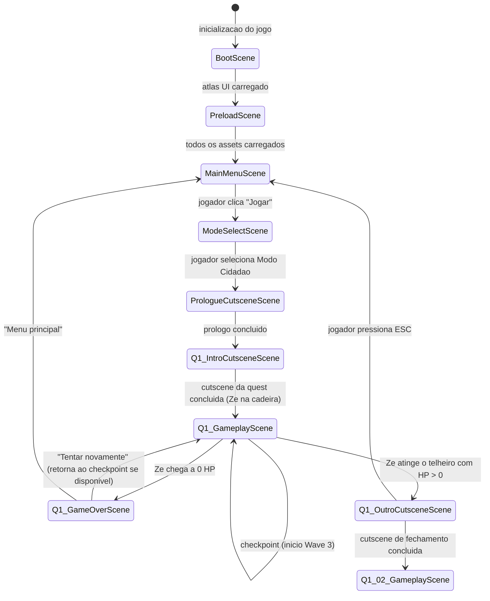
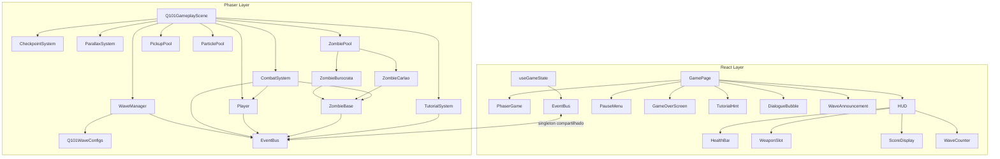

# Q1-01 "HORA EXTRA" — Arquitetura Tecnica Detalhada
### Tim Sweeney — Tech Lead | Abril 2026

---

> *"Uma quest e um contrato: o jogador entrega atencao, nos entregamos diversao. Cada decisao arquitetural que atrasa o primeiro frame jogavel quebra esse contrato. PreloadScene leve. Scenes modulares. Zero alocacao em runtime. Esse e o padrao."*

---

## Contexto e Escopo

Este documento define a implementacao tecnica da Quest Q1-01 "Hora Extra no Apocalipse". Constroi sobre a arquitetura base definida em `22-tech-lead-sideview-arch.md` — leia aquele documento primeiro. Aqui cobrimos o que e especifico desta quest: scenes adicionais, sistema de waves configurado para Q1-01, IA dos inimigos presentes, pipeline de assets, e os padroes de codigo que o time vai seguir em todas as quests subsequentes.

A quest introduz: movimento horizontal + pulo basico, ataque corpo-a-corpo (vassoura), barra de HP, drop de item, e o conceito de inimigo com dialogo narrativo. Nenhuma dessas mecanicas deve exigir nova allocacao de objetos durante o gameplay.

---

## 1. Estrutura de Phaser Scenes para Q1-01

### 1.1 Diagrama de cenas e transicoes



### 1.2 Inventory de scenes e responsabilidades

| Scene | Chave | Responsabilidade | Singleton? |
|---|---|---|---|
| BootScene | `Boot` | Carrega ui_atlas. Unico preload antes da loading screen. | Sim |
| PreloadScene | `Preload` | Carrega todos os assets do jogo com barra de progresso. | Sim |
| MainMenuScene | `MainMenu` | Menu inicial, creditos, leaderboard. | Sim |
| ModeSelectScene | `ModeSelect` | Selecao Cidadao / Politico. Explica diferenca sem spoiler. | Sim |
| PrologueCutsceneScene | `PrologueCutscene` | Cutscene comum a ambos os modos. Usa CutscenePlayer. | Sim |
| Q1_IntroCutsceneScene | `Q101IntroCutscene` | Tela preta, "8 de janeiro", Ze na cadeira, janela quebrando. | Por quest |
| Q1_GameplayScene | `Q101Gameplay` | Loop principal da quest. Contém WaveManager, CombatSystem. | Por quest |
| Q1_GameOverScene | `Q101GameOver` | Carimbo "IMPRODUTIVO". Botoes de retry/menu. | Por quest |
| Q1_OutroCutsceneScene | `Q101OutroCutscene` | Ze + Dona Marta no telheiro. Preview Q1-02. | Por quest |

**Convencao de nomeacao de scene keys:** `Q{capitulo}{numero_2_digitos}{Tipo}` para scenes de quest. `PascalCase` sem espacos. Isso garante que `this.scene.start('Q101Gameplay')` seja autocompletavel e auditavel.

### 1.3 Lifecycle detalhado de Q1_GameplayScene

```
create()
  |-- initCheckpointSystem()     // registra posicao de checkpoint
  |-- createWorld()              // tilemap + parallax + lighting
  |-- createEntityGroups()       // arcade physics groups
  |-- createPools()              // zombie/pickup/particle pools
  |-- spawnPlayer()              // Ze sentado, estado 'idle_seated'
  |-- createSystems()            // WaveManager, CombatSystem, TutorialSystem
  |-- createCamera()             // follow com deadzone
  |-- createForeground()         // posts + janelas foreground
  |-- registerInputHandlers()    // keyboard + mobile virtual joystick
  |-- registerEventBusListeners()
  |-- waveManager.arm('Q101')    // carrega config da quest, aguarda input
  |-- tutorialSystem.activate()  // ativa dicas implicitas de movimento

update(time, delta)
  |-- [hitStop guard]
  |-- player.update()
  |-- waveManager.update()       // dispara spawns conforme timing
  |-- combatSystem.update()      // resolve overlaps, aplica dano
  |-- tutorialSystem.update()    // verifica se hints devem sumir
  |-- zombiePool.updateActive()
  |-- pickupPool.updateActive()
  |-- parallaxSystem.update()
  |-- narrativeSystem.update()   // dialogos contextuais dos zumbis

shutdown()
  |-- EventBus.removeAllListeners() // evita listener leak entre quests
  |-- pools.clear()
  |-- systems.destroy()
```

**Regra critica:** `shutdown()` deve remover todos os listeners do EventBus registrados nesta scene. Falha aqui causa memory leaks que se acumulam ao longo das quests do capitulo.

### 1.4 CutscenePlayer — sistema reutilizavel

Q1-01 tem duas cutscenes (intro e outro). Em vez de duplicar logica, criamos um `CutscenePlayer` que todas as quests do Cap 1 vao reutilizar.

```typescript
// src/game/systems/CutscenePlayer.ts

export interface CutsceneStep {
  type: 'fade-in' | 'fade-out' | 'text' | 'dialogue' | 'wait' | 'sfx' | 'music';
  duration?: number;       // ms
  text?: string;           // para type 'text' e 'dialogue'
  speaker?: string;        // para type 'dialogue'
  audioKey?: string;       // para type 'sfx' e 'music'
  style?: 'narration' | 'dialogue' | 'title' | 'subtitle';
}

export interface CutsceneScript {
  id: string;
  steps: CutsceneStep[];
  onComplete: () => void;
}
```

A scene de cutscene recebe um `CutsceneScript` via `scene.settings.data` e o `CutscenePlayer` executa os steps em sequencia. O `onComplete` dispara a transicao para a proxima scene. Isso significa que Q1-02, Q1-03 etc. so precisam definir seus scripts — a maquinaria de execucao e herdada.

---

## 2. Integracao React ↔ Phaser

A arquitetura base (doc 22) ja define o EventBus, `usePhaser`, `useGameState` e `PhaserGame.tsx`. Q1-01 adiciona tres elementos especificos:

### 2.1 HUD overlay para Q1-01

O HUD e React puro sobreposto ao canvas via `position: absolute`. Nao existe sprite de HUD dentro do Phaser — isso elimina a necessidade de gerenciar depth do HUD e simplifica o layout em diferentes resolucoes.

```
[GamePage.tsx]
  |
  +-- <div style="position: relative, width: 100vw, height: 100vh">
        |
        +-- <PhaserGame />                  (canvas, z-index: 0)
        +-- <HUD />                         (z-index: 10, pointer-events: none)
        |     |-- <HealthBar hp maxHp />
        |     |-- <WeaponSlot weapon durability />   (novo em Q1-01)
        |     +-- <WaveTitle />             (animado via CSS, 2s visible)
        +-- <TutorialHint />                (z-index: 10, pointer-events: none)
        +-- <PauseMenu />                   (z-index: 20, pointer-events: all)
        +-- <GameOverScreen />              (z-index: 30, pointer-events: all)
```

**WeaponSlot** e novo em Q1-01 porque e a primeira quest com arma equipada. O Phaser emite `game:weapon-update` toda vez que a vassoura perde durabilidade ou e trocada.

```typescript
// Novos eventos do EventBus especificos para Q1-01
// Adicionar em EventBus.ts -> PhaserToReactEvents

'game:weapon-update': {
  weaponId: string | null;       // null = apenas soco
  durability: number;            // 0-15 para vassoura
  maxDurability: number;
};

'game:tutorial-hint': {
  hintId: string;                // 'move', 'jump', 'attack'
  visible: boolean;
};

'game:dialogue': {
  speaker: string;
  text: string;
  duration: number;              // ms ate sumir automaticamente
};
```

### 2.2 TutorialSystem — hints implicitas sem texto instrucional

O `TutorialSystem` roda dentro do Phaser mas comunica ao React qual hint mostrar. O React renderiza a seta animada em CSS — mais leve que sprite Phaser para UI de curta duracao.

```typescript
// src/game/systems/TutorialSystem.ts

export class TutorialSystem {
  private scene: Phaser.Scene;
  private hintsShown = new Set<string>();

  constructor(scene: Phaser.Scene) {
    this.scene = scene;
  }

  // Chamado pelo WaveManager quando Ze chega proximo da mesa no corredor
  showMoveHint(): void {
    if (this.hintsShown.has('move')) return;
    this.hintsShown.add('move');
    EventBus.emitToReact('game:tutorial-hint', { hintId: 'move', visible: true });
    // Hint some quando player se move pela primeira vez
  }

  // Chamado pelo TilemapCollider quando ha mesa na frente do player
  showJumpHint(): void {
    if (this.hintsShown.has('jump')) return;
    this.hintsShown.add('jump');
    EventBus.emitToReact('game:tutorial-hint', { hintId: 'jump', visible: true });
    // Hint some apos primeiro pulo bem-sucedido
  }

  // Chamado apos vassoura ser coletada
  showAttackHint(): void {
    if (this.hintsShown.has('attack')) return;
    this.hintsShown.add('attack');
    EventBus.emitToReact('game:tutorial-hint', { hintId: 'attack', visible: true });
    // Hint some no primeiro ataque
  }

  dismissHint(hintId: string): void {
    EventBus.emitToReact('game:tutorial-hint', { hintId, visible: false });
  }
}
```

**Regra de design:** Nenhum hint aparece enquanto o anterior ainda esta visivel. O `hintsShown` Set garante que nenhum hint aparece duas vezes.

---

## 3. Sistema de Waves para Q1-01

### 3.1 Data model de wave — config em TypeScript puro

Waves sao definidas como objetos TypeScript tipados, nao JSON. Isso permite validacao em compile-time e autocompletar na IDE.

```typescript
// src/game/config/WaveConfigs.ts

export type ZombieType =
  | 'burocrata'
  | 'carlao'
  | 'pm_zumbi'
  | 'black_bloc'
  | 'general';

export type SpawnZone =
  | 'right_offscreen'   // fora da tela pela direita (abordagem padrao)
  | 'left_offscreen'    // fora pela esquerda (cerco)
  | 'stairs_bottom'     // base da escada rolante (Q1-01 Wave 3)
  | 'ceiling_drop'      // cai do teto (quests futuras)
  | 'named_position';   // posicao especifica pelo nome no tilemap

export interface SpawnEntry {
  type: ZombieType;
  zone: SpawnZone;
  namedPosition?: string;  // nome do objeto no Tiled, usado com 'named_position'
  delayMs: number;         // delay desde o inicio da wave (0 = imediato)
  count: number;           // quantos deste tipo neste delay
  intervalMs?: number;     // se count > 1, intervalo entre cada spawn
}

export interface WaveSegmentTrigger {
  triggerX: number;        // camera X que ativa este segmento
  allowAdvance: boolean;   // player pode avancar antes de limpar o segmento?
}

export interface WaveConfig {
  id: string;              // ex: 'Q101_W1'
  segmentTrigger?: WaveSegmentTrigger;
  spawns: SpawnEntry[];
  completionCondition: 'all_dead' | 'player_reaches_x' | 'timer';
  completionValue?: number;  // X pixel ou ms, dependendo da condicao
  onComplete?: string;       // ID do proximo evento: 'Q101_W2', 'Q101_BOSS', etc.
}
```

### 3.2 Config concreta da Quest Q1-01

```typescript
// src/game/config/quests/Q101WaveConfigs.ts
import type { WaveConfig } from '../WaveConfigs';

export const Q101_WAVES: WaveConfig[] = [
  // Wave 1: Corredor do Andar — tutorial de movimento
  {
    id: 'Q101_W1',
    segmentTrigger: {
      triggerX: 160,     // camera chega a ~160px (Ze sai da area da mesa)
      allowAdvance: true,
    },
    spawns: [
      {
        type: 'burocrata',
        zone: 'right_offscreen',
        delayMs: 0,
        count: 1,
      },
      {
        type: 'burocrata',
        zone: 'named_position',
        namedPosition: 'corridor_door_b7',
        delayMs: 3000,   // 3s apos o primeiro aparecer
        count: 1,
      },
    ],
    completionCondition: 'player_reaches_x',
    completionValue: 960,  // inicio da Sala de Reunioes (segmento 2)
    onComplete: 'Q101_W2',
  },

  // Wave 2: Sala de Reunioes — tutorial de stealth opcional
  {
    id: 'Q101_W2',
    segmentTrigger: {
      triggerX: 960,
      allowAdvance: false,  // jogador NAO avanca ate resolver esta sala
    },
    spawns: [
      {
        // Dois burocratas "dormindo" (estado 'eating') — so acordam se agitados
        type: 'burocrata',
        zone: 'named_position',
        namedPosition: 'meeting_room_table_a',
        delayMs: 0,
        count: 2,
        intervalMs: 0,     // spawnam juntos no mesmo objeto
      },
      {
        // Dois burocratas atras da porta — acordam se os outros acordam
        type: 'burocrata',
        zone: 'named_position',
        namedPosition: 'meeting_room_door_back',
        delayMs: 0,
        count: 2,
        intervalMs: 0,
      },
    ],
    completionCondition: 'player_reaches_x',
    completionValue: 1920, // base da escada rolante
    onComplete: 'Q101_W3',
  },

  // Wave 3: Escada Rolante — primeira pressao de horda (apos checkpoint)
  {
    id: 'Q101_W3',
    segmentTrigger: {
      triggerX: 1920,
      allowAdvance: false,
    },
    spawns: [
      // 6 burocratas, em duplas a cada 4 segundos
      { type: 'burocrata', zone: 'stairs_bottom', delayMs: 0,    count: 2, intervalMs: 400 },
      { type: 'burocrata', zone: 'stairs_bottom', delayMs: 4000, count: 2, intervalMs: 400 },
      { type: 'burocrata', zone: 'stairs_bottom', delayMs: 8000, count: 2, intervalMs: 400 },
    ],
    completionCondition: 'all_dead',
    onComplete: 'Q101_CARLAO',
  },

  // Carlao — inimigo narrativo unico, pre-boss area
  {
    id: 'Q101_CARLAO',
    segmentTrigger: {
      triggerX: 2880,    // corredor antes do telheiro
      allowAdvance: false,
    },
    spawns: [
      {
        type: 'carlao',
        zone: 'named_position',
        namedPosition: 'cubicle_b7_carlao',
        delayMs: 500,    // pequena pausa dramatica
        count: 1,
      },
    ],
    completionCondition: 'all_dead',
    onComplete: 'Q101_COMPLETE',
  },
];
```

### 3.3 WaveManager — implementacao

```typescript
// src/game/systems/WaveManager.ts
import Phaser from 'phaser';
import { EventBus } from '../EventBus';
import type { WaveConfig, SpawnEntry } from '../config/WaveConfigs';

export class WaveManager {
  private scene: Phaser.Scene;
  private waves: WaveConfig[] = [];
  private currentWaveIndex = -1;
  private currentWave: WaveConfig | null = null;
  private waveStartTime = 0;
  private pendingSpawns: SpawnEntry[] = [];
  private spawnedThisWave = 0;
  private aliveThisWave = 0;
  private questComplete = false;

  constructor(scene: Phaser.Scene) {
    this.scene = scene;
  }

  // Chamado em create() da GameplayScene com o ID da quest
  arm(questId: string): void {
    // Import dinamico das configs da quest
    const configMap: Record<string, WaveConfig[]> = {
      'Q101': Q101_WAVES,
      // Q102, Q103... adicionados aqui conforme implementados
    };
    this.waves = configMap[questId] ?? [];
  }

  // Chamado pelo trigger de camera X (monitorado no update)
  private triggerWave(waveConfig: WaveConfig): void {
    this.currentWave = waveConfig;
    this.waveStartTime = this.scene.time.now;
    this.pendingSpawns = [...waveConfig.spawns];
    this.spawnedThisWave = 0;
    this.aliveThisWave = 0;

    // Notifica React para mostrar o titulo da wave
    const waveIndex = this.waves.indexOf(waveConfig) + 1;
    EventBus.emitToReact('game:wave-announce', {
      wave: waveIndex,
      bossWave: waveConfig.id.includes('CARLAO'),
    });
  }

  update(time: number, delta: number): void {
    if (!this.currentWave || this.questComplete) return;

    const elapsed = time - this.waveStartTime;

    // Processa spawns pendentes cujo delay foi atingido
    const due = this.pendingSpawns.filter(s => elapsed >= s.delayMs);
    due.forEach(spawn => {
      this.executeSpawn(spawn);
      this.pendingSpawns = this.pendingSpawns.filter(s => s !== spawn);
    });

    // Verifica condicao de conclusao da wave
    this.checkCompletion();
  }

  private executeSpawn(entry: SpawnEntry): void {
    const scene = this.scene as any; // acessa zombiePool via scene
    const position = this.resolveSpawnPosition(entry);

    if (entry.count === 1) {
      scene.zombiePool.spawn(entry.type, position.x, position.y);
      this.aliveThisWave++;
      this.spawnedThisWave++;
    } else {
      // Multiple spawns com intervalMs
      for (let i = 0; i < entry.count; i++) {
        const delay = (entry.intervalMs ?? 0) * i;
        this.scene.time.delayedCall(delay, () => {
          scene.zombiePool.spawn(entry.type, position.x, position.y);
          this.aliveThisWave++;
          this.spawnedThisWave++;
          this.updateHUD();
        });
      }
    }

    this.updateHUD();
  }

  // Chamado pelo CombatSystem quando um zumbi morre
  onZombieDead(): void {
    this.aliveThisWave = Math.max(0, this.aliveThisWave - 1);
    this.updateHUD();
    this.checkCompletion();
  }

  private checkCompletion(): void {
    if (!this.currentWave) return;

    let complete = false;

    switch (this.currentWave.completionCondition) {
      case 'all_dead':
        complete = this.aliveThisWave === 0 && this.pendingSpawns.length === 0;
        break;
      case 'player_reaches_x':
        const playerX = (this.scene as any).player.sprite.x;
        complete = playerX >= (this.currentWave.completionValue ?? 0);
        break;
      case 'timer':
        const elapsed = this.scene.time.now - this.waveStartTime;
        complete = elapsed >= (this.currentWave.completionValue ?? 0);
        break;
    }

    if (complete) {
      this.onWaveComplete();
    }
  }

  private onWaveComplete(): void {
    const nextId = this.currentWave?.onComplete;
    this.currentWave = null;

    if (nextId === 'Q101_COMPLETE') {
      this.questComplete = true;
      EventBus.emitToReact('game:quest-complete', { questId: 'Q101' });
      return;
    }

    // Ativa proximo segmento
    const next = this.waves.find(w => w.id === nextId);
    if (next) {
      this.triggerWave(next);
    }
  }

  private updateHUD(): void {
    EventBus.emitToReact('game:wave-update', {
      wave: this.waves.indexOf(this.currentWave!) + 1,
      enemiesRemaining: this.aliveThisWave + this.pendingSpawns.reduce(
        (sum, s) => sum + s.count, 0
      ),
    });
  }

  private resolveSpawnPosition(entry: SpawnEntry): { x: number; y: number } {
    const GROUND_Y = 190; // importar de GameConstants em producao
    const scene = this.scene as any;

    switch (entry.zone) {
      case 'right_offscreen':
        return { x: scene.cameras.main.scrollX + 520, y: GROUND_Y };
      case 'left_offscreen':
        return { x: scene.cameras.main.scrollX - 40, y: GROUND_Y };
      case 'stairs_bottom':
        return { x: 2100, y: GROUND_Y + 48 }; // base da escada, y mais baixo
      case 'named_position': {
        // Lookup no Tiled object layer — resolvido em PreloadScene
        const obj = scene.namedSpawnPoints[entry.namedPosition!];
        return obj ? { x: obj.x, y: obj.y } : { x: 480, y: GROUND_Y };
      }
      default:
        return { x: 480, y: GROUND_Y };
    }
  }
}
```

**Ponto de extensao:** Adicionar uma nova quest e questao de criar um arquivo `Q102WaveConfigs.ts` e registra-lo no mapa do `WaveManager`. O motor nao muda.

---

## 4. Sistema de Combate

### 4.1 Hit detection — overlap AABB via Arcade Physics

Usamos `physics.add.overlap()`, nao colisao. A diferenca e semantica e pratica: colisao impede penetracao (obstaculo), overlap detecta interseccao sem impedimento fisico (hit de ataque). O hitbox de ataque do player e um `Phaser.Physics.Arcade.Image` invisivel que fica ativo por poucos frames durante o swing.

```typescript
// src/game/entities/Player.ts (trecho do sistema de ataque)

export class Player {
  sprite: Phaser.Physics.Arcade.Sprite;
  private attackHitbox: Phaser.Physics.Arcade.Image;
  private attackActive = false;
  private attackTimer = 0;
  private iframes = 0;           // frames de invencibilidade apos levar dano

  // Weapon state
  weaponId: string | null = null;
  weaponDurability = 0;

  // Animation states (string enum para evitar typos)
  readonly STATES = {
    IDLE_SEATED: 'idle_seated',
    IDLE: 'idle',
    WALK: 'walk',
    JUMP: 'jump',
    FALL: 'fall',
    ATTACK: 'attack',
    HURT: 'hurt',
    CROUCH: 'crouch',    // usado na Sala de Reunioes (stealth)
    DEAD: 'dead',
  } as const;

  private currentState: string = this.STATES.IDLE_SEATED;

  initAttackHitbox(scene: Phaser.Scene): void {
    // Hitbox de ataque: rect 24x20, posicionado a frente do player
    this.attackHitbox = scene.physics.add.image(0, 0, '__DEFAULT');
    this.attackHitbox.setVisible(false);
    this.attackHitbox.setActive(false);
    (this.attackHitbox.body as Phaser.Physics.Arcade.Body).setSize(24, 20);
  }

  triggerAttack(): void {
    if (this.currentState === this.STATES.ATTACK) return; // ja atacando
    this.setState(this.STATES.ATTACK);

    // Posiciona hitbox a frente do player
    const direction = this.sprite.flipX ? -1 : 1;
    this.attackHitbox.setPosition(
      this.sprite.x + direction * 20,
      this.sprite.y - 4
    );
    this.attackHitbox.setActive(true);

    // Hitbox ativa por 6 frames (100ms a 60fps)
    this.attackTimer = 6;
    this.attackActive = true;
  }

  update(time: number, delta: number): void {
    // Decrementa iframes
    if (this.iframes > 0) this.iframes--;

    // Gerencia duracao do hitbox de ataque
    if (this.attackActive) {
      this.attackTimer--;
      if (this.attackTimer <= 0) {
        this.attackActive = false;
        this.attackHitbox.setActive(false);
      }
    }

    this.handleInput();
    this.updateAnimations();
  }

  takeDamage(amount: number): void {
    if (this.iframes > 0) return;        // invencivel, ignora dano
    if (this.currentState === this.STATES.DEAD) return;

    this.iframes = 72;                   // 1200ms de iframe a 60fps
    this.currentHp = Math.max(0, this.currentHp - amount);

    EventBus.emitToReact('game:health-update', {
      hp: this.currentHp,
      maxHp: this.maxHp,
    });

    if (this.currentHp <= 0) {
      this.die();
    } else {
      this.setState(this.STATES.HURT);
      // Ze exclama palavrao em texto flutuante
      EventBus.emitToReact('game:dialogue', {
        speaker: 'ze',
        text: '*#@!',
        duration: 1200,
      });
      // Pulso na barra de HP (React anima via CSS)
      EventBus.emitToReact('game:health-pulse', { intensity: 'medium' });
    }
  }
}
```

### 4.2 CombatSystem — orquestracao de overlaps

```typescript
// src/game/systems/CombatSystem.ts

export class CombatSystem {
  private scene: Phaser.Scene;

  constructor(scene: Phaser.Scene) {
    this.scene = scene;
    this.registerOverlaps();
  }

  private registerOverlaps(): void {
    const s = this.scene as any; // acessa player, zombieGroup, projectileGroup

    // Ataque do player atinge zumbis
    this.scene.physics.add.overlap(
      s.player.attackHitbox,
      s.zombieGroup,
      this.onPlayerHitZombie,
      undefined,
      this
    );

    // Zumbi alcanca o player (melee)
    this.scene.physics.add.overlap(
      s.player.sprite,
      s.zombieGroup,
      this.onZombieHitPlayer,
      undefined,
      this
    );

    // Player passa sobre pickup
    this.scene.physics.add.overlap(
      s.player.sprite,
      s.pickupGroup,
      this.onPlayerPickup,
      undefined,
      this
    );
  }

  private onPlayerHitZombie(
    hitbox: Phaser.GameObjects.GameObject,
    zombieGO: Phaser.GameObjects.GameObject
  ): void {
    const player = (this.scene as any).player;
    if (!player.attackActive) return;  // double-check: hitbox pode estar inativo

    const zombie = (zombieGO as any)._entity; // referencia para a classe ZombieBase
    if (!zombie || zombie.isDead) return;

    const damage = player.getWeaponDamage();
    zombie.takeDamage(damage, player.sprite.x);

    // Hit stop: freeze por 3 frames
    (this.scene as any).triggerHitStop();

    // Feedback de acerto na durabilidade da arma
    if (player.weaponId) {
      player.consumeWeaponDurability();
      EventBus.emitToReact('game:weapon-update', {
        weaponId: player.weaponId,
        durability: player.weaponDurability,
        maxDurability: player.weaponMaxDurability,
      });
    }
  }

  private onZombieHitPlayer(
    playerGO: Phaser.GameObjects.GameObject,
    zombieGO: Phaser.GameObjects.GameObject
  ): void {
    const zombie = (zombieGO as any)._entity;
    if (!zombie || zombie.isDead) return;

    // Zumbi so ataca se estiver no estado 'attack' ou 'lunge'
    if (!zombie.isAttacking()) return;

    const player = (this.scene as any).player;
    player.takeDamage(zombie.config.meleeDamage);
  }

  private onPlayerPickup(
    playerGO: Phaser.GameObjects.GameObject,
    pickupGO: Phaser.GameObjects.GameObject
  ): void {
    const pickup = (pickupGO as any)._entity;
    if (!pickup || pickup.collected) return;

    pickup.collect((this.scene as any).player);
  }

  update(_time: number, _delta: number): void {
    // Overlaps sao processados automaticamente pelo Arcade Physics.
    // Este update e reservado para logica adicional de combate
    // (ex: knockback decay, invincibility flash do player).
    const player = (this.scene as any).player;
    if (player.iframes > 0 && player.iframes % 6 < 3) {
      player.sprite.setAlpha(0.5); // pisca durante iframe
    } else {
      player.sprite.setAlpha(1);
    }
  }
}
```

### 4.3 Knockback

Knockback e aplicado ao zumbi quando ele toma dano. Nao usamos `Phaser.Physics.Arcade.Body.velocity` para knockback — usamos uma propriedade manual `knockbackVX` que o `ZombieBase.update()` decai multiplicativamente a cada frame. Isso da controle total sobre a curva de desaceleracao sem depender do sistema de fisicas.

```typescript
// src/game/entities/zombies/ZombieBase.ts (trecho)

applyKnockback(attackerX: number, force: number): void {
  const direction = this.sprite.x > attackerX ? 1 : -1;
  this.knockbackVX = force * direction; // 180 pixels/s para burocratas
}

// Chamado em update()
private tickKnockback(): void {
  if (Math.abs(this.knockbackVX) < 2) {
    this.knockbackVX = 0;
    return;
  }
  this.sprite.x += this.knockbackVX * (1 / 60); // assumindo 60fps
  this.knockbackVX *= 0.82;                      // decay por frame
}
```

---

## 5. IA dos Inimigos

### 5.1 ZombieBase — State Machine compartilhada

Todos os zumbis herdam de `ZombieBase`. A state machine e implementada como enum + switch, nao como classe polimorficas — mais legivel, zero alocacao.

```typescript
// src/game/entities/zombies/ZombieBase.ts

export type ZombieState =
  | 'idle'          // esperando, usado na Sala de Reunioes (burocratas "dormindo")
  | 'patrol'        // anda de um lado pro outro dentro de uma area
  | 'chase'         // seguindo o player
  | 'attack'        // executando animacao de ataque
  | 'eating'        // estado especial: burocrata comendo, ignorante ao player
  | 'hurt'          // levou dano, brevemente paralisado
  | 'knockback'     // sendo empurrado
  | 'dead';         // morto, aguardando pool reciclar

export interface ZombieConfig {
  type: ZombieType;
  hp: number;
  meleeDamage: number;
  speed: number;
  detectionRange: number;   // pixels para ativar chase
  attackRange: number;      // pixels para atacar
  knockbackForce: number;   // forca de knockback recebido
  scoreValue: number;       // pontos ao matar
  dialogues: {             // dialogos situacionais
    idle: string[];
    chase: string[];
    hurt: string[];
    death: string;
  };
}

export abstract class ZombieBase {
  sprite: Phaser.Physics.Arcade.Sprite;
  config: ZombieConfig;
  isDead = false;
  private state: ZombieState = 'idle';
  private hp: number;
  private knockbackVX = 0;
  private hurtTimer = 0;

  constructor(scene: Phaser.Scene, x: number, y: number, config: ZombieConfig) {
    this.config = config;
    this.hp = config.hp;
    this.sprite = scene.physics.add.sprite(x, y, 'game');
    (this.sprite as any)._entity = this; // referencia back para o CombatSystem
  }

  setState(newState: ZombieState): void {
    if (this.state === newState) return;
    this.onExitState(this.state);
    this.state = newState;
    this.onEnterState(newState);
  }

  protected onEnterState(state: ZombieState): void {
    switch (state) {
      case 'chase':
        this.sprite.play(`${this.config.type}_walk`);
        this.emitRandomDialogue('chase');
        break;
      case 'attack':
        this.sprite.play(`${this.config.type}_attack`);
        break;
      case 'hurt':
        this.sprite.play(`${this.config.type}_hurt`);
        this.hurtTimer = 18; // 300ms
        break;
      case 'dead':
        this.sprite.play(`${this.config.type}_death`);
        this.onDeath();
        break;
    }
  }

  protected onExitState(_state: ZombieState): void {
    // Override em subclasses se necessario
  }

  update(time: number, delta: number, playerX: number, playerY: number): void {
    if (this.isDead) return;

    this.tickKnockback();

    if (this.hurtTimer > 0) {
      this.hurtTimer--;
      return; // paralisa durante hurt
    }

    this.updateStateMachine(playerX, playerY);
  }

  private updateStateMachine(playerX: number, playerY: number): void {
    const distToPlayer = Math.abs(this.sprite.x - playerX);

    switch (this.state) {
      case 'idle':
        if (distToPlayer < this.config.detectionRange) {
          this.setState('chase');
        }
        break;

      case 'eating':
        // Burocrata comendo: so acorda se agitado (colisao ou outro zumbi acordou)
        // Logica de "agitacao" e injetada pelo WaveManager
        break;

      case 'patrol':
        // Patrol simples: vai e volta em 80px
        this.updatePatrol();
        if (distToPlayer < this.config.detectionRange) {
          this.setState('chase');
        }
        break;

      case 'chase':
        this.moveTowardsPlayer(playerX);
        if (distToPlayer < this.config.attackRange) {
          this.setState('attack');
        }
        break;

      case 'attack':
        // Ataque e resolvido pelo CombatSystem via overlap
        // Aqui so verificamos se o player recuou (saiu do range)
        if (distToPlayer > this.config.attackRange * 1.5) {
          this.setState('chase');
        }
        break;
    }
  }

  takeDamage(amount: number, attackerX: number): void {
    if (this.isDead) return;
    this.hp -= amount;
    this.applyKnockback(attackerX, this.config.knockbackForce);

    if (this.hp <= 0) {
      this.die();
    } else {
      this.setState('hurt');
      this.emitRandomDialogue('hurt');
    }
  }

  private die(): void {
    this.isDead = true;
    this.setState('dead');
  }

  protected onDeath(): void {
    // Override em subclasses para drops, efeitos, etc.
  }

  private emitRandomDialogue(context: 'chase' | 'hurt'): void {
    const lines = this.config.dialogues[context];
    if (!lines.length) return;
    const line = lines[Math.floor(Math.random() * lines.length)];
    EventBus.emitToReact('game:dialogue', {
      speaker: this.config.type,
      text: line,
      duration: 2000,
    });
  }

  isAttacking(): boolean {
    return this.state === 'attack';
  }
}
```

### 5.2 Burocrata-Zumbi — config e comportamento especifico

```typescript
// src/game/entities/zombies/ZombieBurocrata.ts

import { ZombieBase, ZombieConfig } from './ZombieBase';

export const BUROCRATA_CONFIG: ZombieConfig = {
  type: 'burocrata',
  hp: 3,
  meleeDamage: 1,
  speed: 40,               // pixels/s — o mais lento do jogo
  detectionRange: 200,     // pixels
  attackRange: 20,         // pixels — so ataca corpo a corpo
  knockbackForce: 180,
  scoreValue: 10,
  dialogues: {
    idle: [],              // silencioso quando idle
    chase: [
      'protocolo...',
      'carimba aqui...',
      'assina em tres vias...',
    ],
    hurt: ['a chefia vai saber disso...'],
    death: 'IMPRODUTIVO',
  },
};

export class ZombieBurocrata extends ZombieBase {
  // Estado especial: comendo — ignora player
  private isEating = false;

  constructor(scene: Phaser.Scene, x: number, y: number) {
    super(scene, x, y, BUROCRATA_CONFIG);
  }

  activateEatingState(): void {
    this.isEating = true;
    this.setState('eating');
    this.sprite.play('burocrata_eating');
  }

  // Chamado pelo WaveManager quando outro burocrata acorda
  agitate(): void {
    if (!this.isEating) return;
    this.isEating = false;
    this.setState('chase');
  }
}
```

### 5.3 Carlao — comportamento narrativo diferenciado

Carlao e tecnicamente um inimigo do tipo `ZombieBase`, mas com comportamento que quebra o padrao: ele tem dialogos em fases (nao aleatorios), solta o tablet ao morrer, e tem HP ligeiramente maior.

```typescript
// src/game/entities/zombies/ZombieCarlao.ts

export class ZombieCarlao extends ZombieBase {
  private dialoguePhase = 0;
  private readonly CARLAO_DIALOGUES = [
    'Ze... voce nao vai acreditar... o trending topic...',  // ao ver Ze
    'Isso... vai virar meme...',                             // primeiro hit
    // morte: emitida em onDeath()
  ] as const;

  constructor(scene: Phaser.Scene, x: number, y: number) {
    super(scene, x, y, {
      type: 'carlao',
      hp: 5,
      meleeDamage: 1,
      speed: 35,               // um pouco mais lento que burocrata (gordinho)
      detectionRange: 240,     // range maior — Ze e chefe dele, reconhece de longe
      attackRange: 22,
      knockbackForce: 150,     // mais pesado, knockback menor
      scoreValue: 50,
      dialogues: {
        idle: [],
        chase: [],  // dialogos sao sequenciais, nao aleatorios (gerenciados abaixo)
        hurt: [],
        death: '',  // gerenciado em onDeath()
      },
    });
  }

  protected onEnterState(state: ZombieState): void {
    super.onEnterState(state);

    // Override de dialogos para sequencia narrativa
    if (state === 'chase' && this.dialoguePhase === 0) {
      EventBus.emitToReact('game:dialogue', {
        speaker: 'carlao',
        text: this.CARLAO_DIALOGUES[0],
        duration: 3000,
      });
      this.dialoguePhase = 1;
    }
  }

  takeDamage(amount: number, attackerX: number): void {
    const wasAlive = !this.isDead;
    super.takeDamage(amount, attackerX);

    // Dialogo no primeiro hit
    if (wasAlive && this.dialoguePhase === 1 && !this.isDead) {
      EventBus.emitToReact('game:dialogue', {
        speaker: 'carlao',
        text: this.CARLAO_DIALOGUES[1],
        duration: 2000,
      });
      this.dialoguePhase = 2;
    }
  }

  protected onDeath(): void {
    // Solta tablet como pickup narrativo
    const scene = this.sprite.scene as any;
    scene.pickupPool.spawn('tablet_carlao', this.sprite.x, this.sprite.y);

    // Efeito visual: tweets voando como particulas
    scene.particlePool.burst('tweet_particles', this.sprite.x, this.sprite.y, 12);

    // Audio: notificacao do Twitter em pitch descendente (3 vezes)
    scene.sound.play('sfx_twitter_notif', { volume: 0.8 });
    scene.time.delayedCall(300, () => scene.sound.play('sfx_twitter_notif', { volume: 0.6, rate: 0.85 }));
    scene.time.delayedCall(600, () => scene.sound.play('sfx_twitter_notif', { volume: 0.4, rate: 0.7 }));

    // Notifica WaveManager
    scene.waveManager.onZombieDead();
  }
}
```

**Principio de design:** Carlao nao tem uma state machine diferente de `ZombieBase`. Ele tem overrides cirurgicos em `onEnterState` e `onDeath`. Nao criar subclasses apenas para mudar dados — usar `ZombieConfig`. Criar subclasses quando o comportamento e genuinamente diferente.

---

## 6. Estrutura de Pastas e Modulos — Quest Q1-01

Esta e a estrutura concreta que o desenvolvedor deve criar para implementar Q1-01. Arquivos marcados com `[BASE]` existem na arquitetura geral e nao precisam ser criados do zero.

```
apps/web/src/
│
├── game/
│   ├── PhaserConfig.ts                    [BASE] — adicionar Q101 scenes
│   ├── EventBus.ts                        [BASE] — adicionar eventos Q101
│   │
│   ├── scenes/
│   │   ├── BootScene.ts                   [BASE]
│   │   ├── PreloadScene.ts                [BASE] — adicionar assets Q101
│   │   ├── MainMenuScene.ts               [BASE]
│   │   ├── ModeSelectScene.ts             [NOVO] — selecao Cidadao/Politico
│   │   ├── PrologueCutsceneScene.ts       [NOVO] — cutscene comum prologo
│   │   ├── Q101/
│   │   │   ├── Q101IntroCutsceneScene.ts  [NOVO] — ze na cadeira
│   │   │   ├── Q101GameplayScene.ts       [NOVO] — loop principal
│   │   │   ├── Q101GameOverScene.ts       [NOVO] — carimbo improdutivo
│   │   │   └── Q101OutroCutsceneScene.ts  [NOVO] — ze + dona marta
│   │   └── GameOverScene.ts               [BASE]
│   │
│   ├── entities/
│   │   ├── BaseEntity.ts                  [BASE]
│   │   ├── Player.ts                      [BASE] — estender com weapon system
│   │   ├── Pickup.ts                      [BASE]
│   │   └── zombies/
│   │       ├── ZombieBase.ts              [NOVO — substitui ZombieAssessor etc do base doc]
│   │       ├── ZombieBurocrata.ts         [NOVO]
│   │       └── ZombieCarlao.ts            [NOVO]
│   │
│   ├── systems/
│   │   ├── WaveManager.ts                 [BASE] — reescrever com data-driven config
│   │   ├── CombatSystem.ts                [BASE] — estender com durabilidade de arma
│   │   ├── ScoreSystem.ts                 [BASE]
│   │   ├── ParallaxSystem.ts              [BASE]
│   │   ├── CutscenePlayer.ts              [NOVO]
│   │   ├── TutorialSystem.ts              [NOVO]
│   │   └── CheckpointSystem.ts            [NOVO]
│   │
│   ├── pools/
│   │   ├── ObjectPool.ts                  [BASE]
│   │   ├── ZombiePool.ts                  [BASE] — registrar ZombieBurocrata e ZombieCarlao
│   │   ├── PickupPool.ts                  [NOVO — separado de ProjectilePool]
│   │   └── ParticlePool.ts                [BASE]
│   │
│   └── config/
│       ├── GameConstants.ts               [BASE]
│       ├── ZombieConfigs.ts               [BASE] — adicionar BUROCRATA_CONFIG, CARLAO_CONFIG
│       ├── WeaponConfigs.ts               [BASE] — adicionar VASSOURA_CONFIG
│       └── quests/
│           └── Q101WaveConfigs.ts         [NOVO]
│
├── components/
│   ├── PhaserGame.tsx                     [BASE]
│   ├── HUD/
│   │   ├── HUD.tsx                        [BASE] — adicionar WeaponSlot
│   │   ├── HealthBar.tsx                  [BASE]
│   │   ├── WeaponSlot.tsx                 [NOVO]
│   │   ├── ScoreDisplay.tsx               [BASE]
│   │   └── WaveCounter.tsx                [BASE]
│   ├── menus/
│   │   ├── MainMenu.tsx                   [BASE]
│   │   ├── ModeSelectMenu.tsx             [NOVO]
│   │   ├── PauseMenu.tsx                  [BASE]
│   │   └── GameOverScreen.tsx             [BASE] — customizar para Q1-01 (carimbo)
│   ├── overlays/
│   │   ├── TutorialHint.tsx               [NOVO]
│   │   ├── WaveAnnouncement.tsx           [BASE]
│   │   └── DialogueBubble.tsx             [NOVO — falas dos zumbis]
│   └── cutscene/
│       └── CutsceneOverlay.tsx            [NOVO — renderiza steps do CutscenePlayer]
│
└── hooks/
    ├── usePhaser.ts                       [BASE]
    ├── useGameState.ts                    [BASE] — adicionar weaponState, tutorialHints
    └── useAuth.ts                         [BASE]
```

**Convencao de pastas por quest:** Cada quest tem sua propria pasta em `scenes/Q{num}/`. Isso evita polucao do namespace raiz de scenes a medida que o Cap 1 cresce para 6 quests. Os sistemas (`WaveManager`, `CombatSystem`) ficam em `systems/` sem sub-pasta — sao compartilhados por todas as quests.

---

## 7. Pipeline de Assets — Q1-01

### 7.1 Inventario de assets necessarios

```
public/assets/
│
├── sprites/
│   ├── game_atlas.png          # Atlas principal
│   └── game_atlas.json         # Mapa de frames (TexturePacker)
│   │
│   │   Frames necessarios para Q1-01 (nomes dos frames no atlas):
│   │
│   │   player/
│   │     ze_idle_seated_00..02     (3 frames, ventilador soprando cabelo)
│   │     ze_idle_00..03            (4 frames)
│   │     ze_walk_00..05            (6 frames)
│   │     ze_jump_00..02            (3 frames: take-off, air, land)
│   │     ze_fall_00..01            (2 frames)
│   │     ze_attack_bare_00..04     (5 frames, soco)
│   │     ze_attack_broom_00..05    (6 frames, vassoura)
│   │     ze_hurt_00..01            (2 frames)
│   │     ze_crouch_00..01          (2 frames)
│   │     ze_dead_00..02            (3 frames)
│   │
│   │   burocrata/
│   │     burocrata_idle_00..02
│   │     burocrata_walk_00..05
│   │     burocrata_attack_00..03
│   │     burocrata_eating_00..04   (estado especial Sala de Reunioes)
│   │     burocrata_hurt_00..01
│   │     burocrata_death_00..04
│   │
│   │   carlao/
│   │     carlao_idle_00..03        (segurando tablet, olhando)
│   │     carlao_walk_00..05
│   │     carlao_attack_00..03
│   │     carlao_hurt_00..01
│   │     carlao_death_00..05       (tablet voa das maos)
│   │
│   │   pickups/
│   │     broom_pickup              (frame estatico, brilho via tween)
│   │     sandwich_pickup
│   │     tablet_pickup
│   │     badge_ze                  (cracha de Ze, no inventario desde inicio)
│   │
│   │   vfx/
│   │     hit_spark_00..02          (VFX de acerto)
│   │     death_poof_00..04         (nuvem de papeis ao morrer zumbi)
│   │     tweet_particle            (frame unico de tweet-balao para particulas)
│   │     broom_break_00..02        (vassoura quebrando)
│   │     stamp_improdutivo         (frame do carimbo na game over screen)
│
├── tilemaps/
│   ├── ministerio_q101.json       # Tiled JSON para Q1-01 especificamente
│   └── ministerio_tiles.png       # Tileset 16x16
│
│   Layers no Tiled:
│     ground-surface    (colisao, chao onde Ze anda)
│     ground-subsurface (visual, sem colisao)
│     ground-debris     (papeis no chao, decorativo)
│     platforms         (mesas, arquivos — colisao de pulo)
│     spawn-points      (object layer — named positions para spawner)
│     collision-zones   (areas de colisao especiais: porta bloqueada por cracha)
│     narrative-zones   (triggers de dialogo e eventos de cutscene)
│
└── audio/
    ├── sfx/
    │   ├── stamp_hit.ogg           # som de carimbo batendo (hit nos burocratas)
    │   ├── broom_swing.ogg         # swing da vassoura
    │   ├── broom_break.ogg         # vassoura quebrando
    │   ├── zombie_moan_01..04.ogg  # gemidos dos burocratas (4 variacoes)
    │   ├── carlao_death.ogg        # serie de notificacoes Twitter
    │   ├── glass_break.ogg         # janela quebrando no intro
    │   ├── sandwich_eat.ogg        # coletar sanduiche
    │   └── checkpoint_save.ogg     # som sutil de checkpoint ativado
    └── music/
        ├── mpb_office_loop.ogg     # MPB instrumental levemente distorcida
        └── mpb_distort_loop.ogg    # versao mais distorcida (pos primeiro zumbi)
```

### 7.2 Carregamento em PreloadScene

O carregamento segue o padrao do doc base (22): atlas unico para sprites do jogo, carregar tudo na `PreloadScene`. Para Q1-01, adicionamos os assets especificos da quest sem alterar os atlas base — o tilemap da quest e carregado como arquivo separado porque cada quest tem seu proprio mapa.

```typescript
// PreloadScene.ts — adicoes para Q1-01

// Tilemap especifico da quest
this.load.tilemapTiledJSON('ministerio_q101', 'assets/tilemaps/ministerio_q101.json');
this.load.image('ministerio-tiles', 'assets/tilemaps/ministerio_tiles.png');

// Audio especifico da quest (nao presente no carregamento base)
this.load.audio('sfx_stamp', 'assets/audio/sfx/stamp_hit.ogg');
this.load.audio('sfx_broom_swing', 'assets/audio/sfx/broom_swing.ogg');
this.load.audio('sfx_broom_break', 'assets/audio/sfx/broom_break.ogg');
this.load.audio('sfx_carlao_death', 'assets/audio/sfx/carlao_death.ogg');
this.load.audio('sfx_glass_break', 'assets/audio/sfx/glass_break.ogg');
this.load.audio('mpb_office', 'assets/audio/music/mpb_office_loop.ogg');
this.load.audio('mpb_distort', 'assets/audio/music/mpb_distort_loop.ogg');

// Named spawn points: carregados do object layer do Tiled, resolvidos em create()
// Nao ha carregamento adicional — fazem parte do tilemapTiledJSON
```

**Estrategia de atlas:** Um unico `game_atlas.png` para todos os sprites do jogo. TexturePacker organiza por pasta (`player/`, `burocrata/`, `carlao/` etc.) dentro do mesmo atlas. Isso minimiza draw calls. Alvo: manter o atlas abaixo de 2048x2048 para compatibilidade com dispositivos Android low-end (Mali-400 e similares).

---

## 8. Padroes de Codigo

### 8.1 TypeScript — configuracao

```json
// tsconfig.json (apps/web)
{
  "compilerOptions": {
    "strict": true,
    "noImplicitAny": true,
    "strictNullChecks": true,
    "noUncheckedIndexedAccess": true,
    "exactOptionalPropertyTypes": true,
    "target": "ES2020",
    "module": "ESNext",
    "moduleResolution": "bundler",
    "jsx": "react-jsx",
    "paths": {
      "@zumbis/shared": ["../../packages/shared/src/index.ts"]
    }
  }
}
```

`noUncheckedIndexedAccess: true` e a configuracao mais importante para codigo de jogo — forca verificacao de `undefined` em todos os acessos de array e objeto indexado. Elimina uma classe inteira de crashes em runtime que sao dificeis de reproduzir.

### 8.2 Regras de padroes (aplicadas a toda a codebase do jogo)

**Zero `new` durante gameplay:**
Todo objeto criado durante gameplay (zumbi, pickup, particula, projetil) deve vir de um pool. A unica excecao sao objetos de configuracao imutaveis. Violacoes causam GC stutter visivel em mobile.

```typescript
// CORRETO
const zombie = this.zombiePool.spawn('burocrata', x, y);

// ERRADO — cria alocacao em runtime
const zombie = new ZombieBurocrata(this.scene, x, y);
```

**Composition sobre inheritance para entidades:**
`ZombieBurocrata` e `ZombieCarlao` herdam de `ZombieBase` porque compartilham a state machine. Mas `WeaponSystem`, `DialogueSystem`, `DropSystem` sao injetados como dependencias, nao herdados. Se uma entidade precisasse de multiplas herancas, a resposta e composition.

**Naming conventions:**
- Scenes: `PascalCase` com sufixo `Scene` — `Q101GameplayScene`
- Sistemas: `PascalCase` com sufixo `System` — `CombatSystem`
- Entidades: `PascalCase` sem sufixo — `ZombieBurocrata`, `Player`
- Configs: `SCREAMING_SNAKE_CASE` para constantes — `BUROCRATA_CONFIG`, `VIEWPORT`
- Eventos do EventBus: `kebab-case` com namespace — `game:wave-update`, `ui:resume`
- Chaves de assets: `snake_case` — `ze_walk_00`, `burocrata_death_03`
- Props React: `camelCase` — `onWaveComplete`, `enemiesRemaining`

**Sem `any` em producao:**
O uso de `as any` e permitido APENAS no acesso cruzado entre GameScene e sistemas (onde o cast e `(this.scene as any).player`). Todo novo sistema deve ter uma interface tipada em vez de usar `any`. Comentar todo `any` com o motivo.

**Separacao de mundos:**
Arquivos em `game/` (Phaser) nao importam componentes React. Arquivos em `components/` (React) nao importam classes Phaser diretamente. A comunicacao e exclusivamente via `EventBus`. Esta fronteira e verificada pelo ESLint com regras de importacao.

```
// .eslintrc configuracao de fronteiras
"no-restricted-imports": ["error", {
  "paths": [
    {
      "name": "phaser",                    // proibido em components/ e hooks/
      "allowImportNames": [],
      "message": "Importe de Phaser apenas em src/game/**"
    }
  ]
}]
```

---

## 9. Testes

### 9.1 O que testar em Q1-01 e por que

Para uma quest de jogo, o valor dos testes unitarios esta concentrado em logica de dados e sistemas puros — nao em rendering. A GameScene em si e testada via playtest manual, nao via Jest.

| Modulo | O que testar | Tipo |
|---|---|---|
| `Q101WaveConfigs.ts` | Todas as waves tem `onComplete` valido e apontam para IDs existentes | Unit |
| `WaveManager` | `onZombieDead()` decrementa `aliveThisWave` corretamente | Unit |
| `WaveManager` | `checkCompletion()` so dispara quando `pendingSpawns` e vazio E `aliveThisWave === 0` | Unit |
| `WaveManager` | `resolveSpawnPosition()` retorna coordenadas dentro dos bounds do nivel | Unit |
| `ZombieBase.takeDamage()` | HP decrements corretamente e `isDead` muda na morte | Unit |
| `ZombieBase.takeDamage()` | `onDeath()` e chamado exatamente uma vez (nao em double-kill) | Unit |
| `ZombieCarlao.takeDamage()` | Dialogo de fase 1 emitido apenas no primeiro hit | Unit |
| `ZombieCarlao.onDeath()` | `pickupPool.spawn('tablet_carlao', ...)` e chamado | Unit (mock) |
| `Player.takeDamage()` | Iframes funcionam: segundo dano dentro de 1200ms e ignorado | Unit |
| `Player.takeDamage()` | HP nao vai abaixo de 0 | Unit |
| `Player.getWeaponDamage()` | Retorna 2 com vassoura, 1 sem arma | Unit |
| `CutscenePlayer` | Steps sao executados em ordem e `onComplete` chamado no final | Unit |
| `TutorialSystem` | Hints nao sao exibidos duas vezes | Unit |
| `CheckpointSystem` | Retorna a posicao correta de checkpoint apos morte na Wave 3 | Unit |
| Scores Q1-01 | Formula `kills*10 + hpRestante*5 + bonusTempo` calcula corretamente | Unit |
| Score bonus stealth | `FantasmaDoFuncionalismo` so e concedido se todos burocratas da Wave 2 foram evitados | Unit |

### 9.2 Exemplos de teste

```typescript
// src/game/systems/__tests__/WaveManager.test.ts
import { WaveManager } from '../WaveManager';
import { Q101_WAVES } from '../../config/quests/Q101WaveConfigs';

// Mock minimo de Phaser.Scene
const mockScene = {
  time: { now: 0, delayedCall: jest.fn() },
  cameras: { main: { scrollX: 0 } },
  zombiePool: { spawn: jest.fn() },
  player: { sprite: { x: 0 } },
} as any;

describe('WaveManager — Q1-01 Wave 3 completion', () => {
  it('nao conclui a wave enquanto ha spawns pendentes', () => {
    const wm = new WaveManager(mockScene);
    wm.arm('Q101');

    // Simula wave 3 ativa com 2 spawns pendentes e 0 vivos
    (wm as any).currentWave = Q101_WAVES[2]; // wave 3
    (wm as any).pendingSpawns = [Q101_WAVES[2].spawns[1]]; // 1 spawn pendente
    (wm as any).aliveThisWave = 0;

    const onWaveComplete = jest.spyOn(wm as any, 'onWaveComplete');
    (wm as any).checkCompletion();

    expect(onWaveComplete).not.toHaveBeenCalled();
  });

  it('conclui a wave quando todos morrem e spawns acabaram', () => {
    const wm = new WaveManager(mockScene);
    wm.arm('Q101');

    (wm as any).currentWave = Q101_WAVES[2];
    (wm as any).pendingSpawns = [];
    (wm as any).aliveThisWave = 0;

    const onWaveComplete = jest.spyOn(wm as any, 'onWaveComplete');
    (wm as any).checkCompletion();

    expect(onWaveComplete).toHaveBeenCalledTimes(1);
  });
});
```

```typescript
// src/game/entities/zombies/__tests__/ZombieCarlao.test.ts
import { EventBus } from '../../EventBus';
import { ZombieCarlao } from '../ZombieCarlao';

// Mock de Phaser.Scene para instanciar entidade
const mockScene = {
  physics: {
    add: {
      sprite: jest.fn().mockReturnValue({
        setDepth: jest.fn().mockReturnThis(),
        play: jest.fn(),
        x: 100, y: 190,
        flipX: false,
      }),
    },
  },
  time: { delayedCall: jest.fn() },
  sound: { play: jest.fn() },
  zombiePool: jest.fn(),
  pickupPool: { spawn: jest.fn() },
  particlePool: { burst: jest.fn() },
  waveManager: { onZombieDead: jest.fn() },
} as any;

describe('ZombieCarlao — dialogos sequenciais', () => {
  it('emite dialogo de chase apenas uma vez', () => {
    const emitSpy = jest.spyOn(EventBus, 'emitToReact');
    const carlao = new ZombieCarlao(mockScene, 300, 190);

    // Acorda duas vezes
    (carlao as any).setState('chase');
    (carlao as any).setState('idle');
    (carlao as any).setState('chase');

    const dialogueEmissions = emitSpy.mock.calls.filter(
      call => call[0] === 'game:dialogue' && (call[1] as any).speaker === 'carlao'
    );
    // Primeiro dialogo so deve ter sido emitido uma vez
    expect(dialogueEmissions.length).toBe(1);
  });
});
```

### 9.3 Playwright — testes de integracao criticos

Dois fluxos criticos merecem teste E2E leve (sem renderizacao do canvas, apenas verificando que as transicoes de scene ocorrem):

1. **Fluxo completo Q1-01**: BootScene → PreloadScene → MainMenu → ModeSelect → Intro → Gameplay → Outro. Verifica que nenhuma scene fica pendurada.
2. **Game Over e retry**: Gameplay → GameOver → retry → Gameplay retoma do checkpoint (Wave 3 X position).

Esses testes rodam no CI contra uma build de desenvolvimento com `physics.arcade.debug: false` e canvas offscreen.

---

## Apendice: Diagrama de componentes completo



---

## Resumo executivo

Q1-01 implementa cinco sistemas novos sobre a base existente: `CutscenePlayer` (reutilizavel por todas as quests do capitulo), `TutorialSystem` (hints implicitas sem texto instrucional), `CheckpointSystem` (salva estado na Wave 3), `Q101WaveConfigs` (data-driven, extensivel), e `ZombieCarlao` (override cirurgico de dialogos sequenciais sobre `ZombieBase`).

O criterio de "pronto para shipar" para Q1-01 e: a quest roda em 5-7 minutos, zero crashes em mobile Android (testado em Moto G com Mali-400), nenhum frame abaixo de 55fps no desktop, e a taxa de drop-off (playtest) e abaixo de 15%.

Tudo o mais e polimento.
